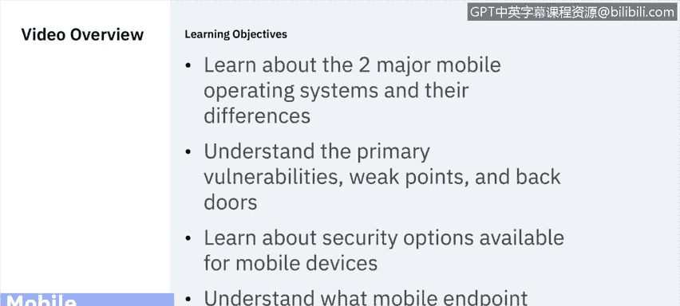
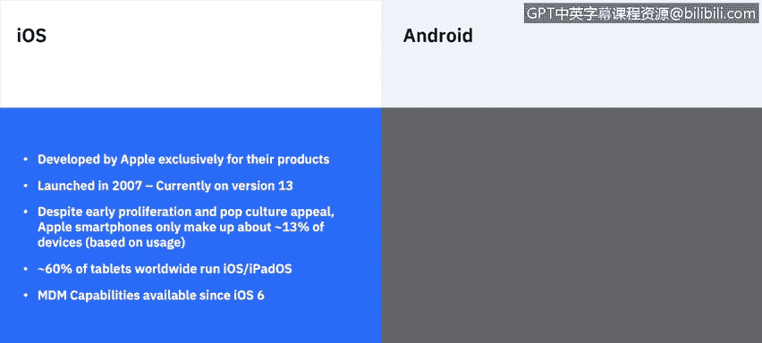
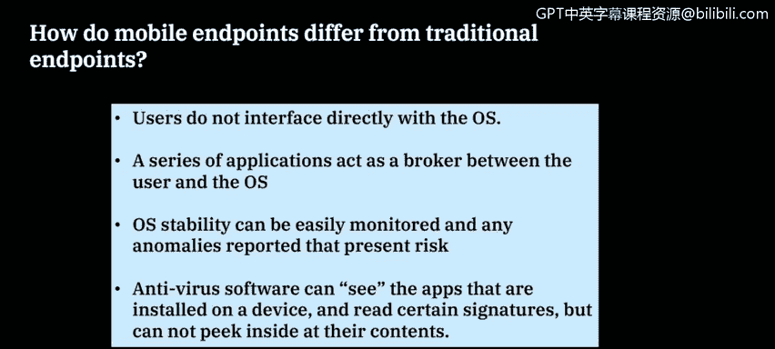
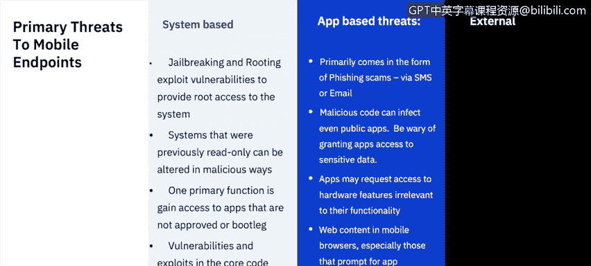
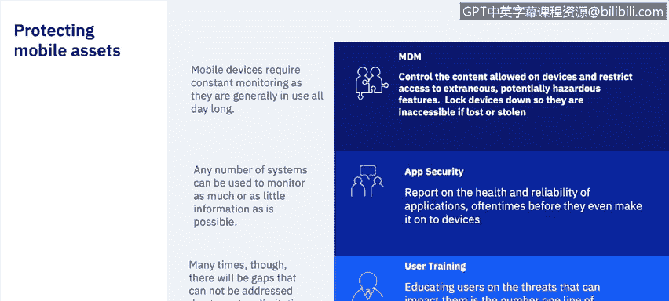
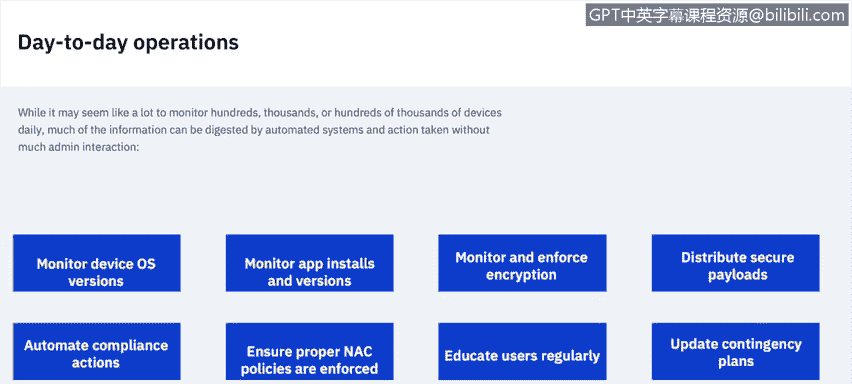

# 课程6：《网络威胁情报课程（IBM）》：51：移动端点防护 📱

在本节课中，我们将学习移动端点防护。我们将了解两大主流移动操作系统及其差异，识别移动设备的主要漏洞和薄弱点，并探讨可用的安全选项以及移动端点管理的日常职责。

## 两大主流移动操作系统

目前市场上有两大主流移动操作系统：iOS 和 Android。过去曾存在其他系统，如 Windows Phone 和主要面向企业市场的 Blackberry。但目前，iOS 和 Android 占据了市场绝大多数份额。Windows Phone 已正式停止支持，而 Blackberry 也已开始将 Android 作为其主要操作系统。

### iOS 🍎

iOS 由苹果公司专为其产品开发。没有第三方苹果产品运行 iOS。它于 2007 年发布，目前最新版本是 iOS 13。尽管早期普及并具有流行文化吸引力，但根据使用情况，苹果智能手机仅占市场设备的约 13%。全球约 60% 的平板电脑运行 iOS 或 iPadOS。自 iOS 6 起，移动设备管理（MDM）功能就已可用。

### Android 🤖

Android 始于 Android Inc. 的一个小型项目，该团队致力于开发 Symbian 和 Windows Mobile OS 的替代品。谷歌于 2005 年收购了它。它基于 Linux 内核，目前主要由谷歌和开放手机联盟（Open Handset Alliance）开发。虽然谷歌提供了 Android 的界面和市场上大量设备，但也存在非谷歌的 Android 设备，用于各种不同行业。首个公开版本于 2008 年发布，目前最新版本是 Android 10。约 86% 的智能手机和 39% 的平板电脑运行某种形式的 Android。自 Android 2.2 起，MDM 功能就已可用。

## 移动端点与传统端点的差异

上一节我们介绍了两大移动操作系统，本节中我们来看看移动端点与服务器、台式机和笔记本电脑等传统端点有何不同。

首先，用户不直接与操作系统交互。与传统桌面软件不同，用户无法开箱即用地获得根访问权限，也无法查看构成操作系统的各种组件和文件夹。相反，一系列应用程序充当用户和操作系统之间的中介。例如，当您打开设备上的“设置”按钮时，您并非直接编辑设置；“设置”本身是一个应用程序，它代表您向操作系统发出命令来执行诸如调节系统音量等操作。

其次，可操作性易于监控。除非我们谈论的是 Android 市场上的某些开源设备，否则绝大多数消费级设备出厂时配置相当标准。开机后，操作系统按特定顺序加载，建立安全链，然后向用户呈现用户界面以运行应用程序。如果该安全链在任何环节被破坏，很容易被检测并报告。

第三，防病毒软件的作用有限。它可以查看设备上安装的某些应用程序并读取特定签名，但与桌面端不同，它无法查看所有内容，无法窥探所有应用程序内部，其视野受限，且无法定制以查看通常无法看到的内容。

## 移动端点的主要威胁

了解了移动端点的特性后，本节我们将探讨其面临的主要威胁。我们将威胁分为三类：基于系统的威胁、基于应用程序的威胁和外部威胁。

### 基于系统的威胁

这类威胁通常试图以某种方式改变操作系统，以获取设备上非标准的功能。这通常表现为“越狱”和“获取 root 权限”。

*   **越狱**：这是 iOS 特有的，因为苹果完全不支持此行为。越狱会自动使您的所有保修失效，并且您的系统资源可能以您未预料的方式被恶意感染。人们通常这样做是为了获取应用商店未批准或不可用的应用程序。
*   **获取 Root 权限**：这在 Android 上略有不同，因为它确实有其用途，特别是对于应用程序开发者。此外，Android 设备无需 root 即可从外部安装应用程序。但 root 仍然会带来问题，特别是如果我们用它来以谷歌先前未授权的方式定制操作系统，可能会创建可被利用的漏洞。

### 基于应用程序的威胁

这类威胁以应用程序的形式出现。

*   **网络钓鱼诈骗**：主要通过短信或电子邮件进行。您收到一封包含链接的电子邮件或看似官方的短信，点击后可能对您的设备造成安全危害。
*   **恶意代码**：甚至公共应用程序也可能感染恶意代码。因此，务必确保始终从可信来源安装应用。苹果和谷歌在扫描其应用商店中应用程序的漏洞方面做得不错，但这并不意味着它们能发现所有漏洞。因此，请选择您了解、有历史记录和良好安全声誉的公司。
*   **不必要的硬件访问请求**：应用程序可能请求与其功能无关的硬件访问权限。例如，很久以前有一个 Android 手电筒应用，它需要打开相机闪光灯，但不知为何还需要访问系统联系人，这显然不是手电筒应用应有的需求。
*   **浏览器漏洞**：网络浏览器也包含漏洞。当您访问特定网站时，浏览器中可能会弹出窗口，声称您的设备已感染病毒，并诱使您点击链接下载所谓的修复程序。请相信，苹果和谷歌不会在浏览器中放置此类弹窗。这通常是外部攻击者试图诱使您在应用程序内点击链接，从而安装恶意软件。

### 外部威胁

当然，还存在外部威胁。

*   **基于网络的攻击**：始终是个问题。Wi-Fi 和蓝牙漏洞可能通过将设备连接到外部媒体而被利用。
*   **社会工程学**：常被用来获取未经授权的访问。攻击方式多样，例如，有人可能看似无害地请求借用您的手机给妻子打电话，声称自己手机没电。这样他们就获得了您的号码，随后可能向您发送看似官方实则虚假的短信，诱使您点击链接并输入信息或下载应用程序。

## 如何保护移动资产

识别了主要威胁后，我们来看看如何保护移动资产。

首先，是**移动设备管理**。MDM 需要持续监控，它允许您控制设备上的内容并限制对功能的访问。如果设备上存在潜在危险信息，例如某个应用程序含有已知恶意软件且已安装在设备上，MDM 可以帮助修复问题，并在修复前阻止用户访问敏感信息。此外，如果设备丢失或被盗，MDM 可以锁定设备使其无法访问。

其次，是**应用程序安全**。市场上有许多第三方公司可以提供应用程序评级。如前所述，可以运行防病毒程序，尽管其覆盖范围有限，尤其是与桌面版本相比。因此，结合公共应用商店的安全措施以及第三方评级系统，可以全面了解市场上应用程序的状况。始终确保不从这些商店外部安装第三方应用程序，除非您 100% 信任其来源，即便如此，也应遵循“信任但要验证”的原则。

最后，是**用户培训**。教育用户了解市场上可能影响他们的威胁始终很重要。您也可以从他们个人日常使用的角度来阐述这些威胁。出现的威胁不仅可能影响组织，也可能影响用户的私人数据，如敏感文档甚至相机中的照片。因此，确保我们的用户教育是最新的，并让他们了解移动设备市场威胁所在的位置至关重要。

## 移动安全日常运维

了解了防护措施后，本节我们来看看负责移动设备安全的人员的日常运维工作。需要监控的内容很多，环境中可能存在成百上千台设备，但大部分信息可由自动化系统处理并采取行动，无需管理员过多干预。

以下是日常运维的关键任务列表：

*   **监控设备操作系统版本**：确保操作系统版本是最新的。这对于移动设备尤其重要，因为通常没有单独的补丁功能；您不是单独修补 Wi-Fi 硬件，而是更新整个操作系统，其中包含漏洞和错误的修复。
*   **监控应用程序安装和版本**：同样，这在移动操作系统上更重要，因为一旦安装，您无法轻易回退应用程序版本。如果旧版本在应用商店中仍然可用，您必须完全卸载并重新安装。对于来自 iOS 应用商店或 Google Play 商店的应用程序，您只能安装市场上可用的版本。如果当前版本有缺陷，您必须从设备上移除它，而无法回退到早期版本。
*   **监控并强制执行加密**：这始终很重要。如今许多设备出厂时已加密，但您始终希望增加安全层，确保强制执行密码，并在可用时让用户利用这些密码，当然还包括生物识别解锁设备，例如指纹或面容 ID。
*   **分发安全负载**：确保您拥有已知安全的负载并将其分发到设备上。不要轻信第三方公司声称其产品安全就接受他们的负载，务必遵循“信任但要验证”的原则。
*   **自动化合规操作**：这非常有用，因为很容易实现自动化。如果设备存在漏洞、被越狱、设备认证失败或安装了不良应用程序，确保可以自动阻止用户访问敏感信息，甚至移除这些恶意应用程序，这样管理员就无需介入，但仍能在这些流程执行时收到主动警告。
*   **确保执行适当的网络访问控制策略**：这在当今尤为重要，尤其是对于移动设备。移动设备通常是勒索软件攻击的起点。用户随身携带这些设备，习惯于随时从口袋中掏出查看信息，这常常导致他们在未适当验证或像使用工作台式机或笔记本电脑那样三思的情况下点击链接。网络访问控制有助于确保只有经过批准的设备才能访问您的网络。
*   **定期教育用户**：我们希望始终了解市场上发生的一切。这可能看起来很多，尤其是当您除了台式机和笔记本电脑外还要兼顾 iOS 和 Android 设备时。但教育是成功部署的关键。
*   **始终更新应急计划**：当大规模感染事件影响您环境中的设备时，会发生什么？您能以多快的速度阻止移动设备访问您的网络、从设备上移除应用程序，或直接切断它们与安全资源的连接？因此，始终要制定应急计划。

即使每天执行所有这些任务，也没有系统是完美的。因此，您需要持续关注应用程序版本、操作系统版本以及用户日常实际使用这些设备的情况。一旦管理员掌握了节奏，我相信监控这些设备并成功防止它们在出现问题时感染您更大的网络，不会占用他们太多时间。

## 总结

在本节课中，我们一起学习了移动端点防护。我们首先介绍了 iOS 和 Android 两大主流移动操作系统及其特点。接着，我们探讨了移动端点与传统端点的关键差异，并详细分析了基于系统、应用程序和外部的三类主要威胁。然后，我们学习了通过移动设备管理、应用程序安全和用户培训来保护移动资产的策略。最后，我们概述了移动安全日常运维的关键任务，包括监控、加密、自动化合规和用户教育等。通过掌握这些知识，您可以更好地理解和实施移动端点的安全防护措施。