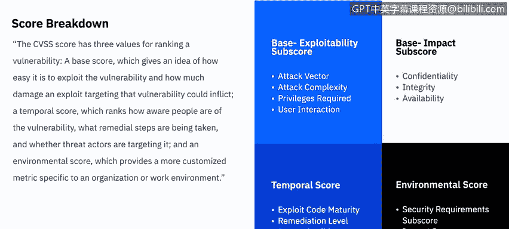

# 课程6：《网络威胁情报课程（IBM）》：52：漏洞评估工具 🛡️

在本节课中，我们将学习漏洞评估工具。我们将讨论不同类型的漏洞扫描器、通用漏洞评分系统（CVSS）的评分方法，以及如何使用安全技术实施指南（STIG）和互联网安全中心（CIS）基准来增强整体安全态势。

## 漏洞扫描概述

根据美国国家标准与技术研究院（NIST）的定义，漏洞扫描旨在识别主机及其属性，例如操作系统、应用程序、开放端口等。更重要的是，它试图自动识别漏洞，而非依赖人工对扫描结果的解读。

漏洞扫描有助于识别过时的软件版本、缺失的补丁和错误配置，并能验证组织安全策略的合规性或偏差情况。

## 什么是漏洞扫描器？

漏洞扫描器是一套具有多种功能的软件套件，其主要任务是评估系统中可能被威胁利用的潜在弱点。

漏洞扫描器的能力包括：
*   维护包含所有已知漏洞和利用方式的最新数据库。
*   检测真实漏洞，同时避免产生过多的误报。
*   能够同时执行多次扫描，进行趋势分析，并生成清晰的结果报告。
*   提供有效的对策建议，以消除发现的任何漏洞。

## 漏洞扫描器的组成

漏洞扫描器主要由四个核心组件构成：扫描引擎、数据库、报告模块和用户界面。

*   **扫描引擎**：根据其安装的插件执行安全检查，识别系统信息和漏洞。
*   **数据库**：存储所有漏洞信息、扫描结果以及扫描器使用的其他数据。
*   **报告模块**：提供扫描结果报告，例如面向系统管理员的技术报告、面向安全管理员的摘要报告，以及面向企业高管的图表和趋势报告。
*   **用户界面**：允许管理员操作扫描器，可以是图形用户界面（GUI）或命令行界面。

## 内部扫描与外部扫描

漏洞扫描器可以针对内部威胁或外部威胁进行扫描，这取决于其扫描的是主机还是网络。

**内部威胁**，无论是有意还是无意，都构成了对系统攻击的很大一部分。这可能源于通过互联网或USB下载到网络的恶意软件或病毒，也可能来自拥有内部网络访问权限的不满员工，或者是已获得内部网络访问权限的外部攻击者。内部扫描是通过在网络内部的机器上运行漏洞扫描器，对网络的关键组件（如核心路由器、交换机、工作站、Web服务器、数据库等）进行扫描。

**外部扫描**同样重要，因为它需要检测面向互联网的资产中的漏洞，攻击者可能通过这些资产获得内部访问权限。外部扫描是通过从互联网对主机运行漏洞扫描器来完成的。在恶意用户或攻击者利用开放问题或漏洞之前将其消除，始终是一个好做法。

## 通用漏洞评分系统（CVSS）

衡量威胁严重程度的一种方法是使用通用漏洞评分系统（CVSS）。CVSS是一种为计算机系统漏洞分配严重性等级的方法，范围从0（最不严重）到10（最严重）。

CVSS提供了跨行业的标准化漏洞评分，有助于关键信息在组织内部各部门之间以及组织之间更顺畅地流动。其评分公式是公开且免费分发的，确保了透明度，并有助于优先处理风险。CVSS排名既提供一个总体分数，也提供更具体的指标。

CVSS分数本身分为三个主要部分：基础分数、时间分数和环境分数，它们共同构成了0到10的总体分数。

### CVSS分数详解

CVSS分数包含三个用于对漏洞进行排名的值：

1.  **基础分数**：评估漏洞被利用的难易程度，以及利用该漏洞可能造成的损害程度。
2.  **时间分数**：评估人们对漏洞的认知程度、正在采取的补救措施以及威胁行为者是否正在针对它。
3.  **环境分数**：提供一个更定制化的指标，针对特定组织或工作环境。

需要指出的是，这只是对CVSS分数构成的高层次概述。建议在课后查看CVSS分数计算器，以了解构成每个子分数的所有不同因素。

具体来说，**基础分数**又分为两个子分数：可利用性和影响。
*   **可利用性子分数**考察攻击向量、攻击复杂性、所需权限以及涉及的用户交互。
*   **影响子分数**则与CIA三要素（保密性、完整性、可用性）有关，评估漏洞对服务CIA三要素的影响。

**时间分数**考察三个方面：利用代码的成熟度、修复级别和报告置信度。

最后，**环境分数**考察安全要求子分数，并同时考虑CIA三要素的影响分数。

## 安全技术实施指南（STIG）

另一种评估工具是安全技术实施指南（STIG）的使用。国防信息系统局（DISA）是负责维护美国国防部IT基础设施安全态势的机构。

许多应用程序的默认配置在安全性方面存在不足，因此DISA认为，为这些应用程序制定安全标准，将使各国防部机构能够在所有现有应用程序实例中使用相同的标准或指南。

STIG适用于各种软件包，包括操作系统、数据库应用程序、开源软件、网络设备、无线设备、虚拟软件等，并且其列表还在不断增长，现在甚至包括移动操作系统。

要查看最新的STIG，可以访问国防部公共网络交换网站（public.cyber.mil/stigs）。在那里，你可以看到最新的更新，下载应用程序查看器（每个操作系统都有一个），浏览这些数据库，并查看任何给定应用程序的最新安全技术实施指南。

## 互联网安全中心（CIS）基准与控制

本视频要讨论的最后一个漏洞评估工具是互联网安全中心（CIS）的基准与控制。CIS基准与控制类似于STIG，它们为任何给定的应用程序或过程提供安全设置和配置的指导与建议。不同之处在于，CIS基准并非来自国防部，而是来自安全专业人士和行业专家。

CIS基准是唯一基于共识制定的、最佳实践安全配置指南，由政府部门、企业、行业和学术界共同开发和认可。其初始基准开发过程定义了基准的范围，并开始了工作草案的讨论、创建和测试过程。通过使用CIS Workbench社区网站，建立讨论线程以持续对话，直到就建议的工作草案达成共识。一旦在CIS基准社区内达成共识，最终基准就会在线发布。

CIS控制是一组优先行动，共同构成了一套纵深防御的最佳实践，旨在缓解针对系统和网络的最常见攻击。这些控制措施由IT专家社区开发，他们运用自己作为网络防御者的第一手经验，创建了这些全球公认的基于安全的最佳实践。

CIS控制体现了有效网络防御系统的五个关键原则：
1.  攻击信息指导防御。
2.  优先级排序。
3.  度量和指标。
4.  持续诊断和缓解。
5.  自动化。

要使用这些控制措施，你需要确定你的企业或公司属于哪个实施组，然后将其与社区制定的20个不同控制组进行比较。

### 实施组与控制组

实施组根据公司的安全需求定义，1级代表最少或正常需求，3级代表最高需求。
*   **实施组1**：适用于数据敏感性较低的小型商业现货或家庭办公室软件环境。通常落在此组。实施组2和3的组织也应遵循组1的所有步骤（此规则适用于所有组，即组3应能执行组2和1的所有步骤，组2应能执行组1的所有步骤）。
*   **实施组2**：侧重于帮助安全团队管理敏感客户或公司信息的子控制措施属于此组。
*   **实施组3**：适用于最大安全需求，包含减少零日攻击和来自复杂对手的针对性攻击影响的子控制措施。通常落在此组。

这些实施组将应用于20个不同的控制组。因此，对于每个控制组，都会有实施组1、2和3级别的对应措施，你可以想象其中存在许多不同的组合。

以下是20个CIS控制，它们分为三个类别：基本、基础和组织的。建议你暂停视频阅读此列表，或访问CIS网站下载PDF或Excel格式自行查阅。

1.  资产清单与控制
2.  软件资产清单
3.  持续漏洞管理
4.  特权账户控制
5.  移动设备、笔记本电脑和工作站的硬件和软件安全配置
6.  审计日志维护
7.  电子邮件和Web浏览器保护
8.  恶意软件防御
9.  网络端口、协议和服务限制
10. 数据恢复能力
11. 安全配置网络设备
12. 边界防御
13. 数据保护
14. 基于需求的访问控制
15. 无线访问控制
16. 账户监控与控制
17. 安全技能评估与适当培训
18. 应用程序软件安全
19. 事件响应与管理
20. 渗透测试与红队演练

本节课中，我们一起学习了漏洞评估工具。我们介绍了漏洞扫描器的类型与组成、如何利用CVSS对漏洞进行标准化评分、STIG在统一安全配置中的应用，以及CIS基准与控制如何提供基于共识的最佳安全实践。掌握这些工具和方法，对于系统化地识别和缓解安全漏洞至关重要。