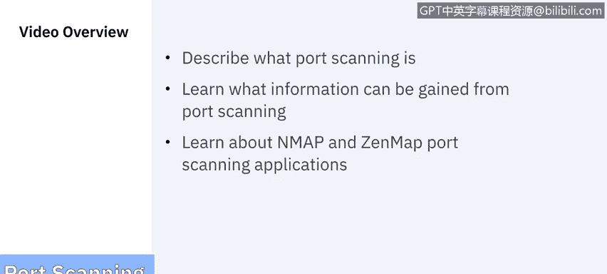
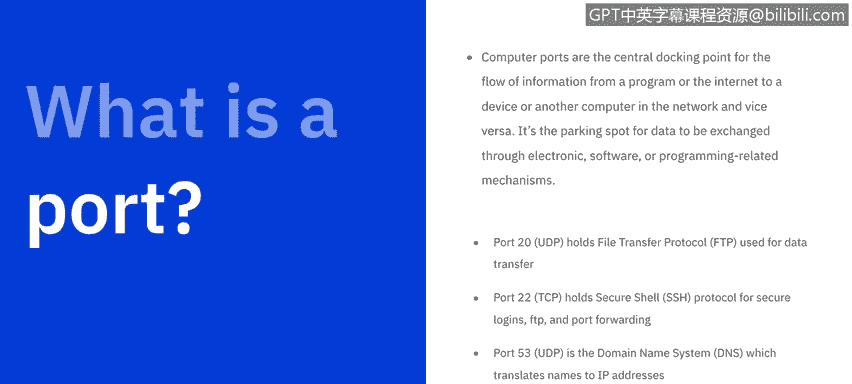

# 课程6：《网络威胁情报课程（IBM）》：：53：端口扫描技术

## 概述

在本节课中，我们将学习端口扫描技术。我们将了解端口扫描的定义、它能提供的信息，并介绍两款常用的端口扫描工具：Nmap 和 Zenmap。课程内容将涵盖端口的基本概念、扫描原理、常见扫描类型以及工具的应用场景。

---

## 端口与端口扫描基础

上一节我们概述了课程内容，本节中我们来深入探讨端口与端口扫描的基础知识。

根据美国国家标准与技术研究院的定义，**网络端口与服务识别**涉及使用端口扫描器来识别活动主机上运行的网络端口和服务（例如FTP和HTTP），以及运行每个已识别服务的应用程序（例如用于HTTP服务的Microsoft Internet Information Server或Apache）。

所有基础扫描器都能识别活动主机和开放端口，但部分扫描器还能提供关于被扫描主机的额外信息。

让我们从基础开始：什么是端口？计算机端口是信息从程序或互联网流向设备或网络中另一台计算机（反之亦然）的中心对接点。它是数据通过电子、软件或编程相关机制进行交换的“停车位”。

端口号0到1023是众所周知的端口号，专为互联网使用而设计，尽管它们也可能有专门的用途。这些端口由互联网号码分配局管理。这些端口通常由苹果、MSN、SQL服务等顶级公司及其他知名组织持有。您可能认识一些更突出的端口及其分配的服务：
*   **端口20**（UDP）：承载文件传输协议，用于数据传输。
*   **端口22**（TCP）：承载SSH安全外壳协议，用于安全登录、FTP和端口转发。
*   **端口53**（UDP）：承载域名系统，用于将名称转换为IP地址。
*   **端口80**（TCP）：承载超文本传输协议。

端口号1024到49151被视为**注册端口**，意味着它们由软件公司注册。而端口号49152到65536是**动态和私有端口**，几乎任何人都可以使用。

---

## 端口扫描原理与类型

了解了端口的基础分类后，本节我们来看看端口扫描的工作原理及其常见类型。

当这些端口被访问时，都会请求一个响应。因此，**端口扫描器**是一个简单的计算机程序，它检查所有这些端口，并会收到三种可能的响应之一：**开放**、**关闭**或**被过滤/丢弃/阻止**等。

*   如果端口**开放**或接受探测，计算机会响应并询问是否需要服务。
*   如果端口**关闭**或未在监听，计算机会响应，确认其存在，但表明该端口当前正在使用或不可用。
*   如果端口**被过滤**或**阻止**，计算机甚至不会响应，您将收不到任何输入。

**端口扫描**是一种确定网络上哪些端口开放并可能正在接收或发送数据的方法。它也是一个向主机上的特定端口发送数据包并分析响应，以识别任何漏洞的过程。

以下是五种常见的扫描类型：

1.  **Ping扫描**：最简单的端口扫描，发送ICMP回显请求以查看哪些主机响应。
2.  **TCP半开放扫描**：也称为SYN扫描或隐形扫描，它发起连接但不完成，因此更具欺骗性且不易被目标主机完全记录。
3.  **TCP连接扫描**：与半开放扫描相对，它会完成整个TCP连接，因此速度更慢、更“嘈杂”，更容易被检测到。
4.  **UDP扫描**：运行UDP端口扫描时，您向每个端口发送空包或不同负载的数据包，**仅当端口关闭时才会收到响应**。它比TCP扫描快，但包含的数据较少。
5.  **隐蔽扫描**：这些TCP扫描比其他选项更安静，可以绕过某些防火墙，但仍会被最新的入侵检测系统发现。

---

## 端口扫描工具：Nmap与Zenmap

在介绍了各种扫描类型后，本节我们将重点介绍两款最流行的端口扫描应用工具。

这引出了最流行的端口扫描应用程序之一：**Nmap**。Nmap代表**网络映射器**，是一款用于网络探索和安全审计的开源工具。它设计用于快速扫描大型网络，但也适用于单台主机。

Nmap以新颖的方式使用原始IP数据包来确定网络上有哪些主机可用、这些主机提供哪些服务（包括应用程序名称和版本）、它们运行的操作系统及其版本、以及正在使用何种类型的数据包过滤器或防火墙等数十种其他特征。

虽然Nmap通常用于安全审计，但许多系统和网络管理员发现它对日常任务也很有用，例如网络资产清点、管理服务升级计划和监控主机或服务运行时间。

最后是**Zenmap**，它仍由Nmap项目开发，但提供了**图形用户界面**。这使得数据的呈现更加有用，整体应用程序也更容易使用。

---

## 总结

本节课中，我们一起学习了端口扫描技术。我们从端口的基本定义和分类入手，解释了端口扫描的工作原理及其三种响应状态。接着，我们详细介绍了五种常见的端口扫描类型，包括Ping扫描、TCP半开放/连接扫描、UDP扫描和隐蔽扫描。最后，我们认识了两款强大的端口扫描工具：命令行工具Nmap及其图形界面版本Zenmap，了解了它们在网络探索、安全审计及日常管理中的用途。掌握这些知识是理解网络侦察和漏洞评估的基础。