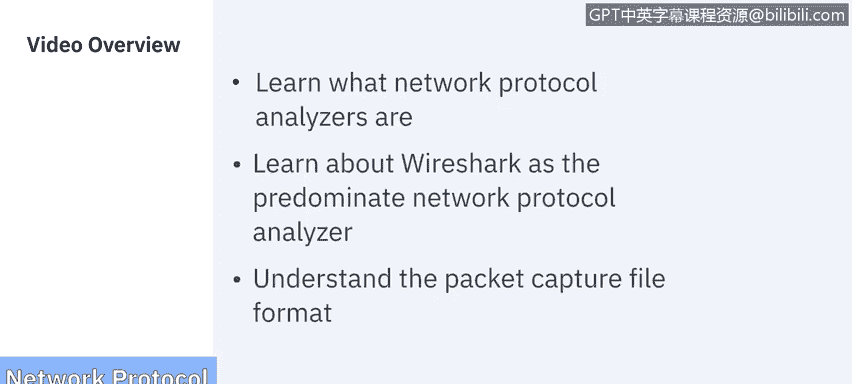
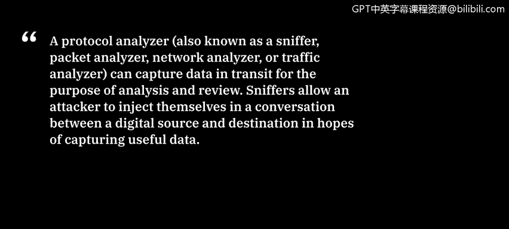
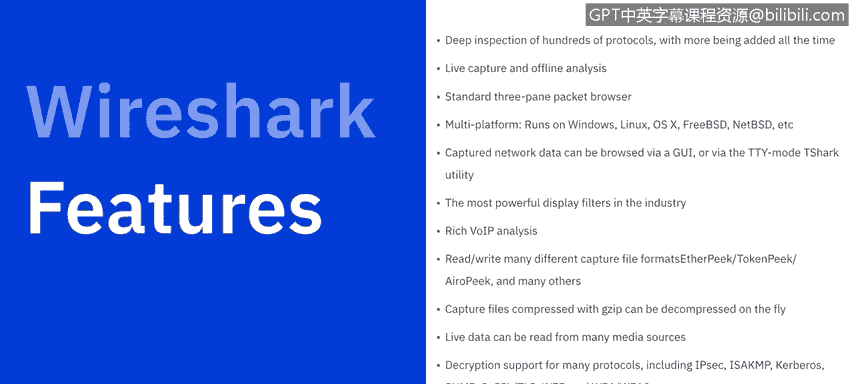
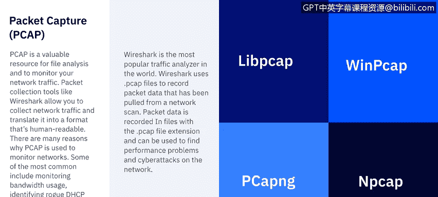

# 课程6：《网络威胁情报课程（IBM）》：54：网络协议分析器概述 🕵️

在本节课中，我们将学习什么是网络协议分析器，了解主流的协议分析器 Wireshark，并理解数据包捕获文件的格式。

## 什么是网络协议分析器？

协议分析器，也被称为嗅探器、数据包分析器、网络分析器或流量分析器，能够捕获传输中的数据，以便进行分析和审查。嗅探器允许攻击者将自己注入到数字源和目的地之间的对话中，以期捕获有用的数据。

这些网络嗅探器工作在 OSI 模型的数据链路层。这意味着它们不必遵守位于协议栈更高层的应用程序和服务所遵循的相同规则。嗅探器可以捕获线路上的一切并记录下来供后续审查。它们允许用户查看数据包中包含的所有数据。

## 主流分析器：Wireshark

上一节我们介绍了协议分析器的基本概念，本节中我们来看看最主流的嗅探器——Wireshark。

Wireshark 拦截网络流量，并将二进制流量转换为人类可读的格式。这使得识别网络上的流量类型、流量大小、频率以及特定节点之间的延迟等信息变得容易。

以下是 Wireshark 的主要用户群体：
*   网络管理员用它来排查网络问题。
*   安全工程师用它来检查安全问题。
*   质量保证工程师用它来验证网络问题。
*   开发人员用它来调试协议实现。
*   普通用户可以用它来学习网络协议内部原理。

## Wireshark 的核心功能

作为一款免费软件，Wireshark 提供了令人印象深刻的功能集。

以下是其主要功能列表：
*   对数百种协议进行深度检查，并且还在不断增加。
*   提供实时捕获和离线分析功能。
*   标配三窗格数据包浏览器。
*   支持跨多个平台运行，如 Windows、Linux、macOS、FreeBSD、NetBSD 等。
*   捕获的数据可以通过图形用户界面或 TTY 模式下的 `Tshark` 实用程序进行浏览。
*   拥有业界最强大的显示过滤器。
*   提供丰富的 VoIP 分析功能。
*   支持读取和写入多种不同的捕获文件格式。
*   捕获文件可以用 Gzip 压缩，并可以即时解压。
*   可以从多种不同的媒体源读取实时数据。
*   支持对许多协议进行解密，包括 IPsec、ISAKMP、Kerberos、SNMPv3、SSL/TLS、WEP 和 WPA/WPA2。
*   可以为数据包列表应用着色规则，以便快速、直观地分析。
*   输出可以导出为 XML、PostScript、CSV、纯文本等多种格式。

然而，使 Wireshark 如此有影响力的核心在于它所捕获的数据本身。

## 数据包捕获文件的价值

现在，我们来探讨一下数据包捕获文件的价值。数据包捕获文件是进行文件分析的宝贵资源。

在监控网络流量时，像 Wireshark 这样的数据包收集工具允许您收集网络流量并将其转换为人类可读的格式。使用 PCAP 文件监控网络的原因有很多。

以下是一些最常见的用途：
*   监控带宽使用情况。
*   识别未经授权的 DHCP 服务器。
*   检测恶意软件。
*   DNS 解析。
*   事件响应。

Wireshark 是世界上最流行的流量分析器。它使用 PCAP 文件来记录从网络扫描中提取的数据包捕获数据。这些数据被记录在扩展名为 `.pcap` 的文件中，可用于发现网络上的性能问题和网络攻击。

## PCAP 文件格式变体

了解了 PCAP 文件的重要性后，本节我们来看看数据包捕获文件的四种不同格式变体。

以下是四种主要的 PCAP 文件格式：
1.  **Libpcap**：`LIB` 代表库，`PCAP` 代表数据包捕获。此格式用于基于 Unix 的系统，如 Linux 和 macOS。
2.  **WinPcap**：这是 Windows 操作系统的变体。虽然 Wireshark 可以读取它，但它是一种较旧的格式，默认情况下不再使用。
3.  **PCAPng**：即下一代数据包捕获格式。这是 Wireshark 默认捕获数据包的格式，之所以被称为“下一代”，是因为它既能捕获也能存储数据。
4.  **Npcap**：此格式仅由 Nmap 使用。Nmap 是一个端口扫描应用程序，同时也具备捕获数据包的能力。

---

**本节课总结**

在本节课中，我们一起学习了网络协议分析器的基础知识。我们了解到协议分析器（或称嗅探器）是用于捕获和分析网络流量的关键工具。我们重点介绍了最流行的分析器 Wireshark 及其强大的功能。最后，我们探讨了数据包捕获文件的价值，并认识了四种主要的 PCAP 文件格式：Libpcap、WinPcap、PCAPng 和 Npcap。掌握这些工具和概念是进行有效网络监控和威胁分析的基础。