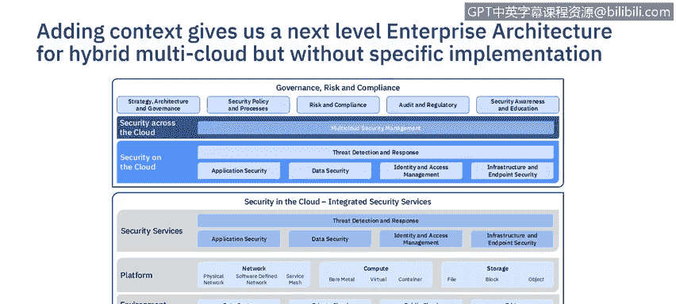
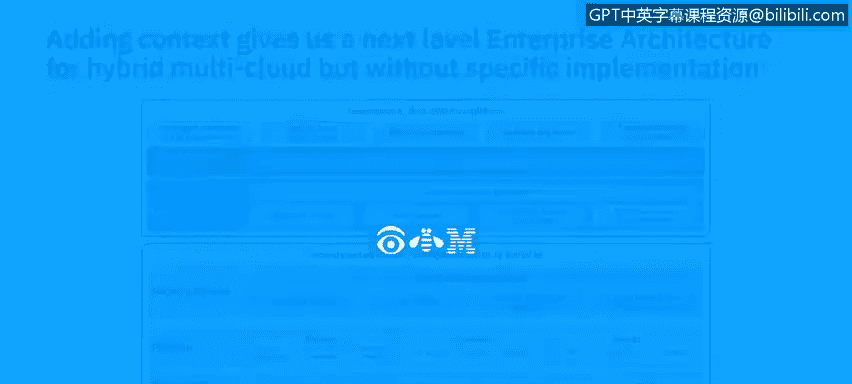

# 课程6：《网络威胁情报课程（IBM）》：56：17_02_high-level-architectural-models.en_subtitled

## 网络安全架构概念：17_02：高层架构模型 🏗️

欢迎回到安全架构概念单元。在上一节视频中，我们讨论了架构对于构建健壮安全体系的重要性。本节视频中，我们将继续探讨有助于描述高层安全架构的概念。

我将解释高层安全架构模型的特征，讨论不同抽象级别的不同表现形式，以及如何在实践中使用这些模型。

架构被定义为建筑的艺术。当建造建筑物时，通常从一个整体图景开始，它提供了建筑物外观的视觉构想。它并不定义建筑物将如何建造，并且很少告诉我们其背景信息。在这个建筑物的例子中，它确实通过等高线和湖泊提供了一些背景信息，但它没有提供足以让我们建造该建筑物的细节。

在IT架构中，这可以被视为企业级架构。后续会有更详细的图纸来提供系统背景和实施的细节。

### 高层架构的类型

我们可以将问题分解为更进一步的抽象层次：企业架构和解决方案架构。

首先，**企业架构**考虑整个企业的广泛范围。它以非常高的层次展示问题空间的主要组件，组件数量较少。它可能展示一些相互关系和背景，但层次非常高。它可以展示流程、高层业务服务或不同的领域，这种表示非常松散。

随着我们对问题进行分解，我们需要添加背景和技术组件。我们开始进入**解决方案架构**。现在，我们开始添加关于环境和技术视角的背景信息。架构图变得更加复杂。

### 架构的表示方法

我们使用所谓的**构建块**来表示这些架构。这些构建块用于表示业务需求。它可以是一个能力、领域、行为或业务服务。这些构建块用于表示松散耦合的分组。

在**企业级**，**架构构建块**是高层指导性组件，指导解决方案架构的开发。架构构建块是产品和厂商中立的。

在**解决方案架构级**，**解决方案构建块**指定了实现功能的技术组件或特定产品。背景信息以平台和环境的形式添加。它们可能是产品或厂商相关的。

以下是构建块的一些示例：

*   **架构构建块**：例如，数据安全、应用安全、网络安全、身份与访问管理、物理安全。这些是通用的安全领域，而非特定的安全功能。
*   **解决方案构建块**：例如，证书颁发机构、应用防火墙、入侵检测系统、安全信息和事件管理。这些是安全功能，但在本例中不特定于任何厂商或产品。

### 企业架构示例

这是一个混合多云环境的企业安全架构的高层示例。架构构建块显示有五个逻辑安全领域，由物理安全支持。由于这是关于多云的安全，它展示了与多云安全管理平台的集成，并通过治理、风险与合规进行监督。

这作为一组高层领域，有助于组织项目或分解问题，但它没有告诉我们任何关于技术、能力或环境的背景信息。

### 添加细节的企业架构示例

在这个企业架构示例中，我们开始添加安全能力的分组，以提供每个领域构成的更多细节。但它仍然没有任何背景信息。这可以作为热图来描述所提供能力的成熟度。我曾见过组织使用这种图表来评估成熟度，然后将能力标记为红色、琥珀色或绿色，以便专注于安全控制的补救。

### 更详细的企业安全架构

在这个企业安全架构中，我们将安全领域分为**内置到云基础设施中的安全控制**和**在云基础设施之上添加的安全**。

对于内置安全领域，控制可以部署到网络、计算和存储平台上，然后进一步分解。例如，对于网络，控制可以存在于物理底层网络、软件定义的覆盖网络以及使用服务网格的容器通信中。

然后，这些平台中的每一个都可以部署到不同的环境中：企业内部数据中心、私有云、公共云和边缘计算服务。

相同的安全领域既用于内置安全，也用于附加安全，因为每个云在包含的内容上都不同，通常需要附加安全。

在图的顶部，再次显示了多云安全管理，以集成每个环境。总体而言，需要治理、风险与合规来确保安全有效运行。

这种架构图用于描述在特定IT环境背景下需要考虑的安全控制的不同视角维度。在这种情况下，它帮助安全架构师描述混合多云环境中安全控制的复杂性。它可以用来讨论在不同环境中建立通用身份和安全平台的必要性，否则会导致复杂性增加，从而提高成本并降低安全有效性。

所有这些架构图都是在非常高的层次上展示的，它们不描述物理实现。在下一个视频中，您将了解解决方案架构的进一步表示形式，因为解决方案被分解为具体的实施方案。

本节课中，我们一起学习了高层安全架构模型的概念、类型和表示方法，并通过示例了解了企业架构如何从抽象走向具体。下一节视频，我们将探讨如何分解解决方案架构。