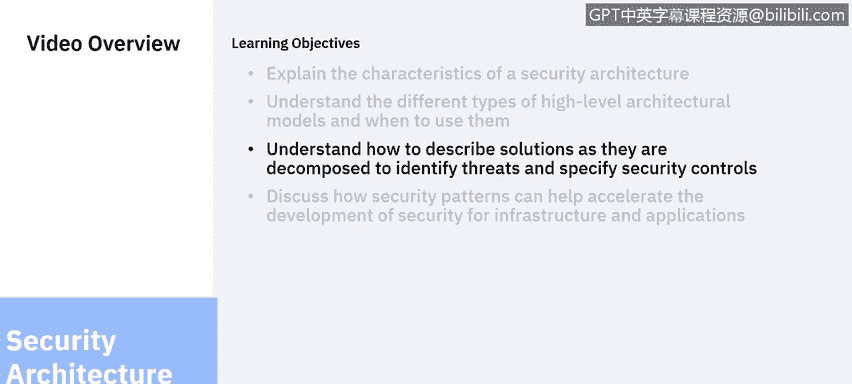
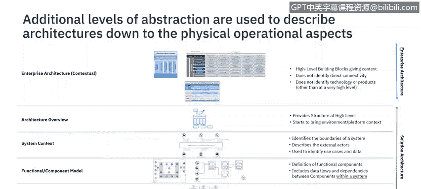
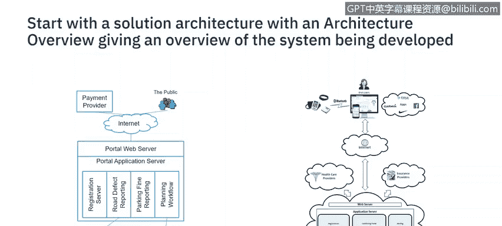
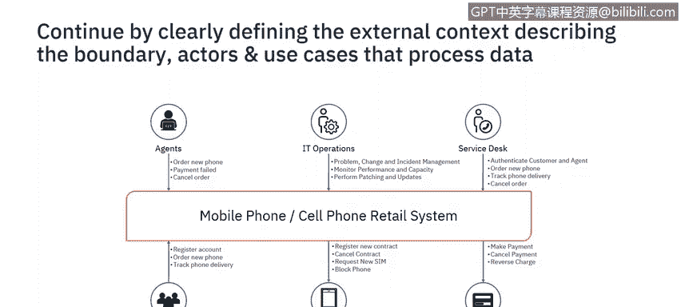
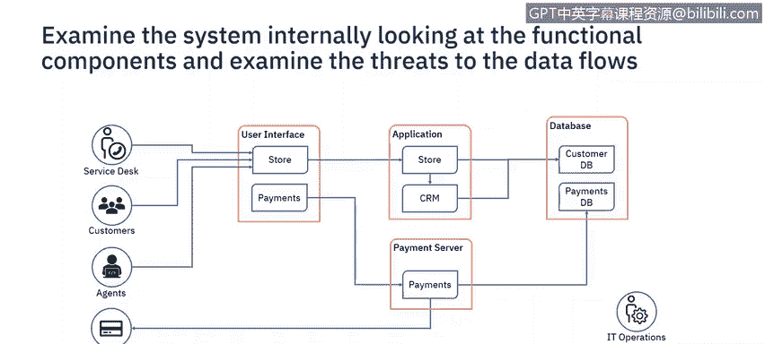
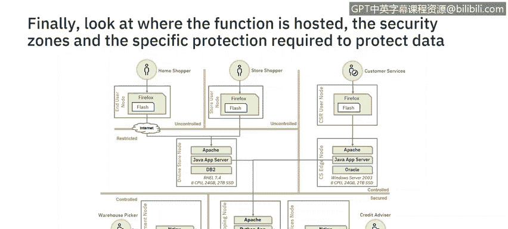

# 课程6：《网络威胁情报课程（IBM）》：57：18_03 解决方案架构

## 概述
在本节课程中，我们将学习如何描述安全解决方案架构。我们将探讨解决方案架构模型、不同抽象级别的表示方法，以及如何在实践中应用这些表示方法。通过本课，你将掌握使用架构思维来系统化地考虑安全性的方法。

---

欢迎回到安全架构概念单元。在上一节视频中，我们讨论了有助于描述企业安全架构的概念。本节中，我们将继续探讨有助于描述安全解决方案架构的概念。

我将解释解决方案架构模型，讨论不同抽象级别的不同表示方法，以及何时在实践中使用这些表示。在开发安全解决方案架构的过程中，需要识别威胁并指定具体的控制措施。

架构通过一系列步骤发展，从整体的企业架构分解到具体的解决方案。

这张幻灯片展示了从整体企业架构到详细操作模型的不同表示级别，后者指定了不同的硬件组件。不同架构之间存在重叠，边界并非总是清晰，有时会使用混合版本的图表。

这些图表将从两个角度使用：一是作为安全架构师，支持更广泛团队正在开发的解决方案；二是作为设计安全服务的安全架构师，此时需要考虑IT架构的所有方面。

本节视频将重点介绍为解决方案指定安全性。我们将涵盖架构概述、系统上下文、功能模型和操作模型。在开始之前，你可以暂停视频，思考一下构成此架构的不同层级。

## 架构概述
一旦明确了需要设计和交付的解决方案，下一步就是记录架构概述。这是一个高级别的概念图。

该图表没有特定格式，但需要足以传达你试图开发的概念。它使项目能够以系统的初始视图启动，但此图表尚未考虑安全性。

## 系统上下文
可以通过首先识别系统边界来考虑安全性。我们将系统外部的实体视为参与者。这些参与者可以是人类或系统。

每个参与者都执行用例描述的活动。这些用例处理流入和流出系统的数据。安全控制措施保护的对象正是这些数据以及执行这些用例的可用性。

因此，创建系统上下文将记录需要保护的外部数据流，并思考参与者和用例。然后，我们可以对正在处理的数据类型进行分类，并根据策略，这将指导所需的安全控制措施以及可能使用的环境。

这非常有用。一旦我们了解了这些，就可以开始思考系统内部的安全性。

## 功能模型
系统外部的参与者和数据流会启动系统内部的数据流。因此，下一步是记录系统的功能组件以及这些组件之间的交互。

这些交互中的每一个都将包含一个数据流。在这个级别，我们还可以查看系统内的威胁参与者，并开始识别保护传输中和静态数据所需的控制措施。

在这个级别，我们记录的是应用程序功能，而不是系统将如何实施和操作。我们需要另一张图表来实现后者。

## 操作模型
需要识别实现应用程序功能所需的能力。根据数据的分类和具体的实施，组件被放置在不同数据分类的区域中。

根据组织的政策和标准，安全控制措施将开始被识别。在这个级别，需要讨论具体的技术或产品要求。例如，在你的组织中，是否允许使用Flash或Windows 2003？

为了支持环境，可能会开始识别新的参与者，例如安全运营团队。这项能力是外包还是内部运营？如果是外包运营，那么安全上下文需要更新以包含新的参与者。

这个新参与者将拥有新的用例和数据，这些数据在传输和静态时都需要受到保护。还有很多需要考虑的因素，但我希望这能让你深入了解使用架构思维来系统化思考安全性的方法。

## 迭代与提问
随着架构的详细阐述，可以提出一些问题，例如：谁是执行安全措施的利益相关者或参与者？每个系统、组件和参与者的位置在哪里？安全控制措施何时需要，最好有实施的优先级？为什么需要这个系统？这有助于确定控制措施及其实施的优先级。需要保护什么？数据将如何被保护？

思考所有这些类型的问题将是一个迭代的过程。早期的图表会被更新，然后后期的图表也会更新以反映这些要求和新的改进。

本节内容到此结束。在下一个视频中，我将与你讨论如何通过使用不同的安全模式来加速解决方案的实施。

---

## 总结
在本节课中，我们一起学习了安全解决方案架构的核心概念。我们从**架构概述**开始，建立了解决方案的高级视图。然后，通过定义**系统上下文**，明确了系统边界、外部参与者、数据流和需要保护的资产。接着，我们深入到**功能模型**，描述了系统内部组件、交互和数据流，并开始识别安全控制。最后，我们探讨了**操作模型**，考虑了技术实现、部署环境和运营团队等具体细节。整个过程是迭代的，需要不断提问和更新图表，以确保安全性与解决方案的设计紧密结合。