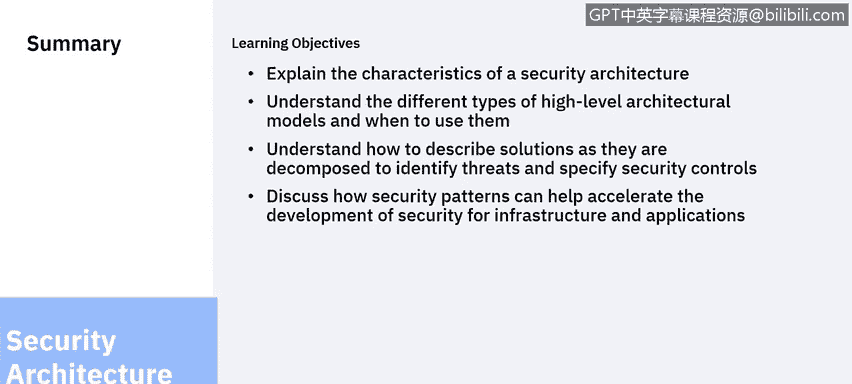

# 课程6：《网络威胁情报课程（IBM）》：58：19_04_security-patterns.en_subtitled - GPT中英字幕课程资源 - BV1jN411679K

## 网络安全架构概念：19_04：安全模式 🛡️

欢迎回到网络安全架构概念单元。在上一个视频中，我们讨论了如何描述一个解决方案。在本节中，我们将继续探讨如何利用模式来加速系统设计。

### 概述
在本节课中，我们将要学习什么是架构模式，以及如何利用现有的、经过验证的模式来加速安全解决方案的设计过程，避免重复劳动并遵循最佳实践。

### 什么是架构模式？
上一节我们介绍了解决方案的描述方法，本节中我们来看看如何利用模式来提升设计效率。

我已经描述了不同的实践方法，但许多前人已经对此进行过深入思考。他们应用最佳实践，创建了能够加速开发过程的模式。

一个**架构模式**是针对常见问题的可复用解决方案。它基于最佳实践，为你提供了一个解决问题的模板。

**模式并非一个完整的解决方案**，因为它没有考虑具体解决方案的上下文环境。

### 模式的类型与来源
模式有多种不同的格式和来源。以下是几种常见的模式类型：

*   **供应商特定模式**：有时软件供应商会提供关于如何使用其软件的模式。
*   **通用模式**：在其他情况下，模式是通用的，不依赖于特定软件。这些模式展示了软件应有的使用方式，并提供了捷径。
*   **详细模式**：还有许多更通用的模式可用，它们提供不同层次的细节。有些模式甚至详尽到像“RBM阅读手册”一样，记录了完整的、经过测试的解决方案，描述了如何将它们组合在一起。

### 模式的应用价值
在开始你的设计之前，始终要寻找通用模式。这有助于：

1.  **识别最佳实践**：直接应用行业验证过的方法。
2.  **缩短开发周期**：避免从零开始，复用成熟的设计思路。

### 单元内容回顾与总结
最后，让我们回顾一下本单元所讲授的内容。

我讨论了安全架构的特性。随着系统复杂性的增加，我们需要一套标准的工具和技术，使我们能够清晰地沟通良好的结构和行为，其目的是避免混乱。

我们看到了温彻斯特神秘屋的混乱案例，我们不希望在我们构建的系统中重蹈覆辙。

我讨论了不同的高层架构模型。企业架构可用于在组织层面进行沟通，提供系统组件的概览，而无需深入实现细节。我演示了三种不同的视角，并讨论了它们各自的用途。

我讨论了解决方案架构，它帮助我们识别威胁，以及保护传输中和静态数据所需的控制措施。不同抽象层次的图表将有助于我们的架构思考过程。

我还讨论了如何通过利用经过验证的架构模式来加速解决方案的设计。

本节课中我们一起学习了安全架构的核心概念、不同层级的模型以及加速设计的有效工具——架构模式。这就是本单元最后一个视频的结尾。

感谢聆听，祝你在将安全架构融入解决方案时一切顺利。