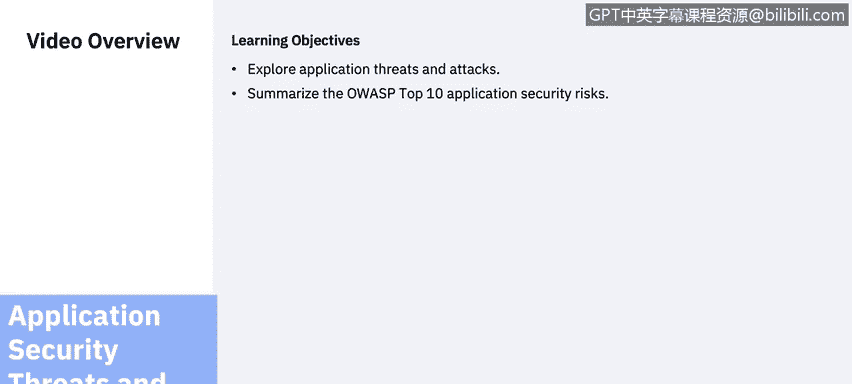
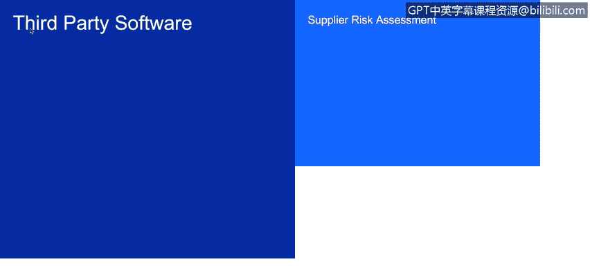
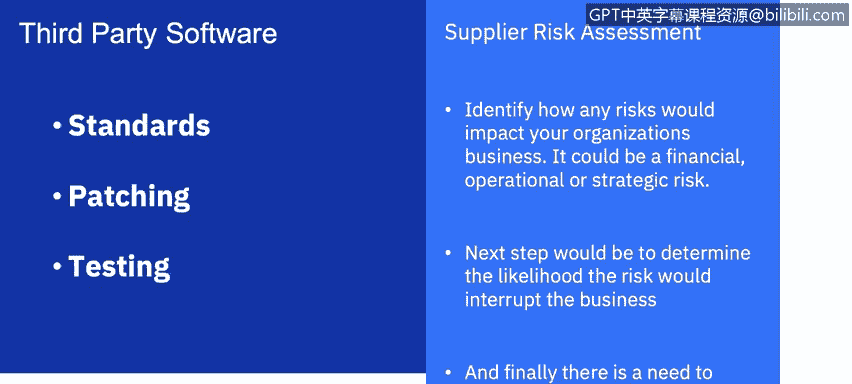
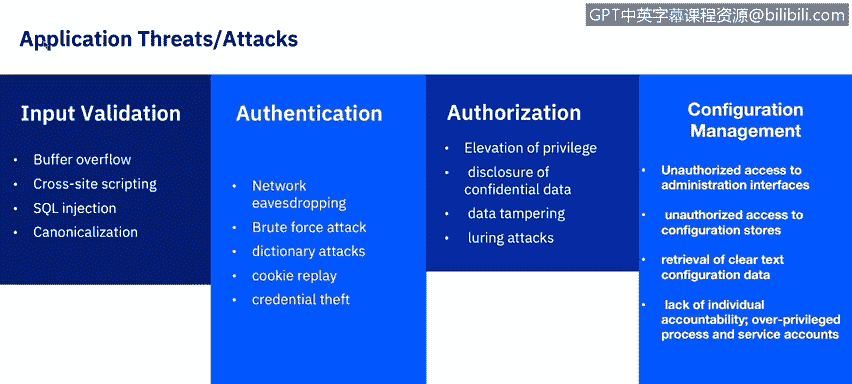
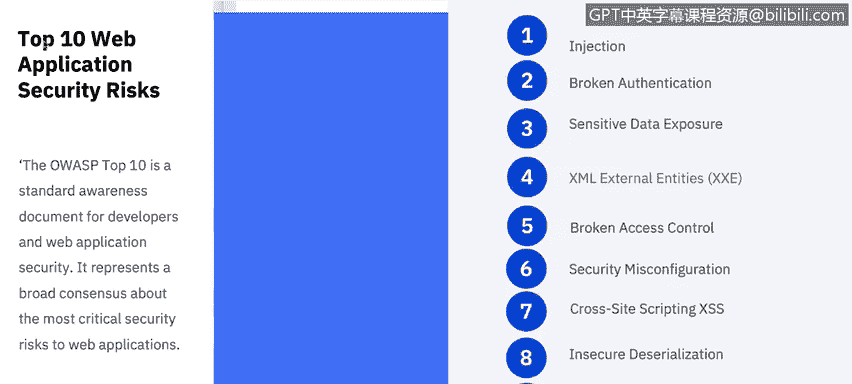
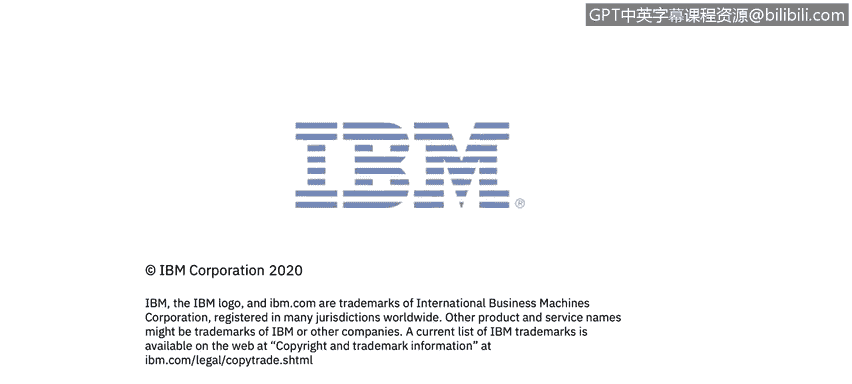

网络威胁情报课程：6：应用安全威胁与攻击

在本节课中，我们将探讨应用安全面临的威胁与攻击，并总结OWASP十大应用安全风险。

到目前为止，我们的讨论主要围绕内部开发的应用程序。然而，组织在选择任何第三方软件，尤其是关键任务软件时，应用安全专业人员应评估相关风险，并询问该软件开发所使用的安全标准。了解第三方提供的安全补丁和任何测试标准同样重要。

以下是评估第三方软件采购风险的正式流程，称为供应商风险评估。

*   第一步是识别任何风险将如何影响组织的业务。这可能是财务、运营或战略风险。
*   下一步是确定风险中断业务的可能性。
*   最后，需要识别风险将如何具体影响业务。

某些风险可能过高，以至于需要改变业务流程或评估其他软件。

应用安全的另一个重要组成部分是安装Web应用防火墙。

Web应用防火墙过滤、监控和阻止进出Web应用程序的HTTP流量。

WAF与常规防火墙的区别在于，WAF能够过滤特定Web应用程序的内容，而常规防火墙则充当服务器之间的安全网关。通过检查HTTP流量，WAF可以防止源自Web应用安全漏洞的攻击，例如SQL注入、跨站脚本、文件包含和安全配置错误。

那么，应用程序面临的一些最常见威胁和相关攻击有哪些？

**输入验证**：攻击者修改现有应用程序的运行时行为以执行未经授权的操作，通常通过二进制补丁、代码替换或代码扩展进行利用。

以下是一些常见的输入验证攻击：
*   **跨站脚本**：我们将在后续课程中深入探讨。
*   **SQL注入**：我们在之前的课程中已经探讨过。
*   **缓冲区溢出**。

**身份验证**：验证个人身份的过程。

以下是一些常见的身份验证攻击：
*   **暴力破解攻击**。
*   **凭证盗窃**。
*   **网络窃听**。

**授权**：指定对资源的访问权限和特权的功能。

一种非常常见的授权攻击是**权限提升**。我们将在下一节关于数据泄露的课程中看到几个这方面的例子。

**配置管理**：典型的配置管理攻击包括：
*   未经授权访问管理界面。
*   未经授权访问配置存储。
*   检索明文配置数据。
*   缺乏个人问责制。
*   进程和服务账户权限过高。

**异常管理威胁**，例如**拒绝服务攻击**，是一种网络攻击，攻击者试图通过暂时或无限期地中断连接到互联网的主机服务，使目标机器或网络资源对其预期用户不可用。

最后，**审计与日志记录**是应用程序面临的另一个常见威胁。

一些相关攻击包括：
*   用户否认执行了某项操作。
*   攻击者利用应用程序且不留痕迹。
*   攻击者掩盖其踪迹。

从事应用安全工作时，应参考许多行业资源。让我们简要了解一下OWASP十大Web应用安全风险。

1.  **注入**：当不可信的数据作为命令或查询的一部分发送给解释器时，就会发生注入漏洞。攻击者的恶意数据可以欺骗解释器执行非预期的命令或在未经适当授权的情况下访问数据。
    *   `攻击示例：SELECT * FROM users WHERE username = 'admin' OR '1'='1';`
2.  **失效的身份认证**：与身份认证和会话管理相关的应用程序功能经常实施不当，允许攻击者破坏密码、密钥或会话令牌，或利用其他实施缺陷临时或永久地冒充其他用户身份。
3.  **敏感数据泄露**：许多Web应用程序和API未能妥善保护财务、医疗保健和个人身份信息等敏感数据。攻击者可能窃取或修改此类保护薄弱的数据以进行信用卡欺诈、身份盗窃或其他犯罪。敏感数据如果在静态或传输时缺少额外保护（如加密），并在与浏览器交换时未采取特殊预防措施，则可能遭到破坏。
4.  **XML外部实体**：许多老旧或配置不当的XML处理器会评估XML文档内的外部实体引用。外部实体可被用于通过文件URI处理器披露内部文件、内部文件共享、内部端口扫描、远程代码执行和拒绝服务攻击。
5.  **失效的访问控制**：对已认证用户允许执行的操作的限制常常未能正确执行。攻击者可利用这些缺陷访问未经授权的功能和/或数据，例如访问其他用户账户、查看敏感文件、修改其他用户数据或更改访问权限。
6.  **安全配置错误**：安全配置错误是最常见的问题。这通常是默认配置不安全、不完整或临时配置、开放的云存储、错误配置的HTTP标头以及包含敏感信息的详细错误消息导致的结果。不仅所有操作系统、框架、库和应用程序必须安全配置，还必须及时打补丁和升级。
7.  **跨站脚本**：每当应用程序在没有适当验证或转义的情况下，将不可信数据包含在新网页中，或使用可以创建HTML或JavaScript的浏览器API，用用户提供的数据更新现有网页时，就会发生XSS漏洞。XSS允许攻击者在受害者的浏览器中执行脚本，从而劫持用户会话、篡改网站或将用户重定向到恶意网站。
    *   `攻击示例：`
8.  **不安全的反序列化**：不安全的反序列化通常会导致远程代码执行。即使反序列化漏洞没有导致远程代码执行，它们也可用于执行攻击，包括重放攻击、注入攻击和权限提升攻击。
9.  **使用含有已知漏洞的组件**：诸如库、框架和其他软件模块等组件，以与应用程序相同的权限运行。如果易受攻击的组件被利用，此类攻击可能导致严重的数据丢失或服务器被接管。使用含有已知漏洞的组件的应用程序和API可能会破坏应用程序防御，并引发各种攻击和影响。
10. **不足的日志记录和监控**：不足的日志记录和监控，加上与事件响应缺失或无效的集成，使得攻击者能够进一步攻击系统、维持持久性、横向移动到更多系统，以及篡改、提取或销毁数据。大多数数据泄露研究表明，检测到漏洞的平均时间超过200天，且通常由外部方而非内部流程或监控发现。

在本节课中，我们一起学习了应用安全的核心威胁与攻击类型，包括输入验证、身份验证、授权、配置管理等方面的漏洞。同时，我们系统性地回顾了OWASP十大Web应用安全风险，这是评估和防护应用安全的重要参考框架。理解这些威胁是构建安全应用程序和有效防御网络攻击的第一步。