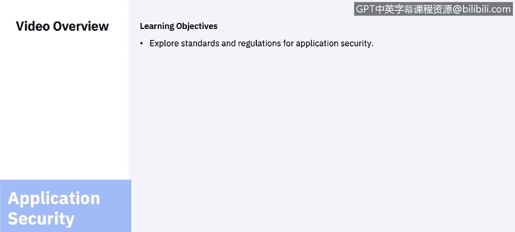
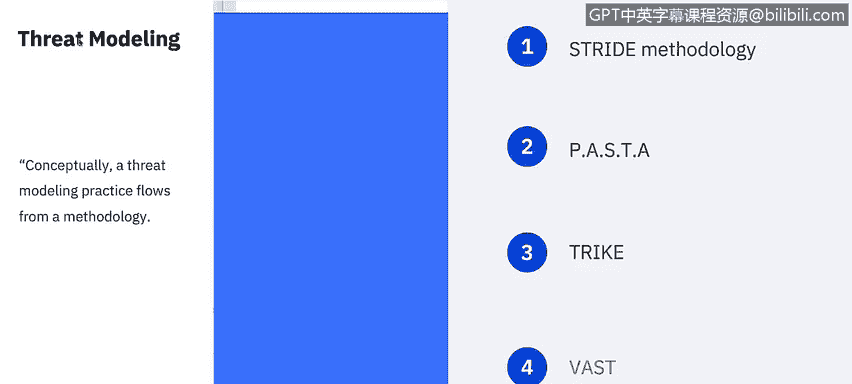
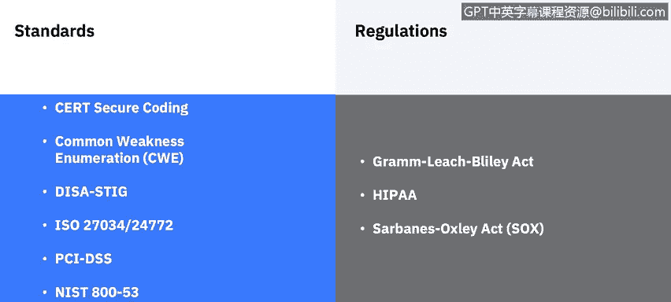
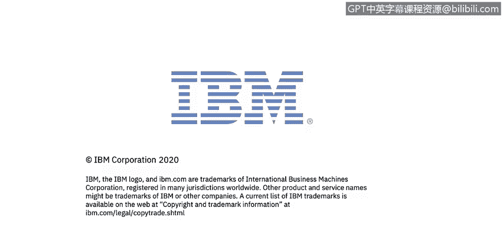

# 课程6：《网络威胁情报课程（IBM）》：61：22_04_应用安全标准与法规

## 📋 课程概述
在本节课中，我们将要学习应用安全领域的核心标准与法规。课程将从威胁建模方法入手，然后系统性地介绍多个重要的安全标准与合规性要求，帮助你构建全面的应用安全知识体系。

---

## 🔍 威胁建模方法
在进入标准与合规性审查之前，我们先花几分钟了解威胁建模。威胁建模是一个识别、列举潜在威胁（如结构性漏洞或安全措施缺失）并确定缓解措施优先级的过程。其目的是根据系统性质、可能的攻击者画像、最可能的攻击向量以及攻击者最想获取的资产，为防御者提供关于需要包含哪些控制或防御措施的系统性分析。

目前有多种威胁建模方法可供实施，通常采用以下四种方法之一：独立式、资产中心式、攻击者中心式或软件中心式。

以下是几种最著名的方法论介绍：

*   **STRIDE**：STRIDE威胁建模方法由微软于1999年提出，为开发人员提供了一个用于发现产品威胁的助记符。STRIDE模式与实践以及资产入口点是微软开发和发布的威胁建模方法之一。
*   **PASTA**：ASTA代表攻击模拟与威胁分析过程，是一种七步式、以风险为中心的方法论。它提供了一个七步流程，用于协调业务目标与技术需求，同时考虑合规性问题和业务分析。该方法旨在提供一个动态的威胁识别、列举和评分过程。威胁模型完成后，安全领域专家会对已识别的威胁进行详细分析，最终列举出适当的安全控制措施。该方法论旨在提供应用程序和基础设施的攻击者中心视图，防御者可据此制定资产中心的缓解策略。
*   **Trike**：Trike方法论的重点是将威胁模型用作风险管理工具。在此框架内，威胁模型用于满足安全审计流程。威胁模型基于需求模型构建，需求模型确立了利益相关者为每个资产类别定义的可接受风险水平。对需求模型的分析产生威胁模型，从中列举威胁并分配风险值。完成的威胁模型用于构建基于资产、角色、行动和计算风险敞口的风险模型。
*   **VAST**：VAST是可视化、敏捷和简单威胁建模的缩写。该方法论的基本原则是，有必要将威胁建模过程扩展到整个基础设施和软件开发生命周期，并将其无缝集成到敏捷软件开发方法中。该方法论旨在为不同利益相关者（应用架构师和开发人员、网络安全人员、高级管理人员）的独特需求提供可操作的输出。它提供了一种独特的应用程序和基础设施可视化方案，使得创建和使用威胁模型不需要特定的安全领域专业知识。

---

## 📜 核心安全标准与法规
安全标准和法规在所有安全领域都很重要，但对于阻止组织内部的攻击而言，可能是最重要的。以下是作为分析师或任何网络安全专业人士应该熟悉的一些额外标准。

*   **CERT C 编码标准**：这是C编程语言的软件编码标准，由CERT协调中心开发，应用于提高软件系统的安全性、可靠性和安全性。
*   **CWE**：通用缺陷枚举（CWE）是一个针对软件弱点和漏洞的分类系统。它是一个由社区项目维护的项目，目标是理解软件中的缺陷，并创建可用于识别、修复和预防这些缺陷的自动化工具。该项目由美国国家网络安全FFRDC（联邦资助的研发中心）赞助，由MITER公司运营，并得到美国CERT和美国国土安全部国家网络安全部门的支持。
*   **DISA STIGs**：国防信息系统局制定了安全技术实施指南（STIG），作为一种网络安全方法，用于标准化网络、服务器、计算机和本地设计中的安全协议，以增强整体安全性。这些指南在实施后，能增强软件、硬件、物理和逻辑架构的安全性，从而进一步减少漏洞。
*   **ISO 标准**：另一组应用安全标准来自国际标准化组织（ISO），是整体信息安全管理标准集的一部分。具体包括：
    *   **ISO 27034**：描述了当应用安全控制（ASC）指定的所需活动被预应用安全理由（PASR）取代时的最低要求。映射到PSR的ASC定义了后续应用程序的预期信任级别。
    *   **ISO 24772**：这是一项关于信息技术、编程语言的标准，它通过语言选择和使用，为如何避免编程语言中的漏洞提供了指导。
*   **PCI DSS**：支付卡行业数据安全标准（PCI DSS）由卡品牌强制要求，但由支付卡行业安全标准委员会管理。该标准的创建是为了加强对持卡人数据的控制，以减少信用卡欺诈。
*   **NIST SP 800-53**：NIST特别出版物800-53为所有美国联邦信息系统（国家安全相关系统除外）提供了安全和隐私控制目录。它由美国国家标准与技术研究院（NIST）发布，NIST是美国商务部的一个非监管机构。

---

## ⚖️ 合规性控制与测试
合规性控制与测试在应用安全中也扮演着重要角色。我将回顾一些作为网络安全专业人士应该了解的监管法规，其中大部分可能是复习，但值得再次提及。

*   **GLBA**：《格雷姆-里奇-比利雷法案》（GLBA），也称为《1999年金融服务现代化法案》。在GLBA于1999年成为法律之前，金融机构之间存在严格的政府界限。银行、保险公司和信用卡提供商在可提供的服务以及彼此之间可共享的信息方面受到严格限制。GLBA在一定程度上放松了这些规定，但这种增加的灵活性引起了人们对可能产生深远隐私影响的担忧。正因如此，该法案对即使在同一公司的子公司之间可以交换的信息类型也包含了许多限制。
*   **HIPAA**：《1996年健康保险流通与责任法案》（HIPAA）的制定主要是为了现代化医疗信息流，规定如何保护医疗保健和医疗保险行业维护的个人可识别信息免受欺诈和盗窃，并解决医疗保险覆盖范围的限制。
*   **SOX**：《2002年萨班斯-奥克斯利法案》（SOX）是一项美国联邦法律，为所有美国上市公司董事会、管理层和公共会计师事务所制定了新的或扩展的要求。该法案的若干条款也适用于私营公司，例如故意销毁证据以阻碍联邦调查。

所有这些法规，都是我们在早期课程的合规性部分已经涵盖的法规之外的补充。

---

## 🎯 课程总结
本节课中，我们一起学习了应用安全的核心组成部分。我们首先探讨了多种威胁建模方法论（如STRIDE、PASTA、Trike、VAST），它们为系统性地识别和缓解安全威胁提供了框架。接着，我们详细介绍了多个关键的安全标准与法规，包括CERT C、CWE、DISA STIGs、ISO 27034/24772、PCI DSS和NIST SP 800-53。最后，我们回顾了重要的合规性法规，如GLBA、HIPAA和SOX。正如你所见，基于安全指南进行开发以及满足合规性要求，都是应用安全不可或缺的重要组成部分。