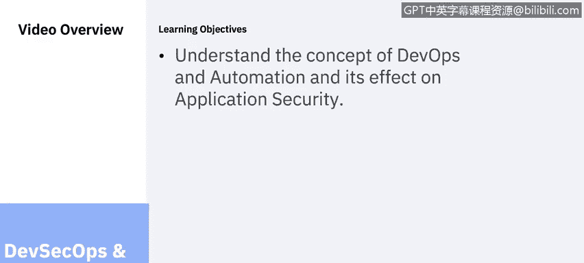
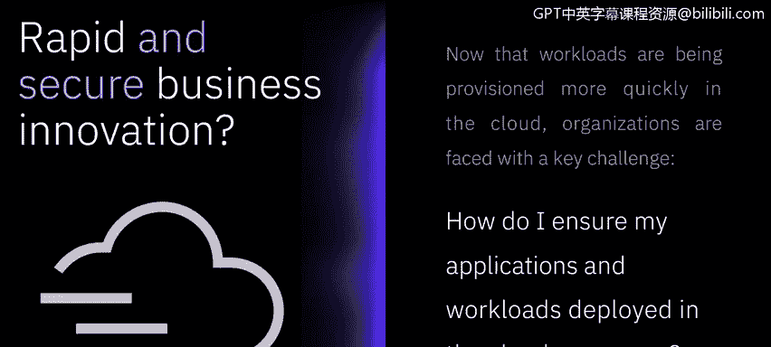
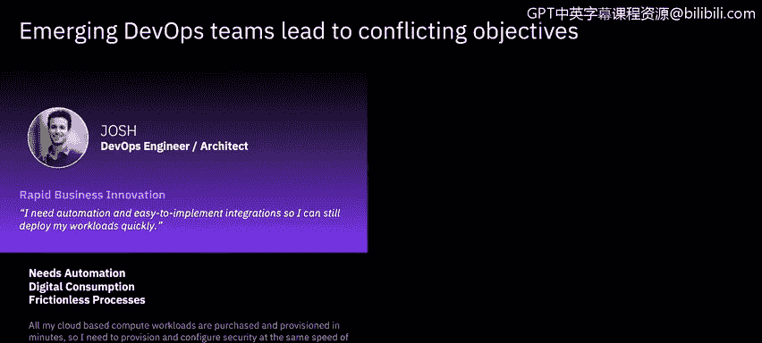
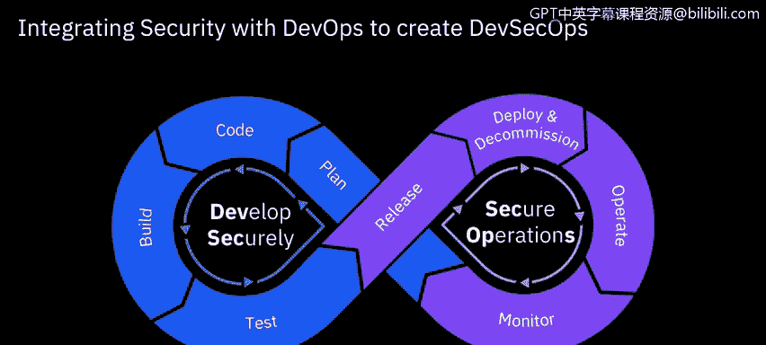
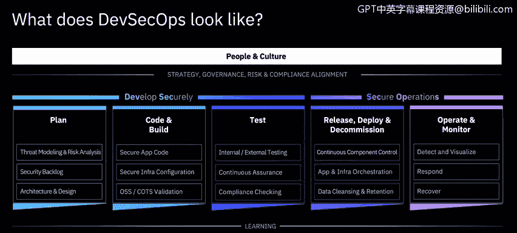
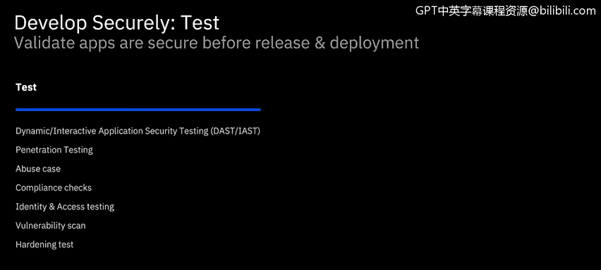
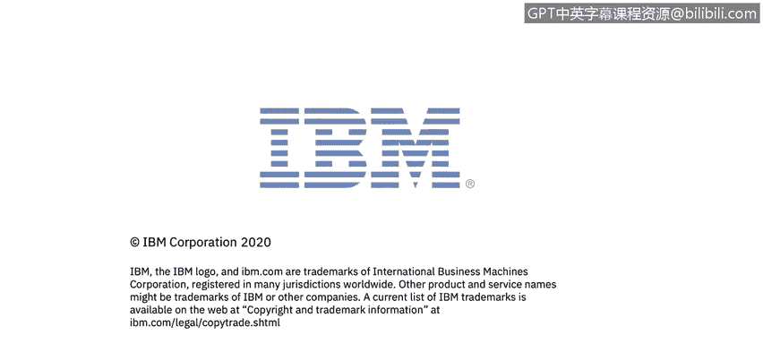

# 课程6：《网络威胁情报课程（IBM）》：62：23_01_devsecops-overview.en_subtitled

## 🛡️ DevSecOps与安全自动化概述

在本节课中，我们将要学习DevOps与自动化的概念，以及它们对应用安全的影响。我们将探讨如何将安全实践整合到快速开发和部署流程中，以实现既快速又安全的创新。

随着云计算的普及，人们对创新和资源供应的速度有了更高的期望。传统的安全检查与测试流程通常被视为会降低这种速度。因此，组织现在必须寻找方法，在确保部署安全的同时，不抑制快速的创新。

为了促进快速开发、创新和资源供应，安全实践必须跟上云时代的敏捷步伐。规划周期变得更短，部署更频繁，迭代次数也根据需要而增加。部署本身变得更小，并通过一致的流水线遵循更标准化的方法。自动化和自助服务正在缩短从构建到部署的时间，团队也被赋予了一定程度的自主权。

## 🔄 DevOps的起源与挑战

上一节我们提到了快速交付的需求，本节中我们来看看DevOps是如何应运而生的。DevOps的出现是因为开发团队主要专注于快速生产新系统、应用和功能，并尽快交付给用户。而运维团队则从完全不同的角度出发，他们的首要任务是确保系统的响应性和稳定性。

DevOps理念弥合了这一差距，它促进集成、协作和沟通，以确保开发速度与质量之间的平衡。开发工程师快速且自主地进行开发，他们与运维工程师并肩工作，以确保部署的质量和无缺陷。

但是，应用的安全性和无漏洞性如何保证？如何确保遵守可能不断变化的法规？如何确保所有开发工作都能保护数据和知识产权，并提供相应的防护与问责？

## 🤝 迈向DevSecOps

DevOps和安全工程师都希望获得易于部署、无漏洞的版本。他们也希望通过自动化和集成来实现这一目标，同时将再培训需求和开销降至最低。这就是为什么DevOps需要演变为DevSecOps，其中安全集成和自动化是关键。

**DevSecOps = 集成的、自动化的、持续的安全。**

将安全与DevOps集成就是DevSecOps。以下是一种实现方法。

## 🏗️ IBM DevSecOps参考架构

IBM DevSecOps参考架构不仅仅是一个技术框架，它还涵盖了与战略、治理、风险和合规性相一致的人员思维模式和文化。该框架指导如何安全地开发和运行安全运维，通过嵌入安全和持续学习，将DevOps转变为DevSecOps。我们将在接下来的幻灯片中更深入地探讨该框架的每个要素。

### 战略与治理

与战略和治理保持一致在系统及其组件的设计中起着核心作用。可以设置检查点，以持续确保遵守各项要求。

### 风险管理

风险是任何IT系统管理中的持续因素，因此需要建立管理风险的流程，并将其集成到运营流程中。

### 人员与文化

如果人员和文化与期望的工作方式不一致，成功将很困难。必须为团队提供培训和帮助，使其了解安全所扮演的角色以及如何以无缝方式将其集成。他们需要理解其益处如何超过任何感知到的障碍。反过来，也需要证明这些障碍要么不再需要存在，要么可以最小化，或者在团队的能力范围内可以减少。团队需要自主权，而不是官僚主义。他们需要能够拥有解决方案，进行选择，并具备考虑相关因素的知识。

### 持续改进

持续改进有助于每个人表现得更好。我们从错误中学习，并因经历而变得更好。因此，应提供教育和学习机会，并将其视为系统和项目生命周期的一部分。

### 协作与信任

拥有不同技能的团队成员之间的协作对于提高自主权和确保安全部署至关重要。当确实发生故障时，无责复盘是在无威胁环境中吸取经验教训的关键。在一个鼓励创新和探索的、信任且安全的环境中，每个人的工作效率都会更高。

## 🛠️ 将安全融入开发流程

上一节我们介绍了DevSecOps的文化与协作基础，本节中我们来看看如何将安全实践具体融入开发流程。

### 准备阶段：识别与设计

花时间根据已识别的威胁和风险来准备安全需求。构建系统以应对和克服这些威胁。安全需求应被视为一等公民，并添加到整体项目待办事项列表中进行跟踪。这与NIST框架的“识别”功能相一致。通过考虑威胁和风险，可以在设计系统时将其纳入考量。然后可以设置检查点来衡量设计的成功，并帮助确保合规性和安全性。随着GDPR等数据保护新法规的实施，企业需要规划如何保护自身及其用户的隐私权。

### 编码与构建阶段

编码和构建阶段是安全与组件创建相结合的地方。在这里，采用“左移”策略并将安全视为代码的好处可以得到真正体现。在开发时获得关于漏洞和代码弱点的实时反馈，使开发人员能够做出明智的决策，并在代码提交前解决问题。安全工程师可以提供应用编码和基础设施配置的最佳实践指导，有助于减少缺陷，并对后续测试阶段发现的漏洞采取补救措施。还应在生命周期早期检查已提交的代码和组件是否存在漏洞，以便采取快速而精确的补救措施。

**“左移”策略**是希望更早修复问题并降低修复成本的核心。应在提交代码前执行初步的漏洞检查。可以在构建时重新检查，并能够阻止使用存在严重漏洞的组件。还可以监控存储库中的发布组件，以更新其使用状态。根据需要，可以执行额外的测试，如我们在前一课中讨论过的白盒测试或黑盒测试。

### 测试与部署阶段

自动化安全检查应贯穿测试和合规性检查过程，并能够基于开发人员在本地和构建时执行的静态测试进行扩展。一套全面的集成自动化测试可以为流水线提供持续保证，促进持续确认系统变更没有影响系统满足其安全和合规要求的能力。这反过来降低了与部署中组件变更相关的风险，同时为风险管理者提供实时保证报告。

一套全面的自动化测试和检查将建立在开发人员编码和持续集成期间执行的测试之上。随着“左移”方法使开发人员能够在提交前发现并采取补救措施，自动化测试应呈现出漏洞和缺陷发现数量下降的趋势。自动化安全测试将减少手动渗透测试的需求。然而，在可预见的未来，要创建安全的系统，一个全面有效的方法可能仍会包含手动测试。

## 📊 总结

本节课中我们一起学习了DevSecOps与安全自动化的核心概念。我们了解到，为了在云时代保持快速创新，必须将安全实践深度集成到DevOps流程中，形成DevSecOps文化。这涉及到从战略、人员、流程到技术的全方位转变，特别是通过“左移”策略和自动化工具，在开发早期引入安全检查，从而实现快速、安全且合规的软件交付。