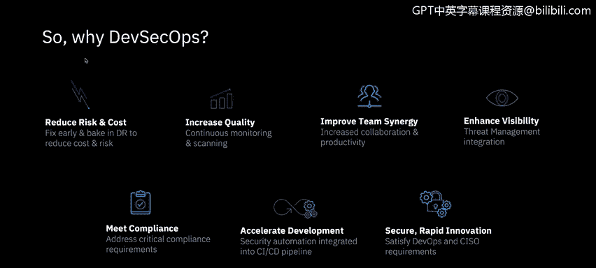
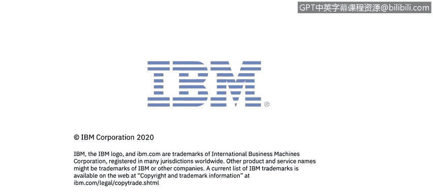

# 课程6：《网络威胁情报课程（IBM）》：63：持续监控与安全运维

在本节课程中，我们将学习组件发布后的安全状态管理，以及如何通过持续监控和自动化运维来保障系统在动态云环境中的安全性。

## 概述

组件在发布后，其安全状态可能发生变化。持续监控使程序能够响应这些变化，并对未来的部署强制执行安全策略。云环境的动态性改变了部署的方式和频率，环境可能在一天内被多次创建和销毁。因此，必须以受控、安全的方式进行环境的创建和销毁，并考虑数据清理与保留策略。资产销毁过程必须经得起审查，并应获得认证。

## 组件发布后的持续扫描

上一节我们介绍了安全测试，本节我们来看看组件发布后的持续管理。

当组件通过测试并成功发布后，需要在程序注册表和代码仓库中进行持续扫描。这能实现对漏洞和许可证状态的最新评估。此信息支持基于组件当前状态做出决策，并限制其未来的部署。

以下是持续扫描的关键作用：
*   **主动修复**：注册表扫描的输出会告知团队是否需要采取补救措施，而无需等待在生产环境中进行漏洞扫描。
*   **版本与库存管理**：发布的组件会被版本化，这些详细信息存储在组件管理数据库（CMDB）中，以记录当前环境状态。这反过来可用于报告和安全审计。
*   **安全基础**：没有资产清单，就无法保护任何东西。你必须清楚资产中有什么。

## 受控的部署与销毁流程

为了应对云环境的快速变化，我们需要对部署和销毁流程进行严格控制。

通过将工具链作为唯一的部署机制，可以获得对部署过程的完全控制。使用参数化的“基础设施即代码”模式，并结合集中的键值（Kv）和密钥存储，可以确保创建和销毁过程的可重复性。

在云时代，组件应被视为**牲畜（cattle）** 而非**宠物（pets）**。这意味着我们可以根据需求销毁和创建可变的镜像，而非长期维护固定的个体。

*   **访问控制**：IAM（身份和访问管理）控制有助于以受监管的方式控制谁或什么可以控制及构造服务。
*   **数据处置**：存储数据的SaaS（软件即服务）产品在数据处置方面可能需要考虑不同的流程。

## 安全运维的整合

安全与运维在“运营”和“监控”阶段是紧密结合的。

对系统内状态和组件的可视化增加了上下文和清晰度，有助于威胁检测。如果无法检测到威胁，就无法修复它。

与系统集成的运维安全有助于确保系统的安全状况在最新信息的支持下达到最佳状态。

*   **自动化响应**：**“剧本即代码”** 可用于在检测到问题时进行修复和报告。它们可以手动运行，目标是最终实现针对问题的自动化响应。
*   **标准化流程**：标准化的剧本以受控、可衡量的方式驱动响应和恢复工作，以减少附带损害和潜伏的攻击载体。
*   **运维关键实践**：有效的安全运维还包括密钥轮换、配置验证和库存维护。

在安全运维的“运营与监控”阶段，问题不在于你是否会被攻击，而在于何时被攻击。

## 关键术语与概念

以下是本领域的一些核心术语：

*   **RASP（运行时应用自我保护）**：一种安全技术，利用运行时检测来发现和阻断计算机攻击。
*   **蓝队 vs 红队 / 演练日**：蓝队成员是内部的网络安全人员，而红队则是试图侵入系统的外部实体。
*   **平均故障间隔时间（MTBF）与平均修复时间（MTTR）**：衡量系统可靠性和可维护性的指标。
*   **SOAR（安全编排、自动化与响应）**：用于提升安全运营效率的技术集合。

## DevSecOps的优势总结

让开发（Dev）、运维（Ops）和安全（Sec）团队尽早协同工作至关重要。DevSecOps可以带来以下益处：
*   降低风险和成本。
*   提高质量。
*   改善团队协同。
*   增强可见性。
*   满足合规要求。
*   加速开发。
*   保障快速创新的安全性。

## 总结

本节课中，我们一起学习了DevSecOps在部署后的关键实践。我们了解到持续监控对于管理动态组件安全状态的重要性，掌握了通过“基础设施即代码”和集中化管控来实现安全、可重复的部署与销毁流程。同时，我们认识到将安全深度整合到运维环节中，利用自动化剧本和可视化工具进行主动检测与响应，是构建弹性安全体系的核心。最后，DevSecOps通过促进团队早期协作，为组织带来了降低风险、加速交付等多重价值。