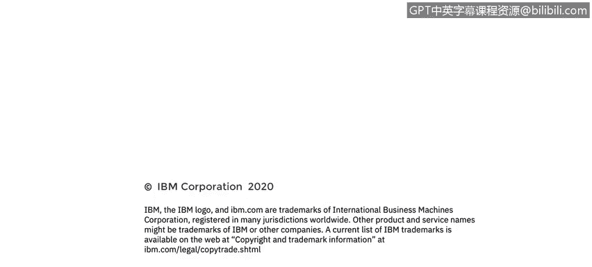

# 课程6：《网络威胁情报课程（IBM）》：64：25_01_应用安全缺陷与编写安全代码

## 📖 课程概述
在本节课中，我们将探讨应用安全缺陷的严重性，并学习编写安全代码的核心原则。我们将了解安全漏洞如何影响企业声誉与财务状况，并掌握预防常见漏洞的基本方法。

---

## 🚨 第一节：安全缺陷的严重后果
上一节我们介绍了课程背景，本节中我们来看看安全缺陷可能带来的具体后果。

如果你的安全缺陷变得举世闻名会怎样？从2014年的心脏滴血和破壳漏洞开始，安全漏洞现在通常会拥有自己的专属网站、炫酷的名称并引发大量媒体报道。安全问题已成为董事会级别的议题，维基解密等事件也印证了这一点。安全研究领域正在迅速扩展。

对于安全研究人员而言，以此谋生的最佳方式就是利用这种名声获利。发现心脏滴血、破壳或近期幽灵与熔断漏洞的研究人员，他们获得了经济保障。许多人试图以安全研究为基础创业，而首要途径就是寻找软件中的安全漏洞。安全研究人员的首要人生目标，就是在某家知名安全供应商的旗舰产品中发现一个重大的安全漏洞，这将为他们奠定事业基础。

这些漏洞具有轰动效应，给我们的客户和我们自身带来巨大成本。同时，不要忘记安全漏洞可能导致法律诉讼。需要提醒大家的主要一点是，美国联邦贸易委员会会监控所有对其软件安全性做出声明的公司。如果联邦贸易委员会认定你夸大了安全声明，他们将介入并乐于实施所谓的“同意令”。

自2000年以来，我已看到超过45起因安全实践不足而导致的同意令。最近，这些同意令的期限往往长达20年。这意味着美国联邦政府将介入并明确规定我们如何运行安全计划。可以想象，管理层非常不希望这种情况发生。因此，我们确保软件安全真实有效的方法之一，就是确保我们软件的安全性真实有效。

---

## 📊 第二节：令人担忧的数据与市场
上一节我们了解了安全缺陷的宏观影响，本节中我们来看看一些具体的数据和背后的黑色产业链。

你应该感到担忧吗？绝对应该。这里有一些快速收集的事实。波耐蒙研究所每年进行一次研究，我手头最新的数据来自2017年。他们估计每次数据泄露的平均成本为每条记录141美元，总成本平均为362万美元。

你可能没有意识到的是，零日漏洞的黑色市场正在增长。这意味着在暗网上，有公司、个人和犯罪集团在监视和寻找漏洞。发现漏洞后，你可以做两件事：负责任地向供应商披露，让我们修复漏洞，并在修复完成后获得一些声誉；或者你可以保留漏洞，并将其出售给敌对国家。

我们几周前了解到的一个漏洞，其售价在5千到2万5千美元之间。因此，如果你决定走这条路而非负责任地披露，你可以赚取可观的金钱。我们都听说过这些数据泄露事件，但问题是我们是否真正吸取了教训。

以下是几个快速示例。趋势科技是另一家网络安全供应商。有两位研究人员决定专注于研究其安全产品，并在六个月内发现了223个漏洞。事实上，曾经担任我这个角色的人认为这是一个挑战，于是去帮助趋势科技系统，做我们现在正在与你们做的事情，以提高意识并确保我们的开发人员能够交付安全的软件。

还有Equifax事件，它影响了众多美国人。那是一个开源软件包中相对较小的漏洞。我们广泛使用开源软件，本应扫描其中的已知漏洞，而这是一个已知漏洞。但负责应用补丁的人员没有及时处理，他们计划在下个季度初解决。不幸的是，黑客在此期间搜索具有该漏洞的网站，并找到了Equifax。结果，其CEO、CIO和首席安全官全部离职。这变成了一个大问题，我希望你们能相信，避免安全漏洞是一件非常重要的事情。

---

## 🎯 第三节：我们将要应对的漏洞类型
在了解了问题的严重性后，本节中我们来看看本系列课程将重点讲解哪些类型的安全问题。

在本系列课程中，我们将处理多种不同类型的问题。我想花点时间解释一下我们选择这些内容的原因。跨站脚本攻击在漏洞数量上占绝大多数，因此我们从这个主题开始。在云端应用中，跨站脚本攻击也占绝大多数。你还会看到加密漏洞、操作系统命令注入、SQL注入。这些虽然数量稍少，但属于非常高严重性的问题，可能造成严重后果。因此，七月份的下一个演示将专注于注入攻击。

---

## ⚖️ 第四节：开发者与攻击者的不对称性
现在大家可能感到有些沮丧，但这是有原因的。编写安全的软件确实不是一项容易的任务。我在开发领域工作了30年，我们确实面临很大的时间压力。需要实现很多功能，但时间有限，因此我们专注于确保分配的功能特性能够完成。不幸的是，黑客可能有的是时间坐在那里研究、分析，寻找那一个漏洞，或者将一两个甚至三个小漏洞串联起来，造成真正的损害。

正如我所说，我们的时间不多，重点通常是我们必须完成的功能特性，安全往往不是我们的首要关注点。与此同时，黑客正在寻找那一个漏洞。

在动机和资源方面，开发者负责产品的主要功能，他们个人通常不会直接受到产品成败的影响。但黑客和安全研究人员则不同，他们的动机是炫耀的权利、声誉、赚取巨额金钱，有时甚至是政治目的，并且可能得到国家支持。因此，他们背后有很多资源。

我认为不能完全责怪一些国家采取这种策略，因为在时间和金钱投资方面，投资30年在大学和研究项目上以开发所需技术，远比雇佣一些优秀的黑客去窃取要花费更长的时间和更多的金钱。所以我们必须警惕这一点。

当然，我们要求开发者现在学习一些安全知识，足以避免引入问题。但那些黑客是安全领域的专家，他们非常仔细地研究这些。然而，通过良好的安全教育、优秀的设计和实施实践，情况并非一片黯淡。

---

## 🛡️ 第五节：预防新漏洞的策略
那么，我们如何做到这一点呢？本节中我们将探讨预防新漏洞产生的核心策略。

我们有以下几种方法。首先是预防新漏洞。我认为开发者能做的最好的事情之一就是了解OWASP Top 10。它在网站上列出，并以三四种不同的方式呈现，取决于你最佳的学习和记忆方式。每年每位开发者都应该复习OWASP Top 10，以确保他们牢记需要注意的问题。

你需要像黑客一样思考，这也是本次演示的原因之一。不仅要考虑你的用例，还要考虑你的滥用案例，即针对你的应用程序可能实施的恶意行为，以及有人能借此实现什么目标。

然后在你的软件中构建防御措施。关键措施总是包括：
*   **输入验证**：确保所有输入数据都符合预期格式和范围。
*   **输出净化**：对输出到用户或其他系统的数据进行处理，防止恶意代码执行。
*   **强加密**：使用经过验证的强加密算法来保护敏感数据。
*   **强身份验证和授权**：确保只有授权用户才能访问特定资源和功能。

如果你处理好这些，我认为90%的问题都会消失。很多时候，我看到团队苦苦挣扎，他们可能选择了一个在安全方面声誉不佳的框架，因此他们从此以后就不断地修补一个又一个跨站脚本问题，而不是选择一个能为应用程序提供跨站脚本保护的框架。所以，如果你试图自己处理所有问题，可能会挂一漏万，总会有人发现你遗漏的东西。

另一件需要记住的好事是：不要认为如果你不面向互联网就没有风险。大多数数据泄露仍然来自内部人员。因此，位于防火墙后、网络内部并不能提供防御，因为有时坏人就在内部。对于文件和数据库也是如此，仅仅因为它们是本地的，并不意味着不需要保护。

---

## 🔧 第六节：处理现有漏洞与架构考量
上一节我们讨论了如何预防新漏洞，本节中我们来看看如何处理已经存在的漏洞，并从架构层面进行改进。

这就是预防新漏洞。接下来是确保解决现有漏洞。有时，重新设计产品前端、选择新技术可能是合理的。使用Struts 1的人都必须迁移到另一个版本，有些人选择不升级到Struts 2，而是转向其他技术。花时间研究你所用技术的安全特性，并查看它们的历史记录是值得的。

实施可以在顶层修复安全缺陷的架构更改。如果你能添加一个进行验证的层，那么即使有人在其他地方编写代码时忘记对某个特定参数进行验证，情况也会好得多。这比依赖并指望每个人每次编写代码时都能考虑到所有事情要好。

同样，不要仅仅局部修复问题，看看你能做什么。然后，请认识到安全漏洞是特殊的。是的，它们是软件缺陷，是软件错误。但它们会危及客户的数据，具有轰动效应，可能出现在新闻中，并可能造成真正严重的问题。因此，许多团队喜欢说“我们下个季度再交付，所以我们要申请豁免或延期”。你真的需要仔细审视这些事情并认真思考，这可能不是很明智的做法，Equifax就是这样做的。

---

## 📝 课程总结
在本节课中，我们一起学习了应用安全缺陷的广泛影响及其严重后果。我们探讨了安全漏洞如何从技术问题演变为商业和法律风险，并分析了开发者与攻击者在动机、资源和时间上的不对称性。核心内容围绕如何预防漏洞展开，重点强调了**输入验证**、**输出净化**、**强加密**以及**强身份验证和授权**这四大防御支柱。最后，我们讨论了处理现有漏洞的策略，包括考虑架构级解决方案和认识到安全漏洞的特殊性，需要优先处理。记住，编写安全代码是一个持续的过程，需要将安全思维融入开发的每一个阶段。