# 课程6：《网络威胁情报课程（IBM）》：65：跨站脚本攻击详解

## 概述
在本节课中，我们将学习跨站脚本攻击的定义、危害、常见性以及其工作原理。跨站脚本攻击是Web应用程序中最常见的漏洞之一，理解其机制对于开发安全的应用程序至关重要。

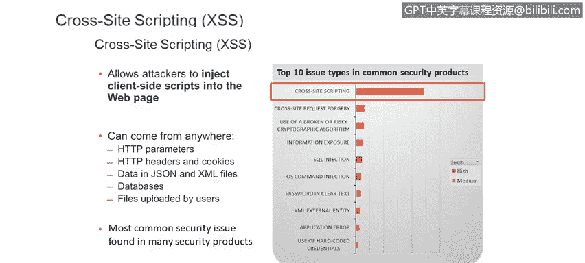

## 什么是跨站脚本攻击？
跨站脚本攻击是一种允许未经授权的人员向您的Web应用程序中注入客户端脚本的漏洞类型。这些恶意脚本可以来自任何地方。

## 跨站脚本攻击的危害
跨站脚本攻击可用于多种恶意目的。以下是其主要危害：

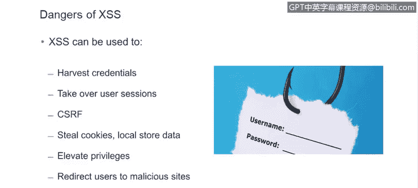

*   窃取用户凭据。
*   攻击者可以接管用户会话。
*   可用于促进跨站请求伪造。
*   窃取用户的Cookie或本地存储的数据。
*   可用于提升权限。
*   可将用户重定向至恶意网站。

由此可见，跨站脚本攻击能造成广泛的损害。

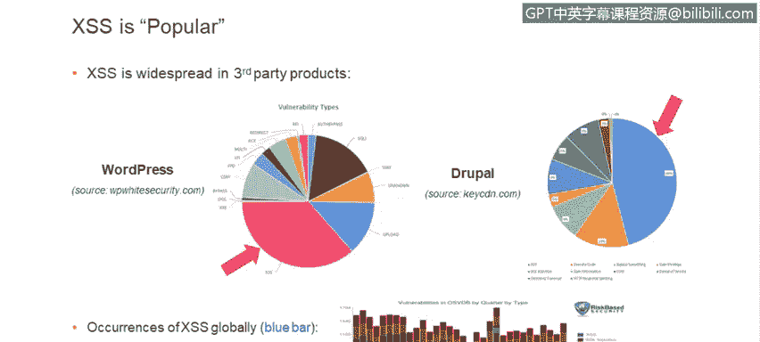

## 跨站脚本攻击的普遍性
跨站脚本攻击在各种产品中都非常普遍。例如，在WordPress和Drupal这两个著名产品中，跨站脚本攻击是统计上出现频率最高的漏洞。几年前，基于风险的安全公司进行了一项研究，分析了最常见漏洞类型。该研究基于一个存储已知漏洞信息的互联网数据库。数据显示，从2007年到2015年，在大多数季度中，跨站脚本攻击是所有类型产品中发生率最高的漏洞。

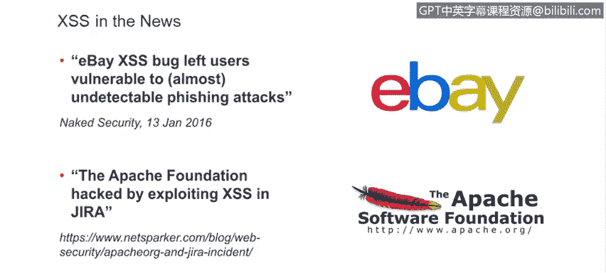

## 实际攻击案例
跨站脚本攻击不仅被质量保证团队或渗透测试团队发现，实际上也正被攻击者积极利用。有两个突出的近期案例：一是eBay曾遭受基于跨站脚本攻击的网络钓鱼攻击；二是Apache基金会曾被黑客入侵，在其攻击链中，第一步就是利用了Jira中的跨站脚本漏洞。此外还有许多其他例子。

因此，该漏洞出现在OWASP十大Web应用安全风险列表中并不令人意外。如果您不熟悉此列表，强烈建议您查阅OWASP，这是一个专注于Web应用安全的在线社区。作为开发者，应了解此列表并时常参考，以确保您的代码不会引入这些漏洞。

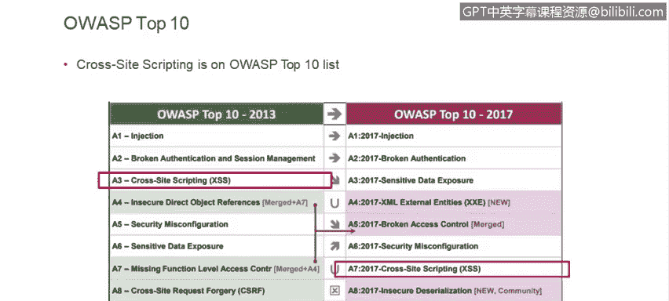

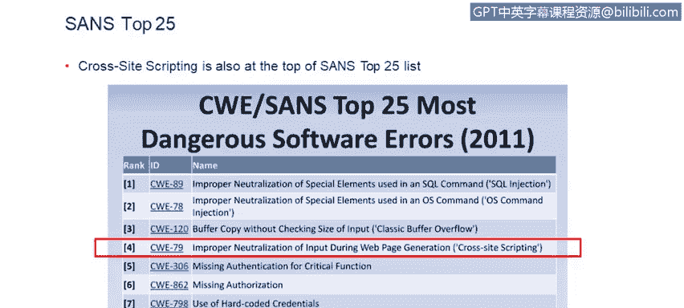

另一个相关的列表是SANS Top 25，跨站脚本攻击在该列表中位列第四。这充分说明了其危险性。

## 跨站脚本攻击的工作原理
现在，让我们看看跨站脚本攻击实际上是如何运作的。我们将使用一个非常简单的应用程序示例，该程序具有简单的数据输入功能。在这个例子中，我们输入用户信息。假设我们有一个非常简单的表单，用于填写用户名、密码和角色，输入的用户会显示在一个简单的表格中。

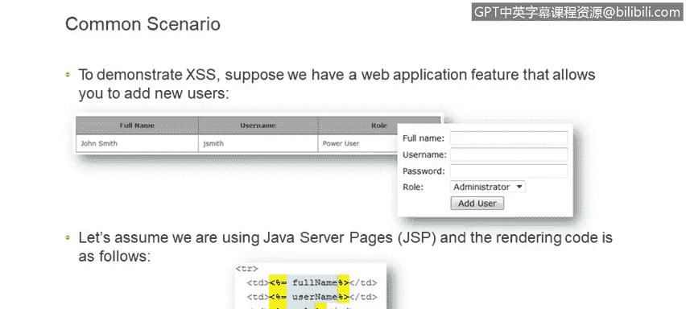

对于此示例，我们将使用Java服务器页面。但实际上，几乎任何技术或框架都可能存在跨站脚本漏洞。如果渲染代码很简单，没有任何额外的检查，只是简单地反射回输入的任何数据，那么输出将不受保护。

常规的数据输入不会引起任何问题。用户输入姓名、用户名和其他信息，生成的HTML基本上会原样反射回输入的内容。我们假设此应用程序背后有某种数据库，数据存储在那里。每次您访问用户列表时，都会得到一个格式良好的HTML页面。到目前为止一切正常。

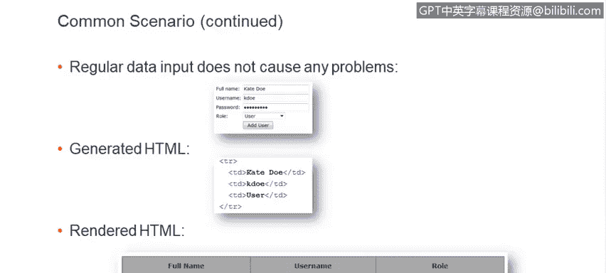

假设有一个恶意用户决定输入不仅仅是全名的内容。例如，他们输入一个HTML标签，在本例中是`<script>`标签和一段JavaScript代码。由于我们的应用程序在输入或输出端都没有任何特殊防御措施，输入的数据将按原样存储在数据库中，并在渲染用户列表时按原样渲染。由于没有特殊处理，输入的`<script>`标签将被浏览器原样解释为脚本标签。

因此，您会在底部看到实际的示例。因为它是一个脚本标签，脚本会执行并弹出一个对话框。这绝对不是应用程序开发者预期的行为，但却是用户能够做到的事情。

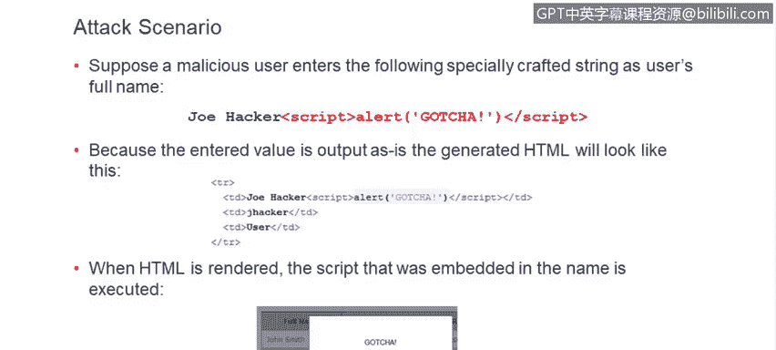

## 存储型与反射型跨站脚本攻击
这看起来像是一个有趣的把戏，可以展示给朋友看，但它真的无害吗？不幸的是，它非常危险。仔细想想，本质上，您是在允许未经授权的人员向您的应用程序中注入功能，而这种功能可以是任何东西，很可能不像上一张幻灯片中展示的那样无害。

这里的另一个危险是，您的客户在使用您的应用程序时信任它，而这种信任现在自动扩展到了第三方注入的这段代码。

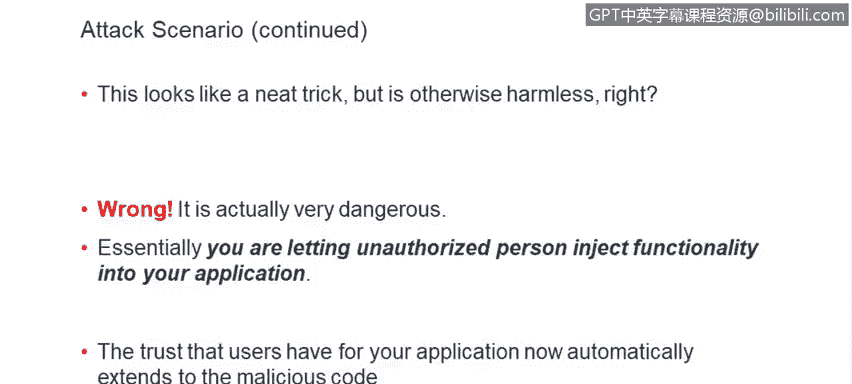

一旦记录被添加，在本例中，它将被存储在数据库中，每次渲染用户列表时，这个对话框都会弹出。这实际上是**存储型跨站脚本攻击**的一个例子，与**反射型跨站脚本攻击**相比，这是一种更危险的变体。存储型跨站脚本攻击被应用程序保留，通常会影响多个用户。

这里增加的另一个危险是，受此恶意脚本影响的其他用户可能是应用程序管理员。实际上，这可能由此导致权限提升，有人可能接管管理员账户。

反射型跨站脚本攻击的危险性稍低。它通常作为电子邮件的一部分或嵌入在恶意链接中发送，通常只影响一个用户。

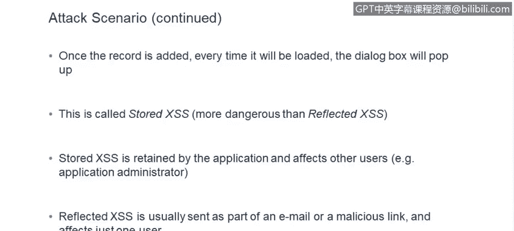

## 一个更危险的示例
现在，让我们看一个更险恶的例子，看看跨站脚本攻击实际上能做什么。假设恶意用户输入他的名字，但同时添加了这段包含HTML、样式表和JavaScript的代码块，看看它实际上如何在客户端应用程序中渲染。

当用户列表被渲染时，现在会弹出一个对话框，提示会话已过期，并要求用户输入其凭据。现在我们面临一个非常严重的安全问题。如果攻击者调整样式表使其恰到好处，并与应用程序的整体外观和感觉相匹配，一些用户可能会真的上当。许多用户可能会认为：“是的，我的会话过期了，最好重新登录。”然后他们会输入用户名和密码，这些信息将被攻击者获取并用于登录应用程序。攻击者可以冒充您。此外，正如我们所知，用户会在多个网站和应用程序中重复使用他们的登录凭据，因此这种凭据窃取实际上可能被用于其他地方，比如您的银行应用程序或您生活中的任何重要应用程序。

由此可见，这已经演变成一个非常危险的局面，必须加以缓解。

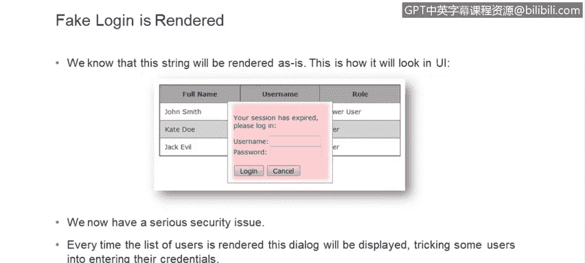

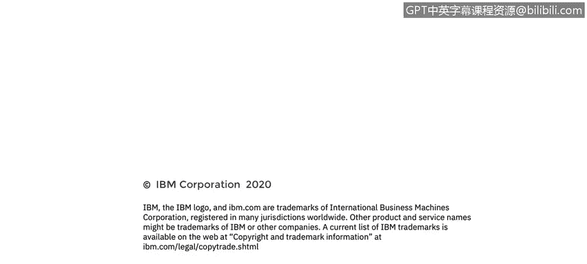

## 总结
本节课中，我们一起学习了跨站脚本攻击的核心概念。我们了解了其定义、广泛存在的危害、在实际产品中的高发性，并通过示例深入剖析了其工作原理，特别是存储型与反射型攻击的区别。最重要的是，我们看到了一个简单的输入漏洞如何演变成窃取用户凭据的严重威胁。理解这些是构建安全Web应用、防御此类攻击的第一步。