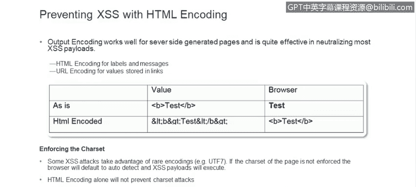
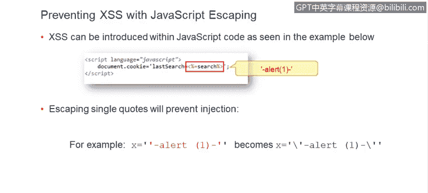
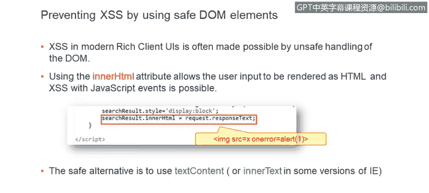
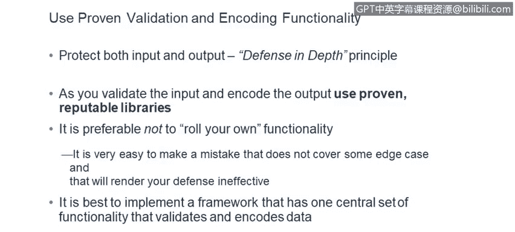
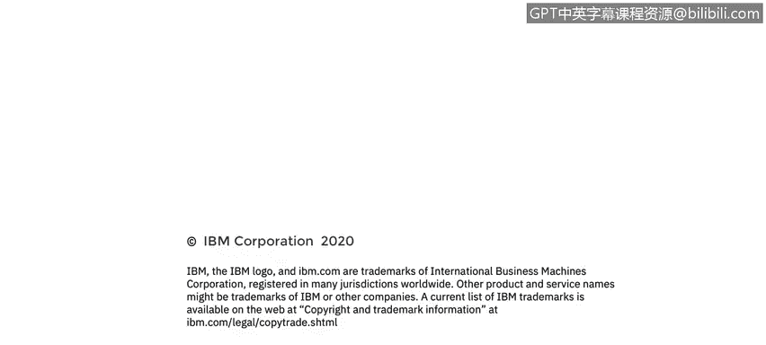

# 课程6：《网络威胁情报课程（IBM）》：66：27_03_cross-site-scripting-effective-defenses

## 概述 📋

在本节课中，我们将学习如何有效防御跨站脚本攻击。跨站脚本是一种常见的网络攻击，但通过正确的编码和验证技术，可以有效地防止它。我们将探讨输出编码、输入验证等核心防御策略，并了解如何在实际开发中应用这些最佳实践。

---

## 输出编码：HTML编码 🛡️

上一节我们介绍了跨站脚本攻击的基本原理，本节中我们来看看如何通过输出编码来防御它。防止跨站脚本攻击并不困难，关键在于开发代码时要谨慎。输出编码是一种非常有效的方法。

对于HTML内容，使用HTML编码可以很好地防御通过URL传递的跨站脚本攻击。对于特殊字符，可以使用URL编码。

HTML编码的工作原理如下：如果你像示例中那样，将数据（如 `test`）原样渲染在 `<b>` 标签中，浏览器会将其渲染为粗体文本。

```html
<b>test</b>
```



然而，如果对代码进行HTML编码，意味着将HTML格式中具有特殊意义的字符替换为HTML实体，那么这段输入将不再被视为有效的HTML，而会变成无害的文本。

例如，如果我们通过编程方式将尖括号 `<` 和 `>` 替换为对应的HTML实体 `&lt;` 和 `&gt;`，浏览器将按用户输入的原样渲染字符串，而不会将其解释为HTML或JavaScript代码，从而失去特殊含义。

```html
&lt;b&gt;test&lt;/b&gt;
```

当然，像所有事情一样，也存在特殊情况需要注意。在某些极端情况下，编码可能不起作用，例如UTF-7编码攻击。这是一种相当罕见的攻击类型，但为了应对这种情况，你还需要注意页面渲染所使用的编码。如果使用UTF-8，你必须强制指定，以防止浏览器自动识别UTF-7编码并触发潜在的跨站脚本攻击。


回到我们的示例，如何修复它呢？

以下是用于转义和正确中和危险输出的多种功能。在这个特定案例中，Java的 `StringEscapeUtils` 类中有一个名为 `escapeHtml` 的函数。如果对每个字段都使用它，用户可能输入的所有特殊字符都将被正确地替换为HTML实体。

```java
String safeOutput = StringEscapeUtils.escapeHtml(userInput);
```



如底部所示，显示的文本将与攻击者输入的一模一样，看起来正常，但会失去其特殊含义，不再被解释为HTML和嵌入的JavaScript。

---

## 输出编码：JavaScript上下文 🔐

转义HTML字符只是问题的一部分。有时，当你允许用户输入的内容作为你生成的JavaScript代码的一部分出现时，跨站脚本攻击也可能发生。

在这个特定案例中，用户指定的搜索变量（`input`）被设置为一个cookie值，但没有采取任何措施来中和可能的恶意输入。攻击者可以添加一个 `alert` JavaScript函数并用单引号包围，这将使他们能够突破代码中的单引号，并让 `alert` 函数实际执行。



因此，当你将用户数据渲染为你生成的JavaScript的一部分时，也必须注意这一点，并转义诸如单引号之类的字符，如下方示例所示。

在现代应用程序中，我们使用大量丰富的客户端用户界面。不幸的是，它们通常是在不安全地处理文档对象模型的基础上构建的。

DOM中有一个名为 `innerHTML` 的属性，你放入其中的任何内容都将被解释为HTML。因此，如果用户输入以某种方式进入了该属性，那么用户输入中的任何内容都将被解释为HTML，以及其中嵌入的任何JavaScript代码。

例如，如果有一个来自用户的 `responseText` 变量，用户在其中嵌入了一个无效的图像标签规范，那么该规范的 `onerror` 处理程序将会触发，并执行 `alert` 函数。当然，在真实案例中，JavaScript功能不会如此无害。

在这种情况下，重要的是要注意并使用 `innerHTML` 的安全替代方案，即 `textContent` 属性，或者在Internet Explorer的某些版本中使用 `innerText`。

---

## 避免动态代码生成的危险 ⚠️

还有一些特殊情况，例如使用JavaScript的 `eval` 函数。`eval` 是一个非常强大但也非常危险的函数，它本质上会接收你给它的任何输入，并将其解释为JavaScript代码。我们强烈建议不要使用此函数，因为很多事情都可能出错。

但如果无法避免，你必须非常仔细地审查输入该函数的内容。同样，一般来说，动态生成JavaScript代码片段也是相当危险的，如果操作不当的话。

最好尽可能地将来自用户的数据与你的代码分开。下方你看到一个具体的例子，说明了如果你使用 `eval` 函数，并且在没有进行任何净化的情况下直接使用用户提供的输入，可能会发生什么。

---

## 输入验证：白名单策略 ✅

输出编码只是解决方案的一部分，另一个重要的事情是输入验证。你肯定不希望恶意数据进入你的产品。

进行输入验证有不同的方式。我们推荐的一种方法称为“白名单”。顾名思义，在这种情况下，你构建一个希望是非常简短、限制性很强的列表，列出你愿意接受的字符集或字符串集，然后拒绝出现的任何其他内容。这将把攻击面减少到一个已知的数量，你确切地知道你在处理什么，并拒绝所有其他输入。

如果可能，大多数输入应该被白名单限制在一个非常有限的集合内，例如字母数字字符。在大多数数据输入场景中，这应该足够了。存在一些特殊情况，你需要允许单引号或其他字符，但特殊字符应该基于例外情况来允许，并且你必须仔细思考：你真的希望允许某个特定字符进入你的应用程序吗？

在我们的测试工作中，我们看到其他方法被实施，例如“黑名单”。顾名思义，这是白名单的反面。如果你实施黑名单，你基本上是在说：我知道这些特定类型的恶意输出，我不想接受它们，但我会接受其他一切。

你可以想象，现在你面对的是未知的数量，是整个可能的输入宇宙，其中一些可能是恶意的，但你只是没有意识到。有一个非常有趣的页面，我强烈推荐所有开发人员看一看，那就是OWASP跨站脚本攻击规避技巧页面。

当你浏览它时，我想你会对绕过你应用程序中设置的任何黑名单的不同模式和方式的数量感到不愉快的惊讶。外面有很多非常聪明的人，他们真的可以造成一些破坏，因此真的不建议你采用使用黑名单的方法。

---


## 客户端验证的局限性 🖥️

我们也不时看到客户端输入验证。这是指你基本上在浏览器中嵌入JavaScript代码，当用户输入数据时，你获取值并检查它是否有效，拒绝无效的内容。这对于用户友好性和产品可用性非常好。

不幸的是，这对于产品安全性毫无帮助，因为攻击者通常甚至不会从浏览器执行攻击。他们会使用所谓的攻击代理直接针对服务器。因此，你在浏览器中实现的用于检查值的JavaScript功能，在保护应用程序免受恶意输入和编码输出时，甚至可能不会被执行。

---

## 深度防御原则 🏰

我认为你应该同时实施这两种方法。这就是我们所谓的“深度防御”原则。有可能其中一种机制存在缺陷，但在那种情况下，另一种机制会接管。如果你有多层防御，其中一层是稳固的并实际保护你的应用程序的机会就更高。因此，实施多种机制比只选择一种更好。

当你实施输入验证或输出编码时，尽量不要自己编写功能。正确地做到这一点并不容易，很容易犯错误或忘记某些边缘情况，而这正是黑客所需要的。他们只需要一个突破口就能进入你的应用程序。

有许多经过验证的库存在于多种语言中。当你使用经过验证的、成熟的功能时，很多人可能已经使用过它，很多错误可能已经被发现和修复。因此，你最好使用行业通用的东西，而不是你自己编写的东西，这样会更安全。

正如Ron提到的，我想重申，在我们的代码审查中，我们看到很多地方人们只是在代码中随意添加各种检查，这是一种非常不安全的方法。很容易遗漏一个检查恶意输入或未正确编码输出的地方，你的应用程序就可能被攻破。

更好的方法是构建一个框架，例如，将你的验证功能集中在一个地方，并从所有接受输入的地方调用它；将你输出的数据编码也集中在一个地方。这样，维护起来会容易得多，代码也会更紧凑。

如果有新开发人员加入你的团队，或者你是一位经验丰富的开发人员但只是忘记在某个输入字段上添加检查，如果你有一个保护你的框架，它仍然是安全的，不会依赖于个别开发人员的技能。

---



## 总结 📝


本节课中我们一起学习了防御跨站脚本攻击的核心策略。

1.  **编码所有输出数据**：请对你作为HTML或可能动态生成的JavaScript片段的一部分生成的所有数据输出进行编码。
2.  **使用严格的白名单**：在接受输入时，请使用严格的白名单。我们不建议使用黑名单或客户端验证，这些方法效果不佳。
3.  **依赖成熟库**：最后，尽量不要自己编写功能，而是依赖经过验证的库。




当然，我们在这里只是浅尝辄止，这是一个更广泛的主题，有很多细节需要注意。因此，在幻灯片中，我们列出了一些你可以查看的链接，以了解更多信息。