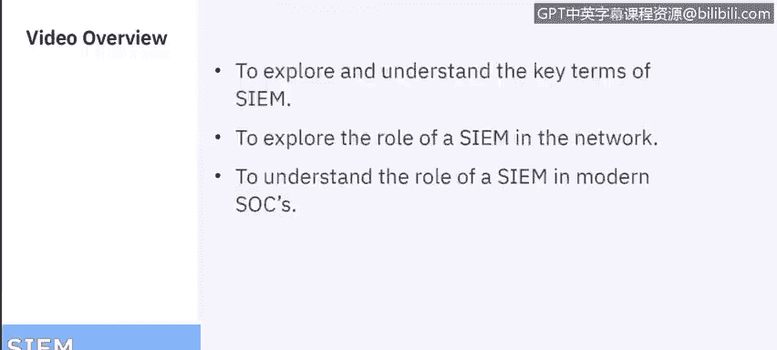
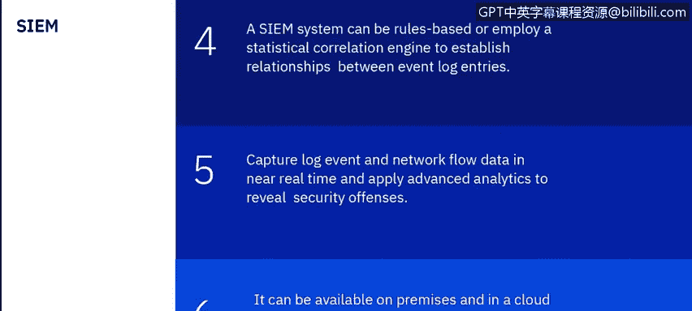
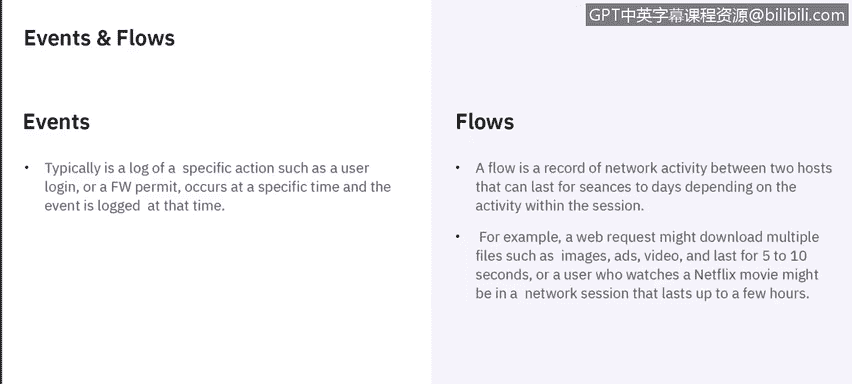
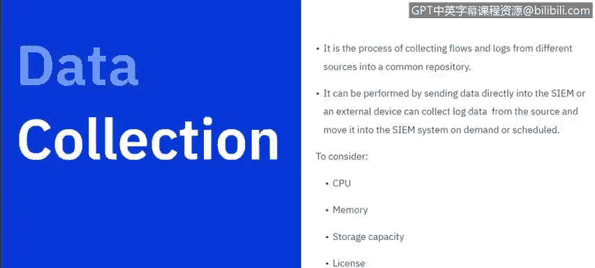
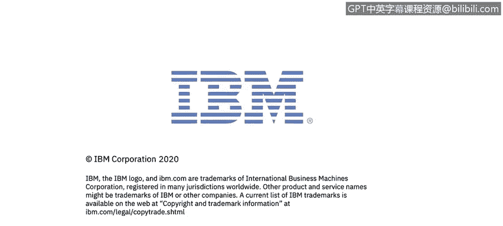

# 课程6：《网络威胁情报课程（IBM）》：67：SIEM概念与优势 🛡️

## 概述
在本节课中，我们将学习安全信息与事件管理系统的核心概念、优势及其在现代安全运营中心中的关键作用。我们将从基本定义开始，逐步深入到数据收集、处理和分析的各个环节。

---

## SIEM系统简介
系统或安全信息与事件管理系统本质上是一个数据聚合、搜索和报告系统。它从您的网络环境中收集大量信息，进行整合，并将数据转换为易于人类访问和阅读的格式。同时，它会对数据进行分类，使所有信息一目了然，便于理解。

以下是围绕SIEM系统我们将要讨论的一些关键术语：日志收集、规范化、关联、聚合以及报告。在SIEM的背景下理解这些术语非常重要。

---

## SIEM的核心功能
SIEM主要收集日志和其他安全相关文档进行分析。日志是设备（如防火墙、Web代理或任何提供网络安全的设备或应用程序）上发生的信息记录。应用程序通常也有日志文件，记录其中发生的具体事件。

SIEM的核心功能是通过监控网络流和事件来管理您的网络安全。事件是应用程序或硬件设备内部发生的事情。SIEM会整合这些日志事件和网络流数据，从成千上万的不同设备（如终端、应用程序、网络硬件等任何连接网络的设备）中提取信息，然后使用高级分析技术对数据进行规范化和关联，以帮助识别可能需要调查的安全违规行为。

SIEM主要采用两种方法：基于规则的方法或采用统计关联来建立日志条目之间的关系。它会近乎实时地捕获日志事件和网络流数据，并对其应用分析，以揭示网络中的安全违规行为。

---

## SIEM的部署方式
SIEM可以通过几种不同的方式部署或使用：
*   **本地部署**：通过软件或设备部署在您自己的数据中心。
*   **云环境**：通过Web浏览器登录到托管环境。
*   **托管安全服务提供商**：由MSSP为特定公司托管，允许您登录，类似于云环境。

---

## 事件与网络流
上一节我们介绍了SIEM的基本功能，本节中我们来看看它处理的两类核心数据：事件和网络流。

**事件**通常是特定操作的日志记录。例如，用户登录、防火墙允许或拒绝等操作在特定时间发生，该事件会在当时被记录。然后，该设备或应用程序会将事件推送到SIEM，SIEM会处理该事件，判断其是正常行为还是异常行为。

**网络流**是两个主机之间网络活动的记录。这种连接（或会话）可以持续几秒钟或几天，具体取决于会话内的活动。例如，传输大文件会比发送即时消息或电子邮件等短暂通信持续更长时间。

当我们提到“主机”时，网络活动可能指您网络上的PC与托管机器（如您访问的网页）通信，或者您将文件传输到云服务（如Dropbox或Box）。任何此类通信都被视为主机之间的网络通信。另一个例子可能是下载多个文件、图像、视频，这可能持续5到10秒；或者观看Netflix电影，这可能持续几个小时。这些都是网络会话，而网络流就是捕获的关于持续时间以及在两个主机之间传输了哪些内容的记录。

---

## 数据收集
我们讨论了事件和网络流，接下来看看SIEM如何收集这些数据。

在SIEM的上下文中，数据收集是指从不同来源收集这些网络流和日志，并将它们放入一个公共存储库（您的数据库）的过程。SIEM将分析该数据库，以确定某些事情是正常还是异常。

数据收集可以通过将原始数据直接发送到SIEM来完成，也可以通过外部设备从源收集日志数据，进行聚合，然后按计划或根据SIEM操作员的要求进行传输。

坦白说，如果数据是实时的，SIEM数据的价值会高得多。如果数据在发生时直接从设备提取到SIEM，您将获得更好、更快的信息，从而使分析能够实时进行，并为SOC分析师提供判断行为是否异常所需的数据。

关于提取多少数据以及提取频率的考虑，实际上受几个因素制约：
*   分配给SIEM应用程序的CPU量（如果使用设备，则是SIEM设备的CPU）。
*   SIEM的内存和存储容量。
*   与您的SIEM相关的许可证也很重要。大多数SIEM的许可是基于**EPS**和**FPM**的概念。
    *   **EPS**：每秒事件数。
    *   **FPM**：每分钟网络流数。
大多数SIEM提供商或系统根据每秒事件数和每分钟网络流数来许可其SIEM。当然，提取到SIEM的源数量也很重要。您引入的源越多，消耗的EPS和网络流也越多。因此，在确定分配给SIEM的资源大小时，这些都是需要考虑的因素。

---

## 数据规范化与许可
上一节我们了解了数据收集，本节中我们来看看如何处理这些原始数据，使其变得有用。

**规范化**是将原始数据转换为SOC分析师可读格式的过程。这包括IP地址、QID识别等任何能提供可用信息的数据。它涉及解析原始事件数据并准备数据以供显示，使其更具可读性，并实现所有记录的可预测和一致的存储。因此，无论数据来自哪个系统，它都会被规范化为可读的格式，以便分析师可以看到IP地址、机器名（如果可用）、用户名（如果可用）等信息，从而更了解环境中发生的情况。

我们应该讨论的另一个概念是**许可和许可限制**。如前所述，大多数SIEM将根据EPS数和网络流数获得许可。许可限制会监控传入事件的数量，并管理输入队列以适应EPS或网络流许可。如果我超出了许可阈值，传入的事件可能会受到限制或排队，直到我低于许可阈值；或者在一次性事件过多的情况下，它们可能直接被丢弃并放入存储，或者完全丢弃。这都取决于系统及其监控方式。因此，在考虑引入的源数量时，这些都是需要考虑的因素。

---

## 事件合并
在SIEM中我们讨论的另一个概念是**合并**。合并事件被解析，然后根据事件之间的共同属性进行合并。QRadar是IBM的SIEM产品，因此本演示中使用的示例都基于QRadar。

事件合并发生在10秒内发现三个具有匹配属性的事件之后。例如，如果我发现来自同一台机器的三个事件，我会将它们合并为一个事件，将这三个不同的属性整合到同一个事件中。这样处理是为了规范化数据，并防止系统显示过多信息，从而难以排序和分析。

当我们讨论合并以及如何组合事件时，有五个属性需要考虑。如果这五个属性匹配，并且我们在10秒内有三个事件，它们都将归入同一台机器和同一个事件。这五个属性是：
1.  QID识别。
2.  源IP。
3.  目的IP。
4.  目的端口。
5.  用户名。

这些构成了QRadar中事件合并的要素。更详细地说，这些事件被解析，当我们发现这些事件之间的共同属性时，我们会将数据规范化为这些字段。我们得到的数据将不止屏幕上显示的这五个，但这些是构成合并的属性。因此，当我们在10秒内有三个事件，并且这五个属性（QID、源IP、目的IP、目的端口、用户名）都匹配时，它们将被合并为一个事件，供SOC分析师查看和理解。

---

## 安全违规
现在让我们谈谈什么是**违规**。违规是系统视为异常的行为，即某些不合理或超出常规的事情，因此可能需要查看。这些数据点可以来自许多不同的来源，例如：
*   安全设备。
*   服务器和大型机。
*   网络活动。
*   数据活动（例如访问数据库）。
*   应用程序活动（例如使用聊天应用程序或Microsoft Office 365）。
*   系统配置信息。
*   漏洞和威胁数据（这对SIEM非常重要）。
*   用户和身份信息。

可能异常的一个例子是：用户在非常短的时间内从多个位置登录。您可能会看到某人的用户ID试图在几秒钟或几分钟内从美国、印度、罗马尼亚登录。这显然是异常行为，因为逻辑上不可能发生。这些事情可能会变成我们所说的违规。

所有这些都被纳入**事件关联**中，例如日志、网络流、IP和地理位置（如前例所述）。然后，该活动会与基线进行比较以寻找异常，这些异常将被放入违规中。违规是SOC分析师查看以确定是否需要进一步调查的内容。

一个好的SIEM会尝试过滤掉误报或实际上不是问题的异常行为所产生的噪音，并提供我们所说的**真实违规**，即可以且应该被调查的内容。许多组织在使用SIEM时面临的挑战是，所有数据涌入后，过滤出太多并非真实违规的违规，导致无法及时调查。不幸的是，SIEM最终变成了环境中的噪音。因此，SIEM的总体目标是调整得足够好，以便能够查看所有传入的数据并有效调整，从而只关注真正需要调查的真实违规。

---

## 总结
本节课中，我们一起学习了安全信息与事件管理系统的核心概念。我们探讨了SIEM作为数据聚合和分析平台的角色，理解了事件与网络流的区别，以及数据收集、规范化和合并的过程。我们还学习了SIEM如何识别安全违规，以及优化SIEM以减少误报、专注于真实威胁的重要性。掌握这些概念是有效利用SIEM保护网络环境的基础。