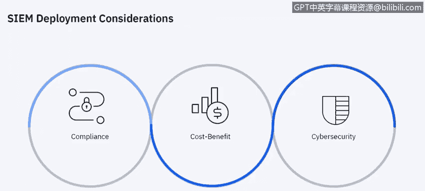
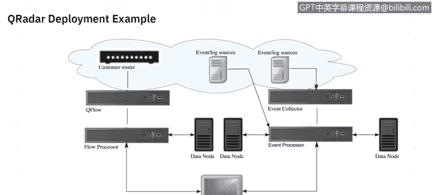
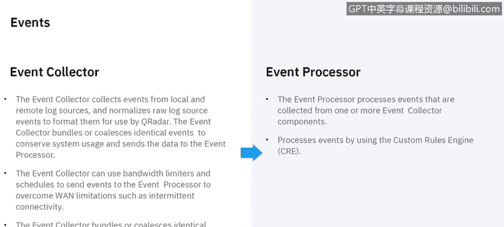
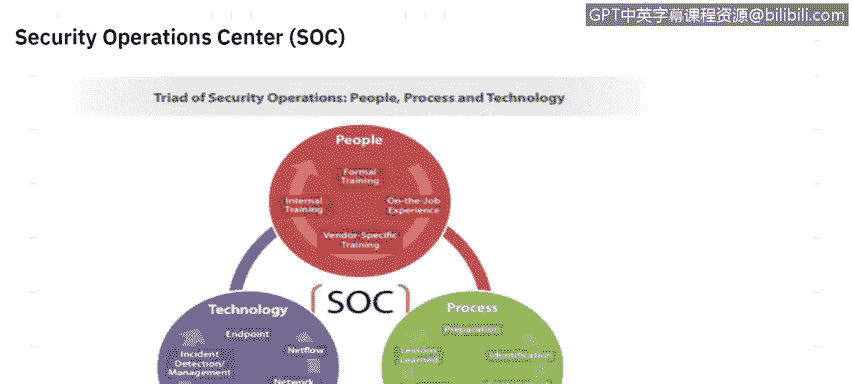
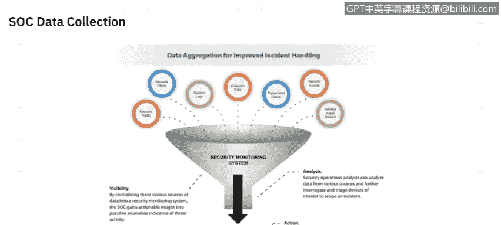
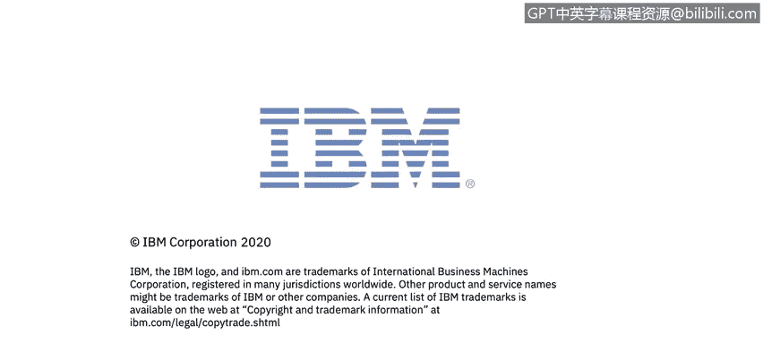

# 课程6：《网络威胁情报课程（IBM）》：68：29_02_siem-deployment

## 概述

在本节课程中，我们将学习安全信息与事件管理系统的部署。我们将探讨部署SIEM时需要考虑的关键因素，并通过一个具体的部署示例来理解其架构和工作流程。最后，我们将了解SIEM如何融入安全运营中心，并提升事件处理能力。

---

## 部署SIEM的考量因素

上一节我们介绍了SIEM的基本概念，本节中我们来看看在部署SIEM时，有哪些关键因素需要优先考虑。

部署SIEM时，主要需要考虑以下几点：

1.  **合规性要求**：是否存在必须遵守的法规或标准，例如欧盟的《通用数据保护条例》（GDPR）、美国的《健康保险携带和责任法案》（HIPAA），或支付卡行业数据安全标准（PCI DSS）。SIEM可以帮助企业满足这些合规性指标。
2.  **成本效益分析**：投资任何新技术时，都需要评估其带来的收益和商业价值。
3.  **网络安全**：随着技术日益普及，恶意行为者可能为了经济利益或其他不良目的，试图在环境中制造问题。保护环境内的数据安全是至关重要的考虑因素。

---

## SIEM部署架构示例

了解了部署前的考量，接下来我们通过一个具体的例子来深入理解SIEM的部署架构。我们将以IBM QRadar为例，但其架构原理与其他主流SIEM产品相似。

下图展示了一个典型的QRadar部署场景：

以下是部署架构的核心组件：

*   **网络流数据源**：数据通常来自网络源，如SPAN端口、网络分路器（Tap）或路由器。这些数据被转换为QRadar可读的格式，称为**QFlow**。
*   **流处理器**：接收并处理QFlow数据。
*   **事件与日志源**：系统日志和事件数据以类似方式处理，它们被发送到事件收集器。
*   **事件收集器与事件处理器**：事件收集器收集数据，事件处理器处理这些数据，然后将其送入控制台供安全运营中心分析师查看。

在较小的环境中，上述所有功能可以整合到一台**一体机**中。这意味着一个简单的实现可能只使用一台设备来完成图中所示的所有工作。

---

## 事件与流处理详解

上一节我们概述了SIEM的部署架构，本节中我们来详细看看事件和网络流是如何被收集和处理的。

### 事件处理流程

下图详细说明了事件处理组件的协作：

以下是事件处理的关键步骤：

1.  **事件收集器**：从本地和远程日志源收集事件，并将日志源事件**规范化**为QRadar可读的格式。事件收集器通常部署在远程位置，例如多个分支机构或数据中心，每个地点一个，用于将数据馈送到中央事件处理器。
2.  **事件处理器**：顾名思义，它处理来自一个或多个事件收集器的事件。处理过程使用**自定义规则引擎**来分析行为是否异常。如果规则引擎判定某个行为可疑，该事件就会被标记为**违规事件**。

### 网络流处理流程

网络流的处理方式与事件类似。下图展示了其处理路径：

以下是网络流处理的关键步骤：

1.  **流收集器**：从数据包中收集流数据。数据来源可以是监控端口（如SPAN或Tap），也可以是NetFlow、sFlow或JFlow等会话流。收集到的数据被转换为QRadar格式（QFlow）。
2.  **流处理器**：接收并处理QFlow数据。与事件收集器类似，流收集器也可以部署在远程数据中心。根据组织的数据中心架构，你可能在多个城市的数据中心部署流收集器，它们将数据馈送到主数据中心的流处理器。
3.  **流处理器的关键功能**：
    *   **去重**：如果相同来源的数据进入不同的流收集器，流处理器会进行去重。
    *   **非对称流重组**：当数据非对称提供时（例如，只捕获了出站流量，未捕获入站流量），流处理器可以识别来自两端的流，并将它们组合成一条记录。但并非总能获取到双向流。

---

## 从一体机到分布式架构

随着组织的发展，SIEM的部署架构也可能需要演变。以下是促使从单一一体机转向多设备分布式架构的几个因素：

*   **数据收集需求增长**：如果数据收集需求超过了一体机的收集能力。
*   **多地点数据收集**：如果需要从不同地理位置收集事件和流数据，且直接连接到一体机的网络吞吐量不佳。
*   **基于数据包的流监控**：监控基于数据包的流源时，可能需要添加专用的流收集器。
*   **工作负载增加**：部署规模扩大，工作负载可能超过一体机的处理能力。
*   **搜索性能要求**：如果同时进行搜索的分析师数量超过了一体机能处理的数量，就需要分布式架构来提升并发搜索速度。
*   **数据保留期限**：许多组织对数据保留期限有强制要求。如果单台设备的存储无法满足长期保留的需求，就需要部署多台设备。
*   **团队规模扩大**：团队增长可能要求更好的搜索性能。

---

## SIEM在安全运营中心中的角色

理解了SIEM的部署，我们来看看它如何融入更广泛的安全运营体系。SIEM是安全运营中心的核心技术组件之一。

下图展示了SIEM在SOC中的位置：

安全运营中心包含三个核心要素：人员、流程和技术。

*   **技术**：SIEM属于技术部分。其他技术组件还包括终端安全、网络监控、事件取证工具和威胁情报平台等。
*   **人员**：人员可能是SOC中最重要的组成部分。他们负责解读SIEM提供的数据，并据此生成安全情报，以判断是否需要更详细地调查某个事件或违规。人员能力来源于正式培训、内部培训、在职经验以及针对特定工具的厂商培训。
*   **流程**：流程定义了SOC的工作方式。它明确了从事件升级为违规，再到进行调查的完整步骤。这是一个闭环过程，包括准备、识别、遏制、消除、恢复以及经验总结，而经验总结又会反馈到准备阶段，形成持续改进。

---

## 通过SOC数据收集改进事件处理

最后，我们探讨一下如何通过SOC的有效数据收集来提升事件处理能力。其核心在于利用SIEM实现全面的环境可见性。

下图说明了数据如何流动并转化为行动：

以下是实现改进事件处理的三个关键环节：

1.  **可见性**：通过将网络流量、系统日志、终端数据、外部威胁情报源和各类事件等所有数据源集中到SIEM中，我们可以确保对环境中的所有活动具备可见性。目标是尽可能多地接入数据源，以实现对整个环境的全面监控（需考虑许可和预算等现实约束）。
2.  **分析与调查**：确定要接入SIEM的所有数据源后，我们依靠SIEM进行分析。SIEM应提供尽可能多的数据和相关情报，帮助安全分析师过滤噪音，专注于那些真正需要调查的事项。
3.  **行动**：根据分析和调查结果，确定正确的调查和修复流程。随后采取行动解决问题，例如打补丁、修改防火墙规则、隔离系统以进行深入调查，甚至可能重新安装系统镜像。

---

## 总结

在本节课中，我们一起学习了SIEM系统的部署。我们首先探讨了部署前需考虑的合规、成本与安全因素。接着，通过QRadar的示例，我们深入了解了SIEM的典型架构，包括事件和网络流的收集与处理流程。我们还分析了从一体机扩展到分布式架构的驱动因素。最后，我们明确了SIEM作为核心技术组件，如何与人员、流程协同，在安全运营中心中发挥作用，并通过集中数据收集、分析和行动来全面提升组织的安全事件处理能力。希望本节内容能帮助你理解SIEM如何助力保护企业环境。