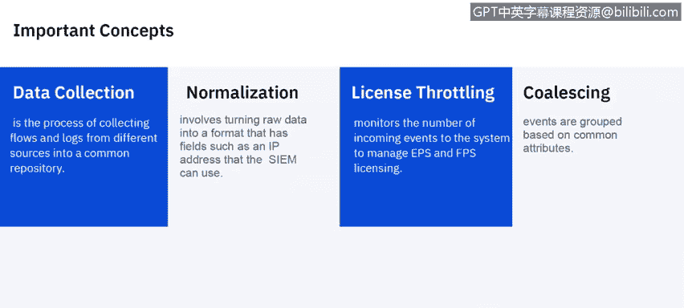
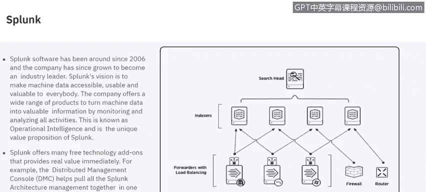
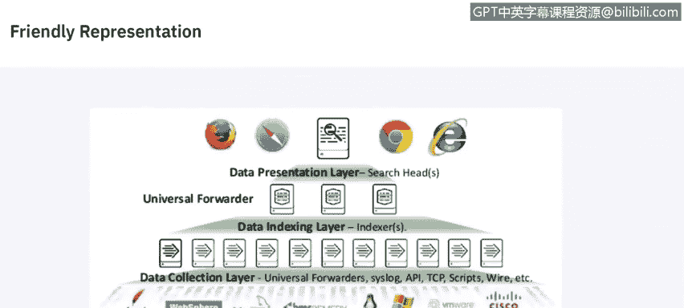

# 课程6：《网络威胁情报课程（IBM）》：69：SIEM解决方案供应商 🛡️

在本节课中，我们将探讨市场上的不同SIEM解决方案及其主要供应商。我们将了解SIEM市场的基本定义、核心概念，并重点介绍几个主流供应商的产品架构与特点。

---

## SIEM市场概述

安全信息与事件管理市场由客户对实时分析安全事件数据的需求所定义。这有助于早期攻击和入侵的检测。SIEM解决方案负责收集、存储、调查安全数据，并支持缓解措施和报告生成，以用于事件响应、取证和法规遵从。

我们将主要讨论Gartner魔力象限中包含的供应商。这些供应商为此目的设计了产品，并积极向各行业的客户销售。

## Gartner魔力象限

以下是Gartner的魔力象限图，许多读者可能对此很熟悉。显然，位于右上角是技术的理想位置。图中可以看到IBM和Splunk处于非常高的位置，此外还有Exabeam、LogRhythm和Rapid7等。市场上还有一些更小众的解决方案，但它们在魔力象限中的出现频率不如上述供应商高。今天我们将重点讨论IBM QRadar、Splunk、Exabeam和LogRhythm。

---

## 部署规模概念

现在我们来谈谈部署规模。Gartner将小型部署定义为拥有约300个日志源，即300个不同的设备或软件向SIEM提供数据，以及大约1500 EPS。EPS是每秒事件数，这是SIEM解决方案通常的衡量和许可方式。中型部署约为1000个日志源和7000 EPS。大型部署约为1000个日志源和15000 EPS。

本幻灯片未讨论网络流。网络流是网络上设备之间的通信记录，它们同样非常重要。并非所有SIEM解决方案都收集网络流，但它们是整体安全策略的一个重要方面。网络流能告诉你网络上的端点与外部端点（如网页、服务器等）之间正在发生什么通信。

---

## 核心概念解析

上一节我们了解了部署规模，本节中我们来深入理解SIEM的核心概念。

*   **SIEM**：安全信息与事件管理工具，提供对网络硬件和应用程序生成的警报的实时分析。
*   **规则**：一种试图将这些事件关联成报告或事件的程序，以便查看环境中的情况。
*   **规则阈值**：触发规则并生成关联事件的点。
*   **事件阈值**：在触发规则阈值之前，事件必须发生的次数。
*   **规则动作**：当所有规则条件和阈值设置都满足时发生的程序。
*   **趋势**：定义如何以及在多长时间内聚合和评估数据趋势的资源。趋势在定义的计划和时间段内执行指定的查询。
*   **事件**：特定用户操作（如登录、防火墙放行）的实际日志。它发生在特定时间，并在该时间被记录。
*   **网络流**：与事件同等重要的网络活动记录。根据会话内的活动，它可以持续数秒、数分钟、数小时甚至数天。例如，发送电子邮件可能是一个持续几秒的流，而下载大文件可能持续数小时甚至数天。
*   **数据收集**：从不同来源收集网络流和日志的过程，这些数据通常进入某种公共存储库，如SIEM内置的数据库。
*   **规范化**：将原始事件转换为具有用户可读字段（如IP地址、机器名）的格式的过程，这有助于用户查看这些原始事件。
*   **许可与许可限制**：监控进入系统的事件和网络流数量以管理许可。大多数SIEM都以这种方式许可，无论是每秒事件数、每秒网络流数还是两者的组合。
*   **合并**：基于共同属性组合这些事件。因此，如果我们在短时间内看到一个端点的多个操作，这些操作通常会被合并为一个单一事件。

---

## 主流SIEM供应商详解

理解了核心概念后，我们来看看几个具体的SIEM解决方案。

### IBM QRadar

我们将讨论的第一个技术是IBM QRadar。IBM QRadar于2005年推出，最初名为Q1 Labs。它的起点与大多数SIEM略有不同，因为它始于网络流分析。QRadar关注网络行为异常，其NBAD平台即网络行为异常检测平台。该平台于2012年被IBM收购，此后一直是IBM安全业务的支柱。

它基于专有的Ariel数据存储和专有的Ariel查询语言，使用Ariel数据库来存储进入系统的数据和事件、网络流。它执行日志关联、网络取证，利用威胁情报源，进行漏洞管理，并具有风险管理组件。

以下是QRadar的一些关键组件：

*   **漏洞管理器**：发现和感知网络设备及应用程序，然后提取安全漏洞并提供相关上下文，以便优先修复这些特定设备。它是IBM Security QRadar平台的一个附加组件。
*   **用户行为分析**：分析用户活动，可以检测内部恶意行为、凭证是否被盗用，并可根据用户的风险活动对其进行优先级排序。这是QRadar的一个免费附加组件，对客户非常有用。
*   **网络洞察**：利用网络流数据，这是QRadar与市场上其他SIEM的主要区别。大多数其他SIEM本身不原生引入网络流数据。网络洞察可以实时引入网络数据，真正洞察环境中发生的情况。因为黑客或攻击者要做的第一件事通常是关闭日志记录，如果日志被关闭，SIEM就接收不到信息。然而，网络不会说谎，你无法关闭网络上的信息流。这就是网络流如此重要的原因，它可以检测网络钓鱼邮件、恶意软件数据外泄、环境内的横向移动等。

### Exabeam

接下来我们谈谈Exabeam。Exabeam是一个进行事件关联和安全分析的SIEM解决方案，由几个不同的组件组成。

*   **Exabeam Manager**：其核心引擎，负责关联、优化保留和检索。
*   **控制台**：用于集中查看所有数据。
*   **指挥中心**。
*   **API**：可用于将其他解决方案集成到Exabeam生态系统中。

与其他SIEM一样，Exabeam安全管理器允许您实时监控事件，并将这些事件关联起来，以便通过解决方案更轻松地查看。

### Splunk

Splunk已经存在了大约10年，最初并非作为SIEM起步，但在这个领域获得了很高的知名度。Splunk的目标是让机器数据对每个人来说都易于访问、可用且有价值。其核心目标是从多个不同来源获取信息，并将其合并到一个单一的数据存储中，以便可以在一个统一的视图中查看这些数据，这就是Splunk的操作智能，也是其独特的价值主张。

Splunk还提供多个免费的技术附加组件，可以提供一些额外的价值。分布式管理控制台将所有Splunk架构管理集中在一组仪表板中。如前所述，Splunk并非以SIEM起家，但已将其产品扩展到非常强大的SIEM解决方案。

以下是Splunk架构的一个示意图：
*   **数据收集层**：转发诸如Cisco IOS、API、脚本等数据。
*   **数据索引层**：接收数据并进行索引。
*   **数据展示层**：通过Web浏览器向最终用户呈现信息的层面。

### LogRhythm

最后，我们来谈谈LogRhythm。它同样拥有一个强大的安全智能平台，也位于Gartner魔力象限中。该平台支持LogRhythm实施的集中管理。

以下是其关键组件：
*   **平台管理器**：负责集中管理LogRhythm实施。
*   **数据处理器**：执行日志收集和管理，是实际从不同来源收集日志的硬件组件。
*   **数据索引器**：索引您的数据和元数据。
*   **AI引擎**：提供关联和分析能力的人工智能引擎，负责所有日志事件的关联，将其整合并提供有关规则和分析的信息。
*   **一体化设备**：为小型实施提供，将所有解决方案组合到单个设备中，还可以进行一些网络监控，对网络流量内容进行深度分析。
*   **数据收集器**：从远程系统收集日志数据，然后准备传输到集中的LogRhythm平台实施。如果您有不同的地理位置，可以在那里部署数据收集器，它将数据转发到主LogRhythm实施。

---

## 总结

本节课中，我们一起学习了SIEM市场的基本情况、部署规模的定义、SIEM的核心概念（如事件、网络流、规则、阈值等），并深入探讨了四个主流的SIEM供应商：IBM QRadar、Exabeam、Splunk和LogRhythm。我们了解了它们各自的历史背景、核心架构、关键组件以及独特的价值主张。理解这些不同的解决方案有助于您根据组织的具体需求评估和选择合适的SIEM工具。