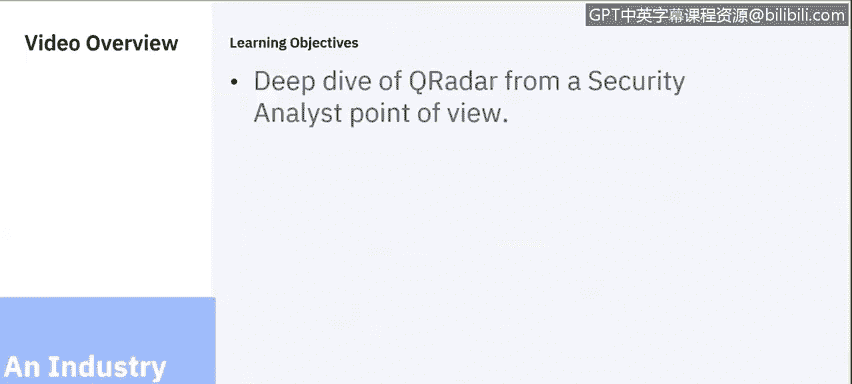
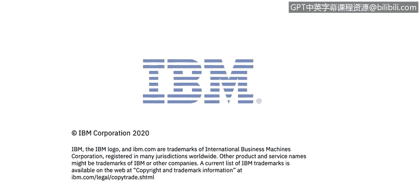

# 课程6：《网络威胁情报课程（IBM）》：70：31_01_qradar-siem-an-industry-example｜

## 🎯 概述
在本节课中，我们将以IBM的QRadar为例，了解一个行业级SIEM（安全信息与事件管理）平台的核心功能。我们将从安全分析师的角度，探讨QRadar如何帮助企业应对现代安全挑战。

---

## 🔍 QRadar：一个行业级SIEM平台
我是Jude Lancaster。今天，我将通过几张图表介绍QRadar。作为一个行业案例，我们将了解QRadar SIEM平台提供的功能。本节唯一的学习目标是从安全分析师的角度更好地理解QRadar。

IBM安全智能平台QRadar旨在解决以下安全挑战：
*   检测高级威胁。
*   检测内部威胁。
*   随着更多公司将工作负载迁移到云端，保护云资源变得至关重要。QRadar可以帮助保护公有云、私有云及混合云上的数据和负载安全。

---

## 🛡️ QRadar的核心能力
上一节我们介绍了QRadar应对的挑战，本节中我们来看看它的具体能力。

QRadar还能帮助客户保护其关键数据，例如数据库和客户数据。无论数据位于云端还是本地，QRadar都能帮助保护公司自身的数据、客户数据、患者数据、政府数据等各类数据。

当QRadar检测到事件时，它能帮助有效响应。它还能帮助确定风险优先级并进行管理。在许多情况下，QRadar能帮助证明合规性，这一点非常重要。

许多组织必须遵守合规性要求。在美国，有**PCI DSS**（支付卡行业数据安全标准），适用于接受信用卡的机构；还有**HIPAA**（健康保险流通与责任法案），用于保护患者数据。此外还有其他区域性法规。在欧洲，**GDPR**（通用数据保护条例）变得非常重要，我们看到许多客户都有相关要求。QRadar可以帮助保护这些数据。

QRadar还能让客户从被动响应转向主动防御。它可以帮助客户进行威胁狩猎、更快地响应，并通过提供环境中的威胁指标和信息，持续改善组织的安全状况。

---

## 🔌 应用生态与自动化
QRadar的一个优势是拥有庞大的应用生态系统。目前，作为安全应用交换计划的一部分，有超过220个应用程序可以添加到QRadar中。

以下是关于应用生态的详细信息：
*   这些应用包括许多合作伙伴开发的程序，以及IBM自身开发的用于增强QRadar功能和易用性的应用。
*   其中一个我们将深入探讨的应用是用户行为分析应用，这将在另一个演示中介绍。
*   超过220个应用中，大部分是免费的。它们为QRadar提供了额外的洞察力和功能。
*   这些应用专为QRadar构建，提供了无缝集成，增强了平台能力。它们能根据您使用的硬件或网络设备，引入额外的信息。我们拥有大量集成来提供这些信息。

我们希望利用QRadar实现的另一件事，是通过提供自动化分析，将提供给SOC分析师的智能自动化。

当我们谈论自动化和智能或AI时，实际上指的是我们的Watson平台。Watson会在互联网上搜寻安全信息，包括结构化和非结构化数据，然后在QRadar客户需要调查威胁时提供这些信息。例如，如果我在QRadar控制台中发现异常情况，我可以要求Watson提供更多详细信息。

Watson会访问像X-Force Exchange这样的平台，这是互联网上仅次于Google和Bing的第三大网络爬虫。当X-Force Exchange与Watson结合时，可以自动化识别和评估QRadar发现的威胁的严重性。因此，当您调查已检测到的威胁时，它能提供大量资源。

---

## ☁️ 部署灵活性与可见性
由于我们能够保护云资产和云数据，QRadar可以看到整个环境。无论我们关注的资产是在云端、您自己的数据中心，还是员工通过VPN工作，这些资产都能被QRadar识别和保护。

客户可以通过多种不同方式使用QRadar：
*   可以在自己的数据中心作为硬件设备或软件运行。
*   可以作为服务从IBM或我们的部分合作伙伴处以SaaS模式消费。
*   甚至可以让他人为您管理，他们完成所有工作，您只消费内容。
*   也可以在公有云上运行，例如AWS、IBM Cloud或Google Cloud。
*   或者采用混合模式消费，部分解决方案在本地，部分为SaaS或基础设施即服务。

---

## 📝 总结
本节课中，我们一起学习了IBM QRadar SIEM平台。我们了解到它是一个旨在检测高级威胁、内部威胁并保护云端及本地数据的综合性平台。QRadar通过其庞大的应用生态系统、与Watson AI的集成实现自动化智能分析，并提供了从本地到云端、从自建到托管的多种灵活部署方式，帮助组织实现主动安全防御、有效事件响应和合规性管理。