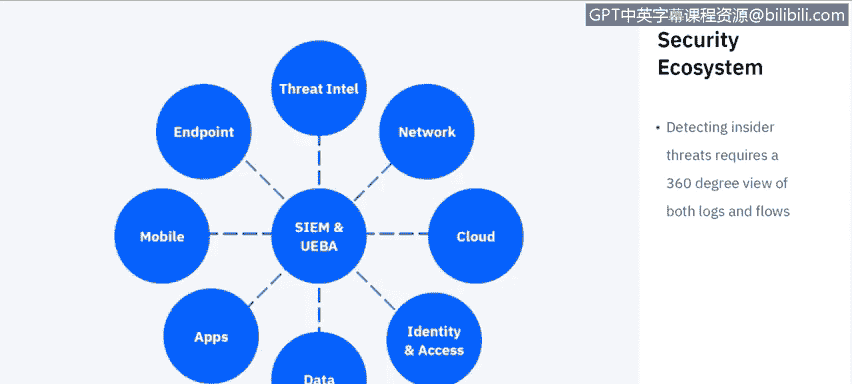
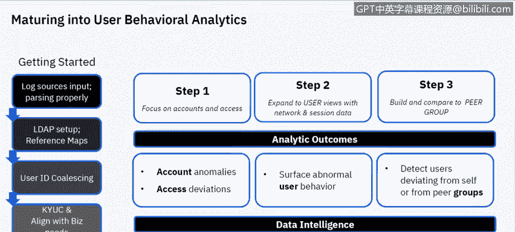
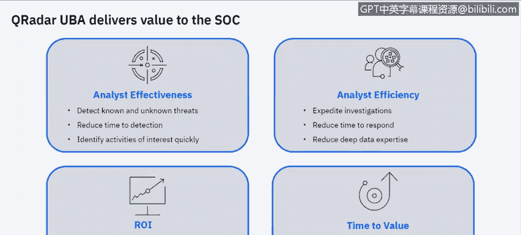

# 课程6：《网络威胁情报课程（IBM）》：71：32_01_user-behavior-analytics.en_subtitled

## 概述 📋

在本节课中，我们将学习IBM QRadar的用户行为分析应用。我们将探讨UBA如何与SIEM系统协同工作，监控和保护组织免受内部威胁，并了解几个关键的用户行为分析用例。

---

## 用户行为分析简介 🧠

用户行为分析是网络安全中的一个重要领域。它通过分析用户和实体的行为模式来识别潜在的安全威胁。这里的“实体”可以指代机器或非个人用户的账户。UBA有时也被称为UEBA，即用户与实体行为分析，两者核心概念相同。

UBA的基础是安全信息与事件管理系统。SIEM负责汇集来自各种来源的数据，而UBA则以不同的视角分析这些数据，基于用户行为评估风险。

以下是构成安全生态系统、为UBA提供数据的关键数据源：

*   **威胁情报源**：例如IBM的X-Force。
*   **网络基础设施**：防火墙、交换机、路由器等设备。
*   **云系统**：组织使用的各类云服务。
*   **身份与访问管理系统**：用于追踪特权账户访问和登录行为，这对UBA至关重要。
*   **重要数据**：数据库、客户数据等关键信息。
*   **应用程序**：内部开发或用于存储数据的应用程序。
*   **移动设备**：随着远程办公的普及，移动设备成为重要数据源。
*   **终端**：用户用于访问公司资源的物理机器。

SIEM将这些日志和流数据源整合在一起，构成了保护组织的安全生态系统基础。

---

## 集成式UBA解决方案的优势 ⚙️

上一节我们介绍了UBA的数据基础，本节中我们来看看集成式UBA解决方案，特别是IBM QRadar UBA的具体优势。

集成式UBA解决方案能提供更全面的安全可见性。IBM QRadar UBA具备以下优势：

*   **全面的可见性**：它提供跨终端、网络和云基础设施的完整可见性，结合了日志源和网络流数据。网络数据不会说谎，即使恶意行为者关闭了日志记录，通过网络流量分析依然能洞察其活动。
*   **更快的洞察时间**：它能加速安全洞察过程，并将宝贵的资源解放出来用于其他调查任务。
*   **集成的分析模型**：它提供利用安全运营平台的分析模型，并与QRadar工作流和界面无缝集成，同时还能利用QRadar Advisor的人工智能能力。
*   **第三方模型兼容**：它可以帮助整合第三方分析模型，或利用组织已实施的现有内部威胁用例。

---

## 核心用例分析 🎯

了解了UBA的优势后，我们具体看看IBM QRadar UBA针对的三个主要内部威胁向量。该应用内置了超过160条规则和机器学习驱动的用例来应对这些威胁。

以下是三个核心的威胁分析用例：

1.  **凭证泄露或被盗**：攻击者通过钓鱼等手段获取了用户的合法登录凭证。
2.  **粗心或恶意的内部人员**：可能是无意造成安全风险的员工，也可能是有意进行破坏的 insider。两者的活动模式可能相似，但动机不同。
3.  **用户账户被恶意软件接管**：恶意软件感染了用户设备并窃取了会话或账户控制权。

---

## 威胁检测机制详解 🔍

上一节我们列出了核心用例，本节中我们深入探讨QRadar UBA如何检测这些威胁，特别是凭证泄露。

QRadar UBA的检测机制可以映射到MITRE ATT&CK攻击框架。它通过分析多种数据源来识别攻击链上的各个阶段。

以下是QRadar UBA检测凭证泄露所关注的部分攻击向量及对应数据源：

*   **钓鱼攻击**：关注风险IP访问、恶意软件下载。相关数据源包括防火墙和Web网关日志。
*   **命令与控制**：检测与C2服务器的异常外联通信。相关数据源包括网络流数据、代理和DNS日志。
*   **横向移动**：识别网络内部的异常访问模式。相关数据源包括Windows安全日志和VPN日志。
*   **数据渗出**：发现异常的大规模数据外传。相关数据源包括数据丢失防护解决方案和云存储日志。

---

## 恶意与异常行为识别 🚨

除了外部攻击，内部人员的恶意或异常行为也是重大威胁。这类行为多种多样，难以追踪。

以下是UBA能够监控和识别的一些可疑内部行为指标：

*   **凭证滥用**：使用他人的VPN证书或凭证。
*   **异常登录**：在非工作时间登录，或短时间内从地理位置相距甚远的地点登录。
*   **异常文件活动**：文件访问和下载行为突然改变，如下载量激增。
*   **权限提升**：尝试或成功获取更高系统权限。
*   **异常打印活动**：通过打印服务器大量传输文件，可能为后续数据渗出做准备。
*   **活动频率骤降**：文件、电子邮件或网页活动突然异常减少。
*   **访问求职网站**：员工频繁访问求职网站可能预示离职风险。
*   **USB设备使用**：监控USB设备的插入以及向其中保存的数据类型。

这些行为可以通过终端日志、打印服务器日志或数据防泄漏解决方案等数据源进行追踪。

---

## 有效实施UBA的步骤 🛠️

要使UBA有效发挥作用，组织需要具备一定的安全成熟度。不能期望安装SIEM后立即从UBA获得有价值的数据。

成功实施UBA是一个渐进的过程。以下是有效利用UBA（包括IBM QRadar UBA）的关键步骤：

1.  **打好SIEM基础**：正确设置和调优SIEM，确保日志源正确输入并解析。
2.  **配置身份信息**：设置LDAP，建立用户与组织部门的映射关系，进行用户ID合并（同一用户可能有多个ID）。
3.  **对齐业务需求**：确保监控策略与组织的实际业务需求保持一致。
4.  **系统调优**：配置和调优系统，确保获取正确数据，并尽量减少误报。

在具体应用UBA分析时，可以遵循以下路径：

*   **聚焦账户与访问**：首先关注账户及其访问权限。
*   **结合网络会话数据**：将用户视图与网络会话数据结合，丰富分析维度。
*   **建立同侪基准**：利用机器学习，建立同岗位或同部门用户的正常行为基准群组。
*   **分析异常结果**：基于收集的数据，识别账户异常、访问偏差、异常用户行为（如下载量突变）以及偏离同侪基准的行为。

---

## 总结与价值 📈

本节课中，我们一起学习了IBM QRadar用户行为分析的核心概念与应用。

UBA，特别是QRadar UBA，能为安全运营中心带来显著价值：

*   **提升分析师效率**：帮助分析师更有效地检测已知和未知威胁。
*   **缩短检测时间**：更快识别需要调查的异常活动。
*   **投资回报率高**：对于QRadar客户，UBA是一个可从IBM App Exchange下载的免费应用，部署快速，调优简单，能快速实现价值。
*   **机器学习增强**：启用机器学习后，能更好地追踪特定用户和群组的行为模式，并在其偏离常态时及时识别异常。

总而言之，UBA是增强组织内部威胁检测和响应能力的重要工具。

---