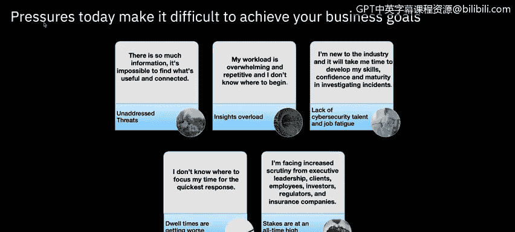

# 课程6：《网络威胁情报课程（IBM）》：72：人工智能与SIEM

在本节课中，我们将学习人工智能及其对安全分析师的价值。我们将探讨现代安全团队面临的挑战，并了解人工智能如何与分析师协作，共同提升安全防御能力。

## 概述：现代安全分析师的挑战

无论您身处2人还是100人的安全团队，目标都是确保业务繁荣。这意味着保护系统和数据以保持合规、阻止威胁并领先于网络犯罪。然而，现代安全运营的压力使得实现这些目标变得困难。以下是当今分析师面临的五大挑战。

以下是当今分析师面临的五大挑战：

1.  **信息过载**：信息量巨大，难以找到有用且相互关联的内容。
2.  **工作负担**：工作量大且重复，不知从何入手。
3.  **技能差距**：行业新人需要时间发展技能。
4.  **优先级模糊**：不清楚应将时间重点投入何处。
5.  **外部压力**：面临来自高管、客户、员工、投资者和监管机构日益严格的审查。

## 挑战的根源

上一节我们概述了分析师面临的普遍挑战，本节中我们来看看这些挑战的具体成因。

组织为阻止不断演变的威胁，采用了比以往更多的单点解决方案。信息过载的一个简单原因是，作为分析师，您可能不知道信息之间如何关联。这导致难以发掘可操作的见解。因此，分析师可能只选择处理有把握的案例，这可能导致错过某些调查，并使组织暴露于风险之中。

需要分析的洞察数量庞大、种类繁多且速度极快，这使得您难以确定工作优先级并找到根本原因。这对各种规模的公司都适用，不仅仅是大型企业。没有分析师知道从何处开始拼凑本地背景信息，以帮助他们快速有效地识别当前问题。

有时，重复性工作和疲劳会使您不堪重负，导致流程崩溃，并大大增加事件发生并使组织面临风险的可能性。

## 衡量成功：驻留时间

那么，安全专业人员如何知道自己在保护和防御数据方面是成功的呢？可以使用多种指标，其中一个非常流行且常用的是**驻留时间**。

**驻留时间** 基本上是指威胁行为者在网络中未被发现的访问持续时间，直到其被完全清除。

## 分析师的核心职责

无论警报来自何处，作为分析师，您都需要快速理解潜在威胁的背景，并关联不同来源之间的趋势、异常域名和IP地址。Jude在SIEM概述中详细介绍了许多相关内容。

您必须及时了解针对特定商业行业和地理区域的网络攻击，并利用本课程模块一中学到的外部研究。您必须优先处理和验证可能造成严重业务影响的潜在恶意活动。您必须了解预期的系统行为，以识别实际系统行为的偏差，向适当的团队报告有效的威胁以进行补救，并与其他分析师分享知识。最重要的是，作为分析师，您必须提供可靠的信息来建立个人声誉。可以想象，这个过程极其耗时。

## 解决方案：人机协作

但一定有更简单的方法。这里的主要启示是，分析师与技术之间需要建立伙伴关系。

它们并非相互排斥。各自都有优势，例如人类的常识，以及人工智能在消除偏见和权衡分析方面的能力。但当它们作为一个团队聚集在一起时，可以更好地阻止威胁并减少驻留时间。

同时，您作为安全分析师也扮演着关键角色。请记住，人工智能会学习您的环境，并根据您输入的数据提供可操作的智能。因此，如果您没有向人工智能提供可靠的数据，您很可能不会信任人工智能为您做出的决策。

## 总结

本节课中，我们一起学习了人工智能在安全运营中的角色。我们探讨了现代安全分析师面临的信息过载、工作负担和技能发展等挑战，并了解了衡量防御效果的**驻留时间**指标。关键在于建立**人机协作**的伙伴关系，结合人类的判断与人工智能的处理能力，共同提升威胁检测与响应的效率。作为分析师，确保输入人工智能的数据质量，是建立信任并发挥其价值的基础。