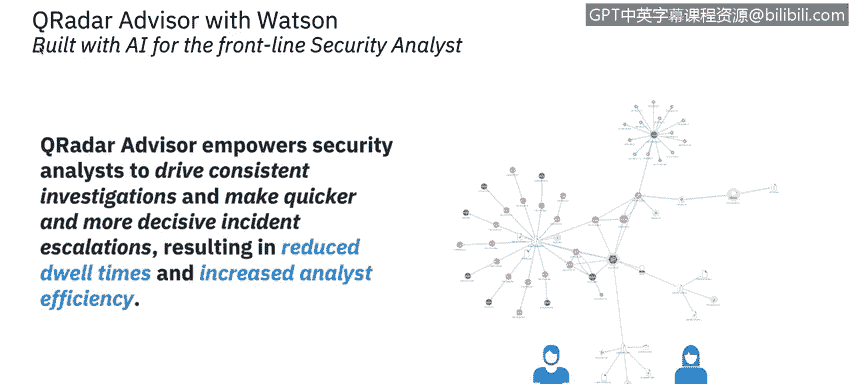
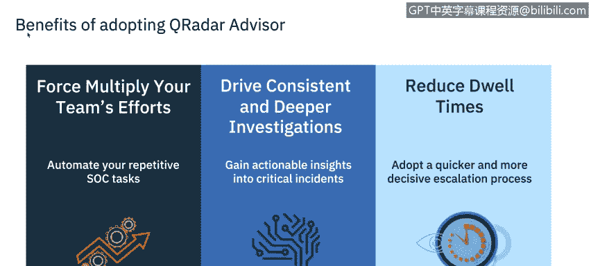
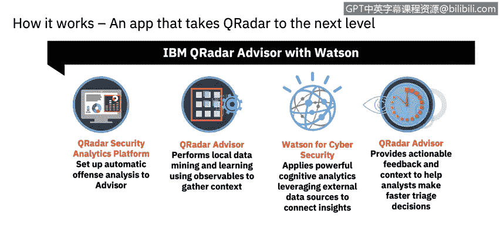
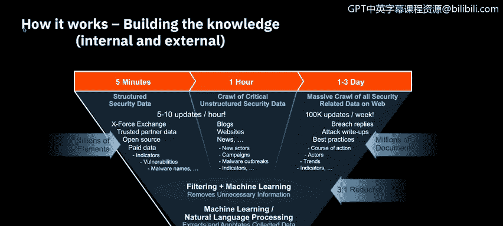
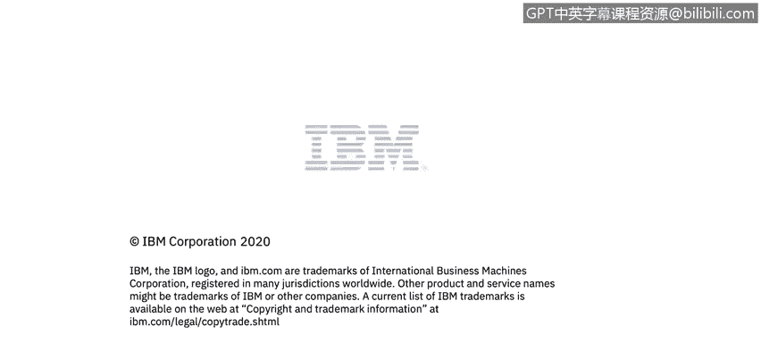

# 课程6：《网络威胁情报课程（IBM）》：73：AI与SIEM行业案例 🧠

在本节课程中，我们将通过一个行业实例，了解人工智能（AI）如何与安全信息与事件管理（SIEM）系统结合应用。具体来说，我们将学习IBM QRadar Advisor with Watson的功能与优势。

## 概述：QRadar Advisor with Watson

QRadar Advisor with Watson 旨在赋能安全分析师，推动调查流程的一致性，并实现更快速、更果断的事件升级。其结果是**减少平均处置时间（MTTR）**并**提升分析师效率**。

## 核心优势

上一节我们介绍了该工具的目标，本节中我们来看看它带来的具体好处。以下是QRadar Advisor的主要优势：

*   **优化人力资源**：它通过自动化重复的、常规的分析任务，避免浪费人力，使分析师能更专注于调查中更重要的环节。
*   **提升调查质量与一致性**：无论是周五下午4点还是周一上午10点，它都能辅助人类智能，确保每一次调查都保持**一致且深入**。
*   **加速处置流程**：通过更快速、更果断的升级流程，帮助**减少事件处置的等待时间**。
*   **增强决策信心**：通过将攻击行为映射到**MITRE ATT&CK框架**，确定根本原因分析并自信地推动后续步骤。

## 工作流程解析

了解了优势后，我们深入看看它是如何工作的。以下是QRadar Advisor with Watson处理安全事件的基本流程：

1.  **内部数据收集**：首先，它从QRadar本地数据库中挖掘与事件相关的数据，获取更广泛的上下文信息。
2.  **外部情报咨询**：接着，它就其对事件所做的观察，咨询Watson for Cybersecurity，以执行外部知识发现和威胁情报检索。
3.  **结果交付**：最终，它通过由Watson for Cybersecurity驱动的IBM Security App Exchange，提供一个**快速部署、易于使用**的解决方案，从而变革安全运营。

## 数据处理与洞察生成

QRadar Advisor with Watson解锁了海量的安全知识，能够实现快速而全面的调查洞察。其数据处理过程如下：

*   **数据源**：分析**结构化数据**（如日志）、**关键安全数据**以及互联网上的**非结构化安全相关数据**。
*   **数据处理**：去除不必要的信息，并对收集到的数据进行提取和标注。

## 攻击链分析与调查关联

处理完数据后，工具会进行深度分析。以下是它分析攻击链和关联调查的关键步骤：

*   **攻击链对齐**：
    1.  评估攻击链中每个步骤的完成度，以验证威胁。
    2.  可视化攻击是如何发生和演进的。
    3.  揭示攻击者后续可能采取的战术。
*   **调查自动关联**：通过已连接的观察指标自动关联不同的调查。这能**避免重复劳动**，将调查范围扩展到当前事件之外，并判断是否需要对由同一事件触发的多个重复调查进行额外的规则调优。

## 环境分析与建议

最后，我们来看看工具如何提供个性化建议。基于对本地环境的分析，Advisor会推荐哪些新调查应该被升级，以辅助分析师决策。

此外，基于最佳实践和配置评估，QRadar Assistant会快速扫描您的本地环境，判断您是否已做好充分利用Advisor with Watson的准备。

## 总结

本节课中，我们一起学习了IBM QRadar Advisor with Watson这一行业案例。我们了解了它如何通过**自动化常规任务**、**整合内外部情报**、**映射MITRE ATT&CK框架**以及**关联调查**来提升安全运营中心（SOC）的效率和效果。您接下来将有机会在虚拟实验室中应用所学到的关于人工智能与SIEM的知识。

