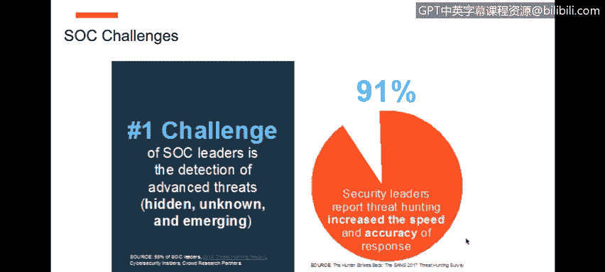

# 课程6：《网络威胁情报课程（IBM）》：6.1：利用网络威胁狩猎主动对抗与缓解未来攻击

在本节课中，我们将学习如何讨论全球网络趋势与挑战，并了解如何通过主动的网络威胁狩猎来对抗和缓解未来的攻击。

网络威胁千差万别，攻击方法也多种多样。为了应对这些不同的威胁来源，组织需要情报来强化自身，以抵御来自内部和外部的威胁。在事件发生后，组织可以识别和调查攻击。所有洞察都将成为组织网络安全战略和战术的一部分，从而形成一种智能的网络安全方法。

接下来的三节内容是IBM网络安全专家Sydney Pearl向全球观众展示的网络研讨会回放。

## 全球网络趋势与挑战概述

上一节我们介绍了课程背景，本节中我们来看看当前面临的全球网络趋势与挑战。

网络犯罪已经改变了公民、企业、政府和执法部门等的角色。网络触及我们所做的一切，我们无法对此视而不见。以医疗保健行业为例，假设你因为心脏问题而使用除颤器。所有这些设备都被我们定义为物联网设备，并且它们正朝着无线、Wi-Fi和IP支持的状态发展。未来五年，随着物联网的持续普及并定义全球文化，你将看到一个明确的趋势。随着更多此类技术的普及，自然也会带来一系列不同的网络安全挑战。关键在于，网络如今触及一切。无论我们称其为网络、互联网还是任何形式的电子通信，底线是我们都相互连接，而这种连接带来了诸多挑战。

以下是这些挑战的具体表现：

*   许多数据泄露是由非恶意的行为或犯罪活动引起的。
*   许多组织正面临网络技能短缺的挑战，这甚至不涉及网络损害，仅指网络安全领域，我们在填补此类职责和技能方面就面临困难。

现在，一个非常关键的点是所谓的“驻留时间”。驻留时间指的是一个漏洞或威胁在未被识别和发现的情况下，存在于你的网络或其他网络中的平均时间，目前大约是191天。这个时间因组织而异。底线是，当今所有组织和行业在如何识别威胁、在其真正成为问题之前发现它，以及识别其复杂程度方面都面临挑战。

## 威胁的演进与复杂性

上一节我们讨论了普遍挑战，本节中我们来看看威胁本身的演进与复杂性。

这些威胁的复杂程度持续增长。众所周知，威胁行为者，无论是跨国犯罪组织、犯罪地下世界，还是国家间的对抗，他们都拥有高度资源。这意味着他们拥有比我们更多的时间、金钱和资源。他们的行为也高度复杂，实际上他们是在运营一项业务。在美国发生的攻击类型（当然这不限于美国）是很好的例子，展示了攻击在组织内潜伏的时间长度以及实际造成的损害程度。

当我们谈论复杂性时，这些跨国犯罪分子、犯罪地下活动和国家行为体拥有更多时间、金钱和资源。这意味着，例如，他们可以运营像“勒索软件即服务”、“恶意软件即服务”这样的业务。这些无疑都是挑战。我们可以清楚地看到，威胁在网络中的驻留是一个挑战：如何在威胁成为实际问题之前识别它们？这些是我们当前面临的其他挑战示例。

## 威胁情报的普适性与多维威胁

上一节我们了解了威胁行为者的资源，本节中我们来看看威胁情报的普适性和威胁向量的多维性。

当我和世界各地的多位首席信息安全官交流时，涉及军事、政府、执法、金融服务、保险、医疗等多个行业，我的观点是：数据就是数据，犯罪活动就是犯罪活动。例如，我过去的一些工作涉及收集国际逃犯的信息，这些逃避司法制裁的逃犯转移并重新定位到世界不同地方。我帮助收集和提供的一些信息和情报，有助于定位这些人的位置，以便将其抓获并引渡回原籍国。所以对我来说，数据就是数据。无论你谈论的是网络犯罪分子、恐怖组织还是金融犯罪，数据就是数据，关键在于如何识别这些数据。

现在，CISO们表示，从目标明确的战争和恐怖主义行为，到间接的犯罪活动，再到针对数据的间谍活动和黑客行动主义团体，现实是威胁向量也是多维的，它们来自各种环境和活动。从零日威胁到勒索软件，再到恶意软件，所有这些类型的威胁都给我们自身以及我们的客户带来了挑战。自然地，安全运营中心和管理服务组织必须理解，如果继续只玩“保护-防御”的游戏（这极其重要，毫无疑问，保护-防御至关重要），同时也需要演进到更主动的网络威胁狩猎的下一阶段。

## 传统SOC的局限与演进方向

上一节我们探讨了威胁的多维性，本节中我们来看看传统安全运营中心面临的挑战和演进方向。

作为我们与多位SOC运营总监、全球系统集成商、托管安全服务提供商交流的发现，当前市场的一个趋势和需求是提高响应的速度和准确性。那么如何做到这一点呢？我们无法洞察隐藏的、未知的和新出现的威胁，又如何知道如何提高响应的速度和准确性？

现实情况是，在传统的SOC中，第一层（Tier 1）系统（端点系统、防火墙）和第二层（Tier 2）系统（如SIEM）确实在发挥作用，但它们只能发现80%的已知威胁。挑战在于，那20%的未知威胁造成了80%的最严重损害。因此，当你观察这个倒金字塔模型时，从80%的已知威胁到20%的未知威胁，而这20%造成了最大的损害，你可以看到这里的问题所在。

在你开始将SOC演进到下一代能力之后，这意味着我们现在需要开始引入和整合**情报主导的分析**，以及我们所说的**情报主导的认知型SOC**。

## 总结

本节课中，我们一起学习了全球网络趋势与挑战。我们了解到网络威胁的多样性和复杂性，以及威胁行为者拥有的丰富资源。我们探讨了数据在威胁情报中的核心地位，以及威胁向量的多维特性。最后，我们分析了传统安全运营中心在应对未知威胁方面的局限性，并指出了向**情报主导的认知型SOC**演进，通过主动的**网络威胁狩猎**来提高威胁发现和响应能力的重要性。