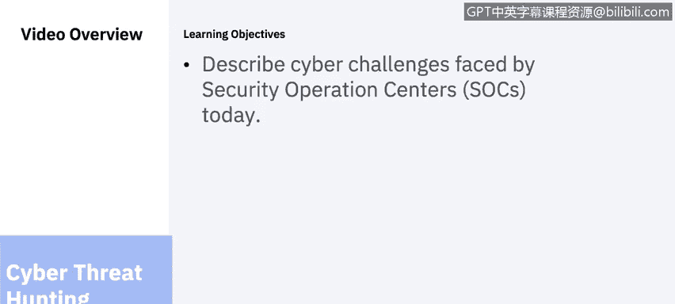
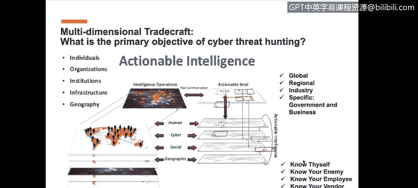
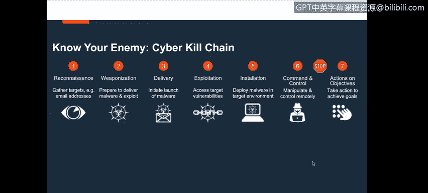
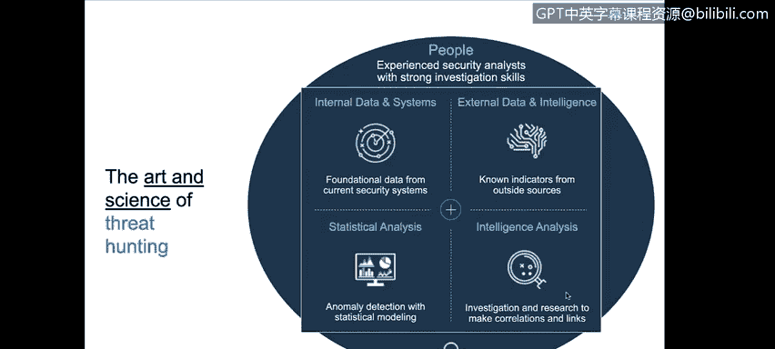
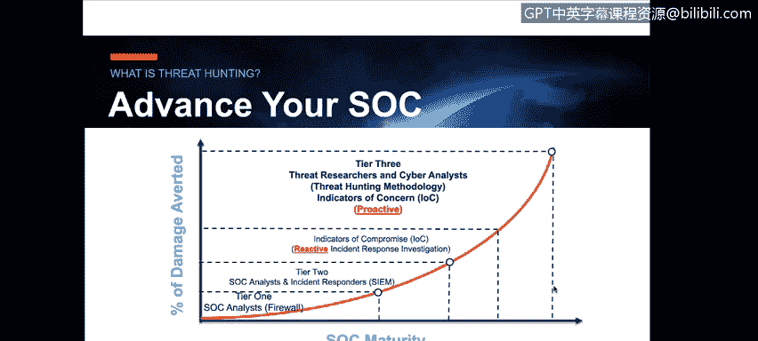
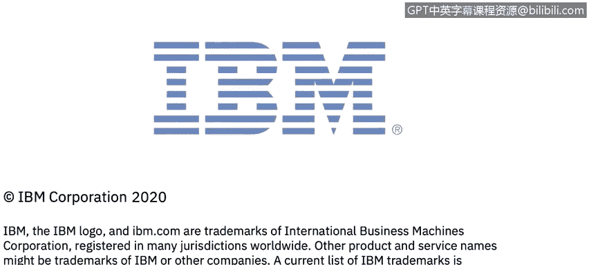

# 课程6：《网络威胁情报课程（IBM）》：75：36_02_soc-cyber-threat-hunting.en_subtitled

## 🎯 概述：什么是网络威胁狩猎？

在本节课中，我们将学习安全运营中心当前面临的挑战，并深入探讨一种更先进的防御模式——由情报驱动的认知型SOC。核心在于理解并实践**主动式网络威胁狩猎**，以超越传统的被动响应模式。

## 🔍 传统SOC的局限与挑战

上一节我们介绍了SOC的基本概念，本节中我们来看看传统SOC面临的挑战。

由IBM带来的SOC网络威胁狩猎。在本视频中，悉尼将描述当今安全运营中心面临的网络挑战。所有情报驱动的认知型SOC。现在，我意识到有很多词汇，如何定义SOC和如何定义下一代，除非你简化并说由情报驱动的下一代SOC。

由主动式网络威胁狩猎驱动，最终是我们需要达到的目标。正如我之前在介绍中所说，我在SOC环境中工作多年。我在Uniics公司工作了10年，与Uniics及其客户的安全运营中心进行交互和合作。作为执行架构师的角色，我的首要任务是理解客户的需求。当然，这是我们所有人都有的需求，无论是内部还是外部，取决于我们是在支持客户还是需要内部支持自己。我们必须理解我们希望通过当前状态的保护和防御操作以及传统SOC操作实现什么目标。

然而，我们发现，我们的许多客户、许多全球系统集成商、许多托管安全服务提供商认识到，必须找到一种方法，在这些威胁成为实际问题之前就开始领先于它们。因此，我们今天想介绍的是如何实际开始做到这一点。

现在，我要回到我在人类情报空间和情报世界的经验。这是我们面临的一个挑战。在SOC中，安全运营专业人员，从一级到四级的分析师和工程师，在他们需要工作的脚本化环境中非常擅长他们的工作。毫无疑问，三级和四级的调查或分析师正在进行网络取证调查。

但必须非常清楚，那并不是真正的主动式网络威胁狩猎，那是反应式网络取证调查。我们将讨论什么是真正的主动式网络威胁狩猎。但我想在这里与大家分享的是，在我们所做的所有事情中，在情报世界、威胁和威胁向量的世界里，这些领域（无论是网络、物理威胁、恐怖主义还是民族国家）的共同点是，这一切都是**人为驱动**、人为导向、人为起源的。

因此，当你开始研究如何主动识别威胁向量、理解跨国犯罪分子、理解他们的运作方式时，现在如何开始制定一个围绕如何进行主动式网络威胁狩猎的策略。

## 🎯 定义主动式网络威胁狩猎

那么，开始的第一步是如何定义什么是真正的网络威胁狩猎。IBM在使用I2的背景下定义它的方式是：**主动且积极地识别、拦截、追踪、调查并消除对手的能力，在他们对你的组织或你的客户构成问题之前**。这就是我们所说的下一代SOC，我们所说的由情报驱动的认知型SOC的大方向。

当然，这需要与网络杀伤链联系起来，这有助于你理解技术、技巧和程序。TTP是我们在情报世界中定义的术语。当然，这也是情报和执法部门大量使用的术语。因此，作为其中的一部分，就是理解什么是网络威胁狩猎。

再次澄清，网络取证调查是当今传统SOC中三级和四级分析师所做的工作，但那是**反应式**的，是你实际正在进行的取证调查。现在你可能会争辩说，如果一个威胁已经发生，漏洞已被利用，我们现在需要进行调查，你是在追捕那个威胁吗？是的，当然是。但你是在网络取证调查的背景下进行的。而我们所说的网络威胁狩猎，是**主动且积极地识别、拦截、追踪、调查并消除这些类型威胁的能力，在它们成为问题之前**。

这又回到了我们之前所说的，你如何识别传统保护和防御、传统SOC环境中那80%的已知威胁。你如何进化到下一代SOC的主动式网络威胁狩猎水平。

## 👥 威胁狩猎所需的技能与团队构成

当你审视SOC内的技能组合时，你看到的是安全分析师一级到四级的技能组合。

以下是进行这类工作真正需要的技能，以及如何构建网络威胁狩猎团队。

实际上，需要一个具备**情报技能**的人员。而今天在技能组合上存在差距。现在，全球系统集成商、托管安全服务提供商可以组建团队来做这类工作，但这在很大程度上是一种不同的技能组合、一个不同的团队。一个网络威胁狩猎团队包括网络威胁情报分析师、网络威胁狩猎员、红队成员等，但目标和目的是推动产生可操作的情报，这是主动式网络威胁狩猎设计的意图。

## 🗺️ 威胁狩猎的起点：从全局到局部

现在，如果你没有任何开始的地方，也不知道如何开始进行主动式威胁狩猎，你从哪里开始呢？

你可以从一个**全球威胁态势视图**开始，将其细化到区域（当然包括北美和其他地区），再细化到行业，真正定制我们正在识别的威胁情报、威胁向量、威胁行为者等，然后具体到实际组织本身。作为全球系统集成商、托管安全服务提供商和IBM安全销售方，我们自然与客户合作，跨越这些不同的行业。理解与此相关的变量，然后当然进一步细化到更深的层次，那就是：你如何了解自己，世界如何看待你，你如何了解你的敌人，你如何了解你的员工、你的供应商、你的客户。这些都是组织的变量，如果你为这些组织提供服务，如果你想帮助他们并帮助他们超越保护和防御空间，这些都是你必须在环境中考虑的因素。

## 🎯 了解你的敌人：从侦察开始

现在，了解你的敌人，当然，了解任何方面，但特别是了解你的敌人。

你必须理解网络杀伤链，当然，开始的第一点是与之相关的**侦察**。我这么说是什么意思？

侦察意味着这些威胁行为者，无论是跨国犯罪分子还是民族国家，正在对组织进行侦察，确定他们想要关注的目标。你可能是一个目标选择或一个机会目标，但无论如何，他们正在进行侦察，收集关于组织的信息，无论是关于你的客户、你的组织还是行业。但要理解，当他们定义侦察时，他们谈论的是高管、运营时间、你在哪里开展业务、最容易进入的途径是什么。

在我们深入探讨如何武器化、交付、利用、安装、命令和控制以及最终执行其行动和目标的所有技术方面之前，第一点是侦察。正如我之前所说，他们有很多时间、金钱和资源来做这件事，他们有世界上所有的时间。

一个例子是智利的一家银行，它曾受到Swift tie的攻击，损失了1000万美元。后来对同一家银行还有另一次攻击，他们损失了4.75亿美元。他们在环境中采取了“低而慢”的策略，因为他们能够进行侦察，找出可以部署恶意软件以执行这些低端交易的薄弱点，这些交易永远不会被基于规则的系统识别出来。因此，在此过程中理解网络杀伤链极其重要。

## 🧠 威胁狩猎的核心：人的因素与数据驱动

现在，如果你看这张图的视觉效果，请理解这里的**关键驱动因素是人类因素**，是人，是威胁狩猎的艺术与科学。

以下是围绕内部外部数据、统计分析和情报的所有因素。

所有这些围绕内部外部数据、统计分析和情报的因素，必须由分析师驱动和管理。这个分析师是具备强大安全背景、理解情报流程并将其与所有这些因素联系起来的情报分析师。为什么这很重要？如果你不了解他们是谁、他们在做什么、他们如何运作、他们来自哪里，如果你不知道如何提出这类与进行网络威胁狩猎相关的问题，你将如何定义数据源需要来自哪里？无论是来自深网、暗网、开源、社交媒体的内部外部数据源，还是内部的SIEM、端点日志等。你如何将所有数据汇集在一起？如果你没有技能来理解关于威胁向量、威胁行为者、他们是谁、他们在做什么以及他们如何运作的大局，那么对你来说，提出正确的问题以产生良好的情报是具有挑战性的。

所以你需要一个开始的地方，那个起点就是你的技能组合。

## 🔄 威胁狩猎：一个非线性的成熟过程

在这张幻灯片中，我只想明确一点，我们想在这里向大家展示的是，**这不是一个线性过程**。所以我经常听到组织说，在我进入这个三级高级网络威胁狩猎之前，我真的希望能够成熟我的SOC。我要非常清楚地对这次通话中的每个人说，这是一个成熟度的现实，你等不起。如果你等待成熟你的SOC，让你的第一级和第二级系统达到完美状态，然后继续在妥协指标的反应式空间中工作（我们将继续这样做），如果你等待开始进行主动式网络威胁狩猎，请理解这是你正在承担的风险，因为威胁行为者、威胁向量对他们来说在不断发展，他们在很多情况下已经领先很多年了。

那么你如何开始平衡竞争环境？事实是，你现在真的需要开始积极进入这个网络威胁狩猎方法论空间。要非常清楚，**妥协指标是反应式的**。我们都熟悉IoC。IoC是反应式的妥协指标。我们在这里介绍的是一种不同类型的IoC，称为**关注指标**，这是主动式的。我看到各种形式的情报，让我相信我的组织可能受到攻击。以下是作为威胁狩猎员，我向我的组织或客户推荐需要采取的行动和步骤。这就是你开始成熟组织的方式。

## 📝 总结

本节课中我们一起学习了主动式网络威胁狩猎的核心概念。我们明确了它与传统反应式取证调查的区别，强调了其**主动识别和消除威胁**的本质。我们探讨了威胁狩猎所需的**情报分析技能**和专门的团队构成，并指出了从全球威胁态势入手，结合网络杀伤链（特别是侦察阶段）来了解对手的重要性。最后，我们理解了威胁狩猎是一个需要**并行推进、而非线性等待**的成熟过程，并引入了**关注指标**作为超越传统妥协指标的主动预警工具。