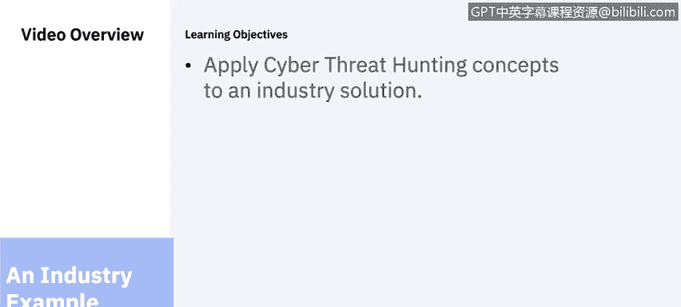
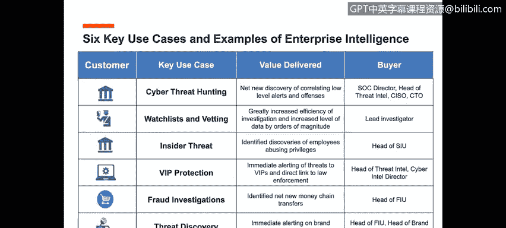
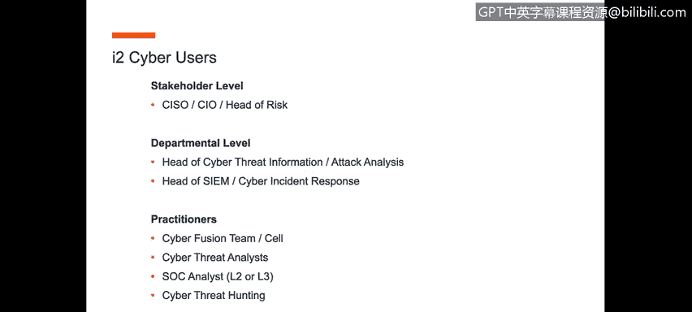
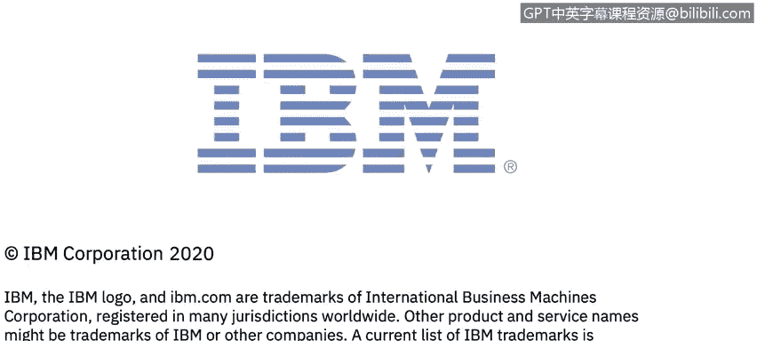

# 课程6：《网络威胁情报课程（IBM）》：76：网络威胁狩猎行业示例 🎯

在本节课中，我们将学习如何将网络威胁狩猎的概念应用于一个行业解决方案。我们将了解威胁狩猎团队的组织结构、核心工作流程以及支撑其运作的关键技术平台。

## 概述

网络威胁狩猎是一种主动的安全防御方法。本节将通过一个行业实例，详细阐述如何构建和运行一个威胁狩猎团队，以及该团队如何与传统的安全运营中心（SOC）协同工作，以提升组织的整体安全成熟度。

## 威胁狩猎团队的组织结构 🏢

上一节我们介绍了威胁狩猎的基本概念，本节中我们来看看一个典型的威胁狩猎团队在组织中的位置及其构成。

威胁狩猎团队通常独立于传统的安全运营中心（SOC）。如下图所示，威胁狩猎团队位于网络情报组织的中心。

其左右两侧分别是：
*   **右侧**：传统的SOC运营，包含安全信息与事件管理（SIEM）系统、端点保护、安全设备管理等环境。
*   **左侧**：各类数据源，包括开源情报、深网、暗网、非结构化数据、开源情报网络等。

威胁狩猎团队的职责是主动进行网络威胁狩猎。他们从上述所有环境中获取数据，并以集中的方式整合分析，从而在威胁演变为实际问题之前，做出更明智的主动决策。这种红队（威胁狩猎团队）与蓝队（SOC）之间的信息共享，能形成一个持续改进的良性循环，最终使整个SOC和环境变得更高效、更成熟。

## 如何构建威胁狩猎团队 🔧

理解了团队的位置后，接下来我们探讨如何具体构建这样一个团队。

构建威胁狩猎团队，可以总结为以下几个要点：
*   **独立性**：威胁狩猎团队应独立于传统的SOC运营。SOC继续负责提供7x24小时的运营保障，而威胁狩猎团队则作为一个更高级的团队存在。
*   **人员构成**：团队成员应兼具安全和情报背景。
*   **团队组成**：一个完整的威胁狩猎团队基础通常包括：
    1.  **网络威胁情报分析人员**
    2.  **网络红队**，负责模拟对组织的攻击。
*   **工作流程**：威胁狩猎团队主动识别威胁，并将信息共享给SOC内的蓝队。蓝队随后可以利用这些信息在其SIEM平台中制定更好的规则，改进安全设备管理，从而提升整体防护和防御能力。

总而言之，威胁狩猎团队虽然独立于SOC，但它是SOC的下一代演进，旨在为组织带来更好的防御能力。

## 威胁狩猎的应用场景 💡

了解了团队构成，我们来看看威胁狩猎技术可以应用于哪些具体场景。

I2企业情报分析平台在多个领域都有应用。从网络狩猎、监视列表到内部威胁，该平台能够服务于众多组织。其核心在于数据情报分析，能够帮助我们将内部与外部的风险点连接起来，形成所谓的“风险洞察”。

以下是几个在SOC环境中的应用案例：
*   **网络取证调查**：通过此类分析，减少了从SIEM系统产生的事件告警数量。SOC分析师能够快速有效地洞察正在发生的情况，从而减少所看到的误报。
*   **欺诈检测**：另一个案例是欺诈情况分析，通过该平台的应用，成功减少了发生的欺诈数量。

这些案例表明，威胁狩猎分析能够有效提升安全运营的精准度和效率。

## 核心技术平台：I2企业情报分析 🛠️

那么，要实现威胁狩猎，需要什么样的技术支撑呢？I2企业情报分析平台正是为此而设计。

I2平台已问世多年，部署于超过100个国家，服务于政府、军队、执法机构和私营企业等各行各业。它能够帮助组织将SOC、GSI、MSSP或内部SOC运营提升到下一代认知分析的水平。

该平台的核心能力包括：
*   **数据整合**：能够对接内部和外部数据源，并将其整合到一个统一的环境中进行分析。
*   **关联分析**：通过实体、链接和属性来连接数据点，真正厘清事件脉络（如上图所示），将人员（分析师）、驱动因素和监控情报结合起来。
*   **情报生产**：将信息转化为可操作的情报。
*   **协同共享**：为威胁狩猎团队和SOC提供一个集中的协作与情报共享环境。

其价值主张在于**优化运营**、**发挥力量倍增器作用**，并帮助**预测和主动识别**威胁。

## 平台用户与法律价值 ⚖️

最后，我们来看看该平台的使用者及其独特的法律价值。

在网络安全领域，该平台的典型用户包括各类分析师和决策者。其价值在于能够整合所有不同的内外部数据源，并将生成的情报提交给CSO、CIO或风险主管以辅助决策。

需要特别指出的是，I2平台已被全球执法机构用于起诉多项犯罪活动，其分析结果在包括荷兰海牙国际法庭在内的法律程序中均被采信。因此，I2企业情报分析平台不仅可用于传统的安全取证调查和主动威胁狩猎，其分析结果还能支撑刑事调查，并经受住法庭的质证。这使得组织能够与总法律顾问、法律和执法机构就此进行有效沟通。

## 总结

本节课中，我们一起学习了网络威胁狩猎的行业实践。我们了解了威胁狩猎团队应独立于SOC，并整合了情报与安全技能。我们探讨了威胁狩猎在减少误报和欺诈检测等方面的应用场景。最后，我们介绍了I2企业情报分析平台如何作为核心技术，通过整合数据、关联分析和生产可行动情报，来赋能威胁狩猎团队，并提升整个安全运营的成熟度与效率。