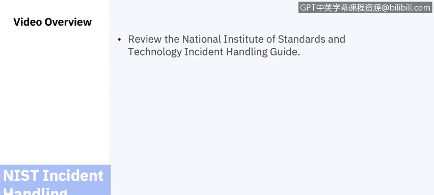
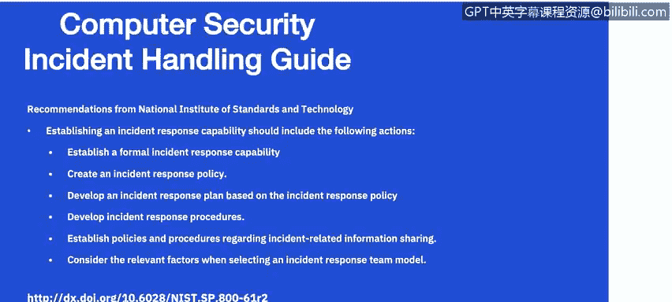
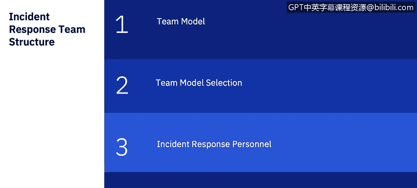

# 课程7：《网络安全顶级项目：入侵响应案例研究》：1：0_NIST事件响应生命周期团队.zh

## 🎬 课程概述

在本节课中，我们将要学习美国国家标准与技术研究院（NIST）事件响应处理指南的概述。我们将探讨建立有效事件响应能力的关键组成部分，包括团队结构、人员配置模型以及所需的技能组合。

---

## 📋 事件响应的挑战与基础

上一节我们介绍了课程概述，本节中我们来看看建立事件响应能力时面临的挑战和需要确立的基础规则。如果你已经学习过渗透测试、事件响应和取证课程，这部分内容可能是一次复习，但为本课程设定基本规则仍然非常重要。

建立事件响应能力应包括以下行动：

以下是建立事件响应能力的关键行动列表：
*   **制定事件响应策略和计划**：事件响应策略是事件响应计划的基础。它定义了哪些事件被视为安全事件，建立了事件响应的组织结构，明确了角色与职责，并列出了事件报告的要求。
*   **制定事件响应程序**：事件响应程序为响应事件提供了详细的步骤。组织应提前在策略和程序中确立与外部各方（如媒体、执法机构和事件报告组织）沟通适当事件细节的流程。团队应遵守组织与媒体等外部各方互动的现有政策。
*   **设定外部沟通准则**：作为此过程的一部分，你需要设定与外部各方就事件进行沟通的准则。你需要向适当的组织（例如美国网络安全和基础设施安全局）提供相关的事件信息。在策略中，你应决定是否使用信息共享与分析中心（ISAC）。ISAC是一个非营利组织，为收集关键基础设施面临的网络威胁信息提供中心资源，并促进公私部门之间的双向信息共享。

---

## 👥 团队结构与人员配置模型

上一节我们介绍了建立事件响应能力的基础框架，本节中我们来看看如何选择和构建事件响应团队。选择团队结构和人员配置模型时，需要考虑几个方面，我们将在本视频后面深入探讨。

以下是选择事件响应团队模型时需要考虑的相关因素：
*   **评估团队模型**：仔细权衡每种可能的团队结构模型和人员配置模型的优缺点，结合组织的需求和可用资源进行考量。
*   **选择具备适当技能的人员**：团队的可信度和专业能力在很大程度上取决于其成员的技术技能和批判性思维能力。关键技术技能包括系统管理、网络管理、编程、技术支持和入侵检测。有效的应急处理也需要团队合作和沟通技巧。应为所有团队成员提供必要的培训。
*   **建立沟通渠道**：在安全事件发生之前，建立事件响应团队与内外其他团队之间的关系和沟通渠道。每个事件响应团队都依赖于其他团队的专业知识、判断和能力，包括管理层、信息安全保障、IT支持、法律、公共事务和设施管理。
*   **确定团队服务范围**：确保确定事件响应团队应提供哪些服务。虽然团队的主要重点是事件响应，但大多数团队还执行其他功能，例如监控、入侵检测、发布安全公告以及对用户进行安全教育。

现在，让我们更深入地探讨事件响应团队的结构。事件响应团队应可供任何发现或怀疑发生涉及组织安全事件的个人使用。事件处理人员分析事件数据，确定事件的影响，并采取适当行动以限制损害并恢复正常服务。

对于团队模型，大多数组织会使用几种不同的模型：
*   **集中式事件响应团队**：处理整个组织的事件。此模型通常用于地理位置集中的小型组织。
*   **分布式事件响应团队**：组织拥有多个事件响应团队，分别负责某个业务单元或大型组织，或负责不同的地理区域。应指定一个协调团队。

计算机安全事件响应团队（CSIRT）是一组IT专业人员，为组织提供围绕预防、管理和协调潜在网络安全相关紧急情况的服务和支持。

在为事件响应团队选择适当的结构和人员配置模型时，组织可以考虑三种人员配置模型：
*   **内部员工模型**：使用内部员工。
*   **部分外包模型**：将部分事件响应工作外包给另一个组织。最常见的安排是将入侵检测传感器、防火墙和其他安全设备的全天候监控外包给场外的托管安全服务提供商（MSSP）。
*   **完全外包模型**：将事件响应工作完全外包，通常是外包给现场承包商。当组织需要全职的现场事件响应团队，但没有足够可用的合格员工时，最有可能使用此模型。

在为事件响应团队选择适当的结构和人员配置模型时，组织应考虑以下因素：
*   **全天候可用性需求**：是否需要7x24小时可用。
*   **人员性质**：团队成员是全职还是兼职，是否将现有团队（如IT帮助台）作为事件报告的第一联络点。
*   **员工士气**：事件响应工作压力很大，通常需要团队成员承担待命职责。许多组织也难以找到愿意参与、经验丰富且具备适当技能的人员，尤其是在需要24小时支持的情况下。**分离职责**，特别是减少团队成员负责执行的管理工作量，可以显著提升士气。
*   **成本**：成本也可能是一个主要因素，例如比较要求员工7x24小时在现场与使用可能支持多个客户的外包组织之间的成本差异。

---

## 🔧 团队技能与职责

上一节我们讨论了团队的结构和人员配置，本节中我们来看看事件响应团队成员需要具备哪些技能，以及团队通常承担哪些职责。

事件处理需要在多个技术领域具备专业知识和经验。所需知识的广度和深度取决于组织风险的严重程度。

事件响应团队成员应具备出色的技术技能，例如系统管理、网络管理、编程、技术支持或入侵检测。每个团队成员都应具备良好的解决问题能力和批判性思维能力。并非每个成员都需要是技术专家。

除了技术专长，事件响应团队成员还应具备其他技能：
*   **团队合作技能**至关重要，因为成功的应急响应需要合作与协调。
*   每个团队成员还应具备良好的**沟通技巧**。这些沟通技巧很重要，因为团队必须与各种各样的人互动。
*   **写作能力**在团队成员准备公告和程序时也很重要。

事件响应团队的主要重点是执行事件响应，但仅执行事件响应的团队相当罕见。一些事件响应团队还执行以下职能：
*   **入侵检测**。
*   **公告分发**：团队可能会在组织内发布关于新漏洞和威胁的公告。

---

## 📝 课程总结

在本节课中，我们一起学习了NIST事件响应处理指南的概述。我们探讨了建立事件响应能力的关键步骤，包括制定策略、计划和程序。我们深入分析了不同的团队结构模型（集中式与分布式）和人员配置选项（内部、部分外包、完全外包），并讨论了在选择模型时需要考虑的因素，如可用性、成本、人员技能和士气。最后，我们明确了事件响应团队成员所需的技术与非技术技能，以及团队可能承担的扩展职责。理解这些基础概念对于构建一个高效、可靠的事件响应团队至关重要。