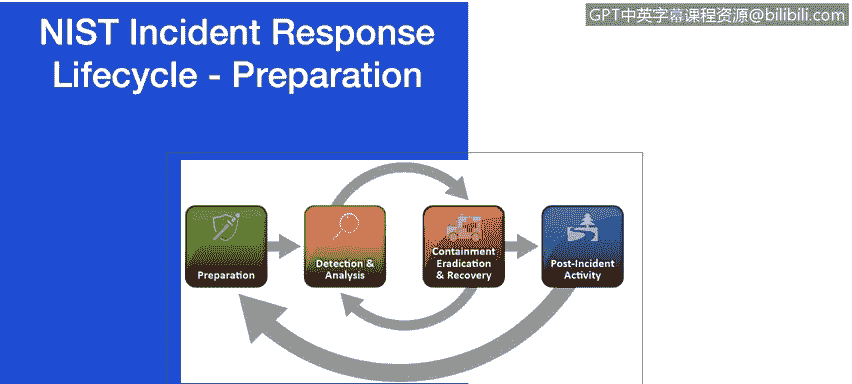
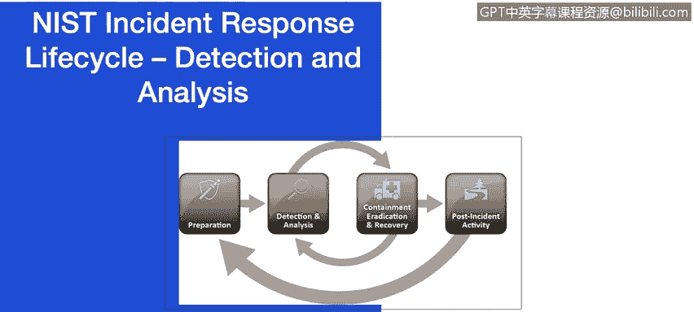
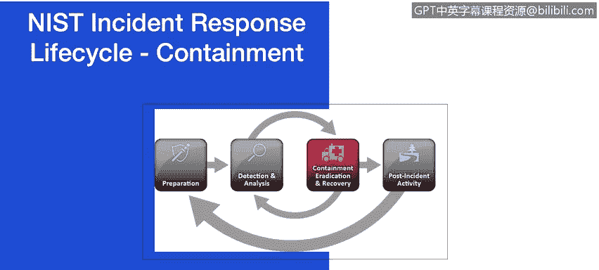
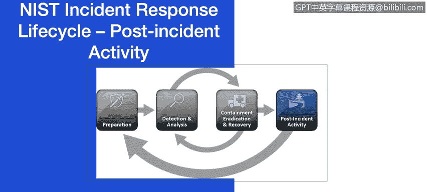

# 课程7：《网络安全顶级项目：入侵响应案例研究》：2：1_NIST事件响应生命周期

在本节课中，我们将详细学习事件响应流程的主要阶段，包括准备、检测与分析、遏制、根除与恢复以及事后活动。由于这对许多人来说可能是一次复习，我将重点指出关键要求。如需更全面的了解，您可以参考之前的课程或NIST事件处理指南。

## 准备阶段 🛡️

上一节我们介绍了课程概述，本节中我们来看看事件响应生命周期的第一个阶段：准备。事件响应方法论通常强调准备，这不仅包括建立事件响应能力以使组织准备好应对事件，还包括通过确保系统、网络和应用程序足够安全来预防事件。

以下是准备阶段的一些基本要求：

*   **事件处理人员通信设施**：在本课程的案例研究中，以及当您准备构建自己的案例研究时，审视组织在哪些方面未能满足这些基本要求非常重要。
*   **联系信息和待命信息**：如果您突然无法访问存储这些信息的手机、平板电脑或笔记本电脑，您是否能够联系到成功联系团队所需的信息？这是在准备事件响应时需要考虑的问题。
*   **事件状态报告能力**：这对于在组织遭受网络攻击时快速调动正确资源至关重要。
*   **安全作战室**：在需要多人技能时，您是否有安全的作战室来召集相关人员？如果组织后来因数据泄露事件被要求提供证据，您将在哪里存储任何取证证据？所有这些问题都需要在组织内发生安全事件之前得到解答。

您还需要拥有正确的事件分析硬件和软件。您需要备用工作站、服务器和网络设备或其虚拟化等效物，这些可用于恢复备份和测试恶意软件等目的。还需要数据包嗅探器和协议分析器来捕获和分析网络流量。这些只是从硬件和软件角度您需要的一些例子。

最后，请审查您的事件分析资源。您是否拥有网络图和关键资产列表、关键文件的加密哈希值，以及是否能够访问干净操作系统和应用程序安装的镜像，以便用于可能的恢复目的？

## 常见攻击向量 🎯

事件可能以无数种方式发生，因此为处理每个事件制定逐步说明是不可行的。组织应做好处理任何事件的普遍准备，但应重点准备处理常见攻击向量的事件。所列的攻击向量并非旨在为事件提供明确的分类，而只是列出常见的攻击方法，可作为定义更具体处理程序的基础。

以下是几种常见的攻击向量：

*   **消耗攻击**：这是一种使用暴力方法破坏、降级或摧毁系统、网络或服务的攻击。针对身份验证机制（如密码）的暴力攻击很常见。
*   **电子邮件攻击**：这是一种通过电子邮件消息或附件执行的攻击。例如，设计为附件文档或电子邮件正文中指向恶意网站链接的漏洞利用代码。

在本课程中，我们将探讨这些攻击向量以及其他几种攻击向量。我们尚未讨论的其他几种攻击方法可能涉及设备丢失或被盗。组织使用的计算设备或媒体（如笔记本电脑、智能手机或身份验证令牌）的丢失或被盗应立即报告给组织，并作为安全事件处理的一部分进行处理。此外，还有**其他类别攻击**，即不属于任何其他类别的攻击。您的事件响应团队将如何处理尚未识别且未写入逐步程序中的攻击？

## 检测与分析阶段 🔍

对于许多组织来说，事件响应流程中最具挑战性的部分是准确检测和评估可能的事件，确定事件是否已经发生，如果是，则确定问题的类型、范围和严重程度。这在本课程的多个案例研究中将变得清晰。使其如此具有挑战性的是三个因素的结合：事件可能通过许多不同的方式被检测到，细节程度各不相同；潜在事件迹象的数量通常很高；以及需要深入的专业技术知识和丰富的经验来正确有效地分析事件相关数据。

事件迹象分为两类：**前兆**和**指标**。前兆是表明未来可能发生事件的迹象。指标是表明事件可能已经发生或正在发生的迹象。如果检测到前兆，组织可能有机会通过改变其安全态势来防止事件发生，从而保护目标免受攻击。例如，显示漏洞扫描器使用的Web服务器日志条目，或来自某个团体的威胁声明该团体将攻击组织。虽然前兆相对罕见，但指标却非常普遍。

一个指标可能涉及防病毒软件警报，它检测到主机感染了恶意软件；包含来自不熟悉的远程系统的多次失败登录尝试的应用程序日志；或者网络管理员注意到与典型网络流量流的异常偏差。

如果每个前兆和指标都保证准确，事件检测分析就会很容易。不幸的是，情况并非如此。入侵检测系统可能会产生误报或不正确的指标。

是什么让事件检测分析如此困难？理想情况下，应评估每个指标以确定其是否合法。指标的总数可能每天达到数千或数百万，从所有指标中找到发生的真实安全事件可能是一项艰巨的任务。

## 遏制阶段 🚧

遏制阶段的一个关键部分是决策。我们应该关闭系统吗？我们应该断开网络连接还是禁用网络上的某些功能？如果预先确定了遏制事件的策略和程序，做出这样的决定就容易得多。

遏制策略因事件类型而异。确定适当策略的标准包括：对资源的潜在损害和盗窃、证据保存的需要、实施策略所需的时间和资源以及此解决方案的持续时间。是否存在紧急变通方案？是否存在两周后需要移除的临时变通方案？是否存在永久性解决方案？在某些情况下，一些组织会采取重定向措施。

尽管在事件期间收集证据的主要目的是解决事件，但它也可能需要用于法律程序。应根据符合所有适用法律和法规的程序收集证据，这些程序是在之前与法律工作人员和适当的执法机构讨论后制定的，以便任何证据在法庭上都是可接受的。

## 根除与恢复阶段 🔄

在事件得到遏制后，可能需要进行根除以消除事件的组成部分，例如删除恶意软件和禁用被入侵的用户帐户，以及识别和缓解所有被利用的漏洞。

## 事后活动阶段 📝

事件响应中最重要的部分之一也是最常被忽略的部分：学习和改进。每个事件响应团队都应不断发展，以反映新的威胁、改进技术和吸取的教训。小事件需要有限的事后分析，但通过新的、引起广泛关注和兴趣的攻击方法执行的事件除外。

在发生严重攻击后，通常值得召开跨团队和组织界限的事后分析会议，以提供信息共享机制。组织应制定关于事件证据应保留多长时间的策略。大多数组织选择在事件结束后将证据保留数月或数年。

## 总结

本节课中我们一起学习了NIST事件响应生命周期的五个主要阶段：准备、检测与分析、遏制、根除与恢复以及事后活动。我们探讨了每个阶段的关键要求和挑战，例如准备必要的资源、识别攻击向量、准确分析事件迹象、制定遏制策略以及从事件中学习的重要性。理解这个生命周期是有效管理和响应网络安全事件的基础。