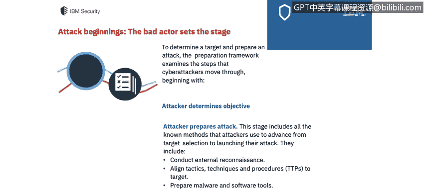
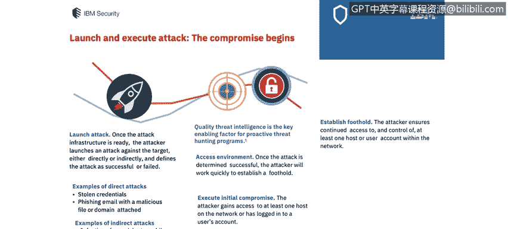
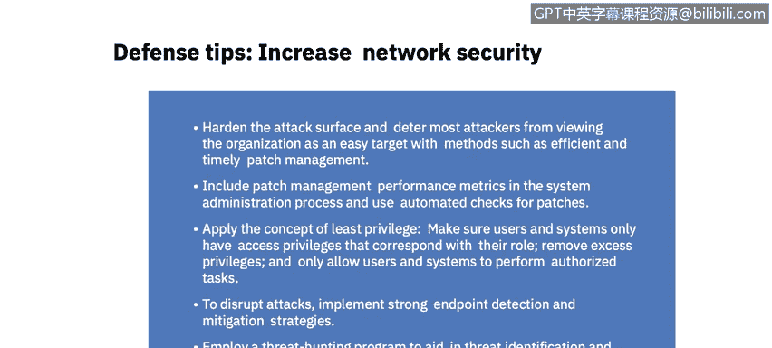
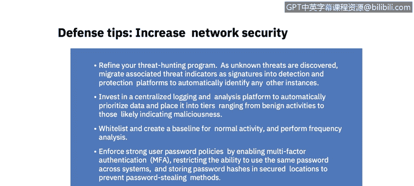
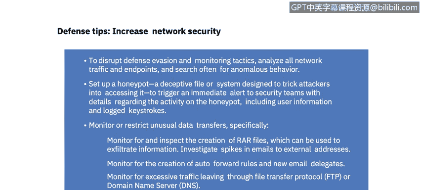

# 课程7：《网络安全顶级项目：入侵响应案例研究》：3：IBM X-Force IRIS网络攻击框架 🛡️

## 概述
在本节课中，我们将学习IBM X-Force IRIS团队开发的网络攻击框架。该框架从攻击者的视角，系统性地剖析了网络攻击从准备到执行的全过程。理解此框架对于网络安全分析师构建有效的防御策略至关重要。

---

## 网络攻击框架简介
上一节我们介绍了课程背景，本节中我们来看看IBM X-Force IRIS网络攻击框架的核心价值。

该框架由IBM X-Force事件响应与情报服务团队的专家开发。它旨在全面描述攻击者采取的所有行动，为安全分析师和威胁猎手提供所需洞察，以缩小风险敞口并挫败日益增多的网络攻击。

框架概述了网络攻击的每个阶段，使安全分析师能够以可重复且全面的方式审视攻击。需要注意的是，攻击的各个阶段**不一定按顺序发生**。根据攻击进展，阶段可能同时发生、多次迭代，甚至被完全跳过。

---

## 阶段一：攻击准备 🎯
在攻击开始前，恶意攻击者会进行周密准备。攻击的第一部分是准备框架，它审视了网络攻击者从开始到发起攻击所经历的步骤。

以下是攻击准备阶段的关键步骤：

1.  **确定攻击目标**：攻击者明确其目的，例如窃取知识产权。
2.  **识别攻击目标**：攻击者选定具体的攻击对象。
3.  **确定攻击需求并制定初步攻击计划**。
4.  **准备攻击**：此阶段包括攻击者从目标选择到发起攻击所使用的所有已知方法。
    *   进行外部侦察。
    *   调整战术、技术与程序。
    *   准备恶意软件和软件工具。攻击者会定义计划用于入侵并在网络中横向移动的工具集。这可能包括恶意软件、被重新用于恶意目的的合法软件工具或两者结合。
5.  **准备攻击基础设施**：攻击者可能构建命令与控制网络。我们将在后续的“水坑攻击”案例研究中看到一个具体例子。

基于此阶段的防御建议如下：

*   **构建威胁画像**：分析可能针对公司的攻击者。构建画像时需考虑：
    *   过去是否有威胁行为者针对过本组织？
    *   哪些类型的攻击者会对本组织感兴趣？
    *   这些威胁组织位于何处？
    *   攻击者的目标是什么？
*   **保护关键资产**：采取步骤保护资产。攻击者可能瞄准最关键的数据，因此需明确这些数据的存储位置。判断威胁行为者是否对本组织感兴趣，是否存在攻击者希望获取的资产、知识产权、客户数据或专有数据。
*   **监控域名注册**：为防止C2服务器注册看似合法的域名来欺骗目标，应购买所有可能与公司名称相关的各类变体域名，并监控可疑的域名注册活动。

---

## 阶段二：攻击发起与执行 ⚔️
上一节我们介绍了攻击的准备阶段，本节中我们来看看攻击是如何正式发起和执行的。

一旦攻击基础设施准备就绪，攻击者就会对目标发起攻击（直接或间接），并定义攻击成功或失败。本课程后续将更详细地探讨其中一些攻击类型。

成功的入侵标志着网络攻击执行框架的开始。如果尝试失败，攻击者可能会回溯之前的步骤，以完善攻击策略并确定失败点，从而重新发起攻击。他们可能会审视访问环境、再次执行初始入侵，并尝试建立实际的立足点。

此阶段的防御建议如下：

*   **强化攻击面**：通过补丁管理使组织不被视为容易攻击的目标。可以将补丁管理绩效指标纳入系统管理流程，并使用自动补丁检查。
*   **应用最小权限原则**：这是我们之前课程中探讨过的概念。
*   **破坏攻击**：实施强大的端点检测和缓解策略，正如我们在端点安全相关课程中所见。
*   **采用威胁狩猎计划**：以辅助威胁识别和缓解。

---

## 阶段三：网络访问扩展 🔗
随着攻击的继续，攻击者会尝试扩大其在网络中的访问权限。

一旦攻击者在网络中获得了立足点，下一步就是扩大网络访问。此阶段包括攻击者从初始入侵到执行其目标所使用的方法。

以下是攻击者可能采取的行动：

1.  **提升权限**：攻击者在受感染网络内获得更高级别的访问权。凭证转储、使用先前窃取的哈希绕过密码、破坏内部应用程序或系统都是可用于提升网络访问权限的战术。
2.  **横向移动**：攻击者在网络内部横向移动。我们将在本课程后面审查的第三方案例研究中看到这种情况。
3.  **进行内部侦察**：攻击者可能使用查询网络操作系统和端口、浏览文件以寻找数据或追踪特定资源的服务票证等战术来收集有关网络的更多信息。
4.  **维持持久性**：攻击者完成行动以加强并维持其立足点，确保持续访问环境。

此阶段的防御建议如下：

*   **完善威胁狩猎计划**：随着未知威胁的发现，将相关的威胁指标作为签名集成到检测和保护平台中，以自动识别其他任何实例。
*   **投资集中式日志记录与分析平台**：自动对数据进行优先级排序和分层。
*   **创建白名单和正常活动基线**，并执行频率分析。
*   **强制执行强用户密码策略**：启用多因素认证，并对员工进行密码规则的教育和限制。

---

## 贯穿始终的持续阶段 🔄
在网络攻击生命周期中，某些方面是持续存在的。

*   **行动安全**：从攻击准备开始，行动安全代表了攻击者为向受害者或网络安全防御者隐藏其攻击准备而采取的所有行动。
*   **防御规避与监控**：战术包括使用旨在伪装攻击存在的恶意软件、数据掩蔽等。典型行动包括删除日志、隐藏或伪装恶意代码。
*   **反馈管道**：反馈管道从攻击准备开始一直贯穿到执行阶段。一旦进入网络，攻击者会重新评估其目标和战术，将结果与任务目标进行比较，并可能返回以改进任何攻击阶段。

针对这些持续威胁的防御建议如下：

*   **分析所有网络流量和端点**，并经常搜索异常行为。
*   **设置蜜罐**：即旨在诱骗攻击者访问的欺骗性文件或系统，可立即向安全人员发出警报。
*   **监控并限制异常的数据传输**。
*   **查找特定文件的创建**。
*   **调查发送到外部地址的邮件激增情况**。
*   **监控自动转发规则的创建**。
*   **监控来自单个FTP或DNS服务器的过多流量**。

---

## 阶段四：攻击目标执行 🎯
一旦执行阶段成功完成，攻击者便朝着最终目标迈进。这可能是窃取、间谍活动、传递信息、破坏公司声誉等。威胁行为者可能对组织怀有多种不同的目标。

您必须建立自己的网络攻击应对策略，以有效防止恶意行为者进入您的网络。要从攻击者的角度全面审视网络攻击技术。本课程将展示的一些详细攻击案例研究将帮助您制定此策略，并在组织向您介绍其策略时，您也能具备相关知识，熟悉一些最常见的攻击策略。

此阶段的最终防御建议如下：

*   **建立并培训专门团队**以响应安全事件。我们之前研究过NIST组织建议设立的事件响应团队。
*   **演练相关攻击场景**：使用桌面推演或模拟网络攻击的仿真练习来实践相关攻击场景。另一种方法是审查案例研究，并整理过去公司发生的攻击案例。
*   **彻底检查可用的取证数据**：以了解攻击细节、确定缓解优先级、向执法机构提供数据并规划风险降低策略。您将在案例研究中查看特定已发生漏洞的取证细节。
*   **考虑与可信赖的安全合作伙伴签订事件响应保留协议**：这将使您能够利用可信合作伙伴的知识，并跨公司共享数据，从而可能预防未来的攻击。

---

## 总结
本节课中，我们一起学习了IBM X-Force IRIS网络攻击框架。该框架将攻击分解为**准备、发起与执行、访问扩展、目标执行**等主要阶段，并强调了**行动安全、防御规避和反馈管道**等贯穿始终的要素。通过理解攻击者的每一步行动，并应用相应的防御建议（如构建威胁画像、强化攻击面、实施威胁狩猎、集中日志分析等），安全分析师可以更主动地构建防御体系，有效应对网络威胁。

在下一个视频中，我们将通过2013年发生的Target数据泄露案例研究，向您展示攻击者在现实生活中的所作所为，以及该次攻击和数据泄露给公司带来的代价。