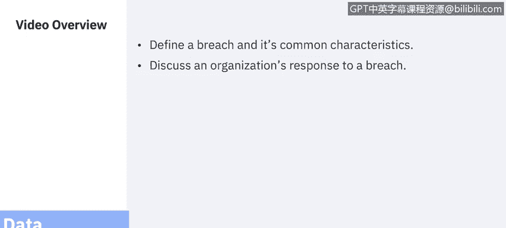
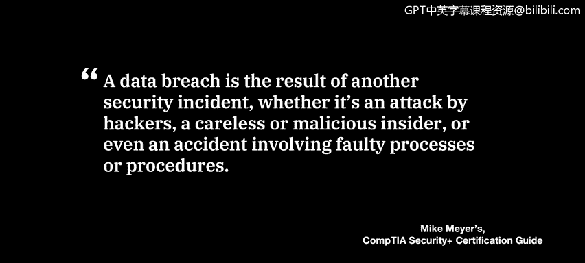
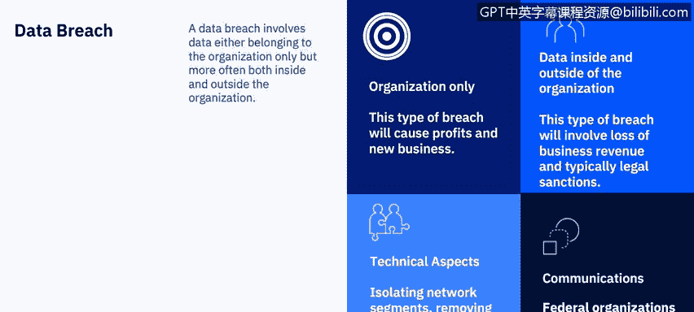
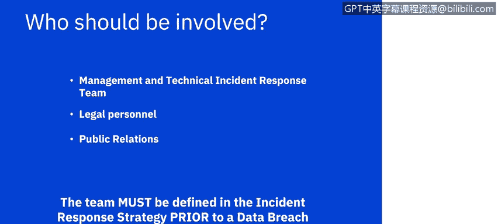

# 课程7：《网络安全顶级项目：入侵响应案例研究》：4：3_什么是数据泄露 🛡️

## 概述

在本节课中，我们将要学习数据泄露的定义、其常见特征，并讨论组织应如何响应数据泄露事件。

---

## 什么是数据泄露？

数据泄露是最常发生的安全事件之一。你几乎每天都能在新闻中听到数据泄露事件，尤其是在恶意行为者利用全球性事件（例如新冠疫情）的时期。然而，数据泄露对新闻媒体来说并非新鲜事，它已经影响公众相当长一段时间了。

作为一名网络安全专业人士，特别是分析师，回顾过往的数据泄露案例研究，并实时关注新闻和威胁情报网站关于新泄露事件的报告，是非常重要的。

---

## 数据泄露的定义与特征

上一节我们提到了数据泄露的普遍性，本节中我们来看看其具体定义。

迈克·迈尔斯在其《Security+认证复习指南》一书中，将数据泄露定义为：**数据泄露是另一个安全事件的结果**。这个安全事件可能是黑客攻击、内部人员的疏忽或恶意行为，甚至是涉及错误流程或程序的意外事故。

一个组织会对外部或内部攻击做出响应，例如，执行系统加固程序或对员工进行教育。然而，数据泄露需要采取的行动，**远超出典型安全事件所需的范围**。

---

## 数据泄露的类型与影响

理解了数据泄露的定义后，我们来看看它的不同类型及其带来的不同影响。

组织对数据泄露的响应方式，将受到泄露数据归属的影响：是仅属于该组织，还是同时涉及组织内外。

以下是两种主要类型：

*   **仅涉及组织内部的数据泄露**：这类泄露可能仅导致公司收入或知识产权的损失。尽管这是一个严重问题，但它可能不涉及刑事和法律问题，而涉及组织内外的泄露则不然。
*   **涉及组织内外的数据泄露**：这类泄露影响公司内外的数据，例如涉及个人可识别信息的数据泄露，包括医疗记录、信用卡数据或个人数据（如社会安全号码、驾照号码）。对于此类数据泄露，组织将面临潜在的罚款、法律制裁和刑事处罚，同时也会失去利益相关者和客户的信任。每种情况都是独特的，可能需要数年时间才能完全了解对公司造成的损害程度。

---

## 数据泄露的响应流程

了解了数据泄露的影响后，本节我们探讨组织应如何响应。

响应团队必须遵循为安全事件已建立的流程和程序，例如从系统收集数据、关闭IP端口、建立防火墙规则以阻止数据，或采取一系列其他系统加固措施。

然而，他们可能还需要执行额外的取证工作，包括：
*   确定哪些类型的数据可能已暴露给攻击者。
*   判断攻击者是否已将数据下载到其系统或暗网。

团队可能还需要与高管层沟通，以决定下一步行动方针，尤其是在遭遇勒索软件等攻击时（亚当将在本课程后续模块中详细探讨）。此时必须决定如何推进，因为结果和后续步骤可能会因组织的决定或攻击者对该决定的反应而有很大不同。

最后，典型的安全事件通常不需要与组织外部进行沟通，但对于数据泄露，组织在法律上有义务与多个外部方沟通，具体取决于数据类型，包括：
*   执法机构，如美国联邦调查局。
*   处理医疗数据的政府机构。
*   处理信用卡数据的金融机构。

由于每个国家的法律可能差异很大，团队应在发生泄露事件前，对所有可能的组合进行审查。

---

## 响应团队的构成与沟通

上一节我们介绍了响应流程，本节中我们来看看具体应由谁参与以及如何沟通。

我们之前讨论过谁应该参与安全事件响应，但数据泄露将涉及不同的沟通方式和沟通协议。

作为安全分析师，一旦意识到发生数据泄露，你应立即联系你的管理团队。法律和公共关系团队希望在安全事件响应团队之外的任何人进行沟通之前，审查所有通信内容。

随着课程的深入，你会发现沟通将远远超出发现泄露的当天（无论是你的团队发现的，还是攻击者向媒体报告的），并且可能因这些具体情况和/或攻击者窃取的数据性质而变得独特。

**最重要的是，需要在数据泄露发生之前，就确定哪些团队需要知情，以及哪些团队需要与公司外部进行沟通。**

---

## 总结

本节课中，我们一起学习了数据泄露的核心概念。我们明确了数据泄露是安全事件的结果，探讨了其不同类型（内部与内外结合）带来的不同影响，并概述了组织响应数据泄露的关键步骤，包括技术响应、取证、高管决策以及至关重要的法律与外部沟通。

接下来的两个视频将是你案例研究回顾的开始。我们将深入探讨各种攻击类型和攻击者案例研究，所有这些都将为你独立研究和记录案例分析的实践项目做好准备。