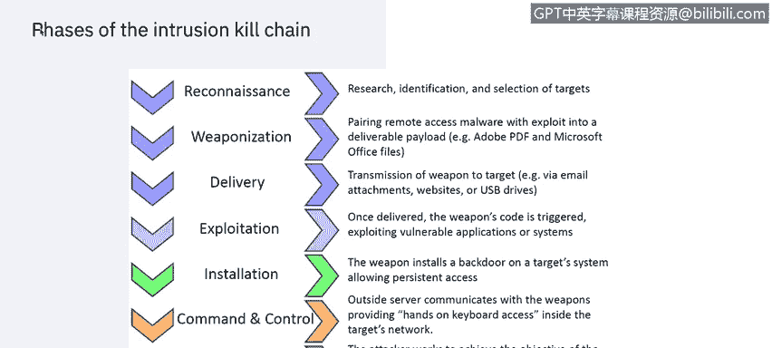
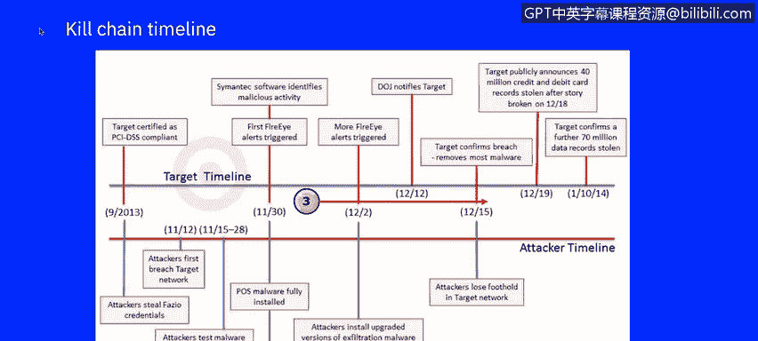
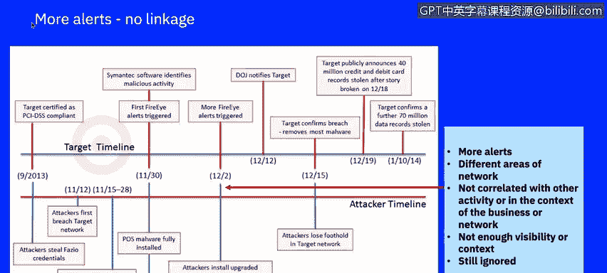
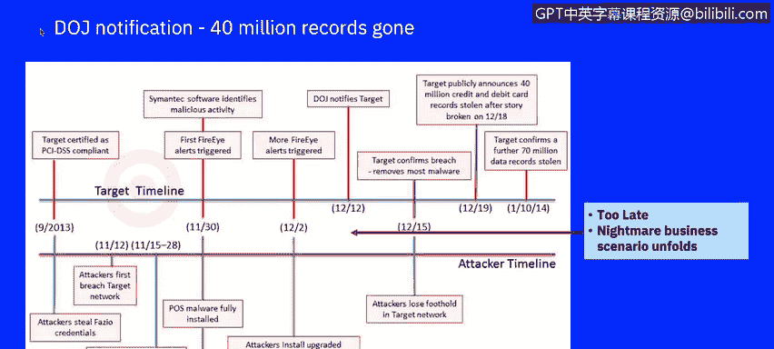
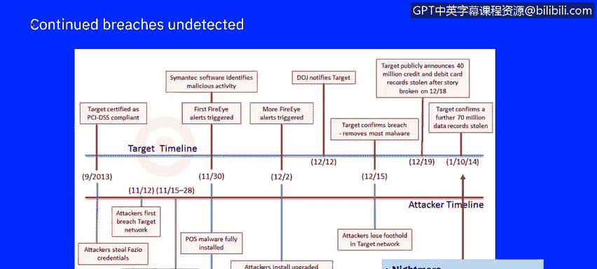
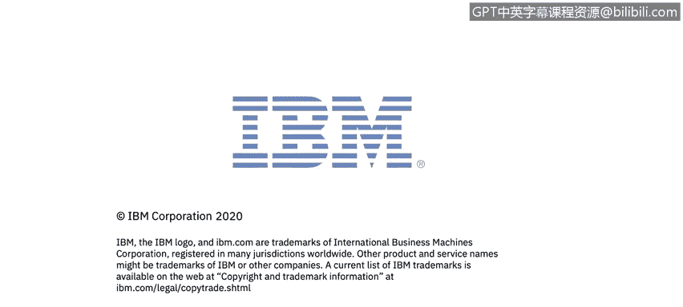

# 课程7：《网络安全顶级项目：入侵响应案例研究》：5：4_目标攻击时间线.zh

## 🎯 概述

在本节课中，我们将深入分析一个真实世界的大规模攻击案例——塔吉特公司数据泄露事件。我们将学习如何剖析攻击场景，理解攻击者的行动时间线，并从中汲取关键的安全教训。这个2013年发生的案例虽然年代较早，但其揭示的安全问题至今仍具有极高的教育价值。

## 🏢 案例背景：塔吉特公司

塔吉特公司是一家美国零售企业，成立于1902年，总部位于明尼苏达州明尼阿波利斯市，是美国第二大折扣零售商。截至2013年，塔吉特在美国运营着1916家门店，并于同年3月进军加拿大市场。

然而，在2013年12月，塔吉特系统遭遇了一次大规模数据泄露，影响了多达1.1亿客户。根据IBM X-Force威胁情报报告，零售行业在2020年是受攻击第二严重的行业。2019年的数据显示，该行业遭受了针对前十大行业所有攻击中的16%，相比2018年11%的攻击占比和第四的排名，有显著上升。

## 🔍 攻击时间线分析

上一节我们介绍了案例的背景和行业现状，本节中我们来看看攻击是如何一步步发生的。我们将使用洛克希德·马丁公司提出的“入侵杀伤链”模型作为分析框架。

### 第一阶段：侦察

大约在塔吉特公司获得PCI DSS（支付卡行业数据安全标准）认证的同时，攻击者开始了第一阶段的侦察活动。攻击者通过简单的互联网搜索，找到了关于塔吉特第三方供应商的信息。塔吉特甚至公开了一个供应商门户网站，这泄露了其在线供应商账单系统所使用的软件类型。

### 第二阶段：武器化

在武器化阶段，攻击者创建了带有恶意软件的电子邮件，很可能附带了PDF或Microsoft Office文档。

### 第三阶段：投递

以下是攻击投递阶段的两个关键步骤：
1.  攻击者向供应商发送了受感染的电子邮件，这是一次典型的网络钓鱼攻击。
2.  恶意软件部署后开始记录密码，为攻击者提供了进入塔吉特外部账单系统的钥匙。

### 第四阶段：利用与安装

攻击者利用供应商的凭证访问塔吉特内部网络。塔吉特外围网络的安全薄弱可能助长了攻击者成功侵入包含持卡人数据的最敏感区域。攻击者似乎直接将他们的RAM抓取恶意软件上传到了POS终端。

在利用阶段，RAM抓取恶意软件和外泄恶意软件开始记录数百万次刷卡数据，并存储被盗数据以备后续外泄。报告表明，攻击者在试图进一步破坏塔吉特网络期间，维持了对供应商系统一段时间的访问。

### 第五阶段：命令与控制及行动

虽然攻击者维持命令与控制的确切方法未知，但很明显，他们能够在外部互联网与塔吉特持卡人网络之间保持通信线路。攻击者通过FTP（一种标准的文件传输方法）以明文形式将被盗数据传输到外部服务器，其中至少有一台位于俄罗斯，整个过程持续了两周。

## 🚨 事件检测与响应

上一节我们梳理了攻击的执行过程，本节将关注塔吉特公司的检测与响应情况，这同样是安全分析中的关键环节。

2013年12月12日，美国司法部通知塔吉特，其被盗的信用卡凭证已在俄罗斯暗网网站上被识别并出售。此时，塔吉特内部尚未有人意识到遭受了攻击。

塔吉特立即启动了深入调查，并成功阻止了进一步的数据外泄活动。三天后，大部分恶意软件被清除。也正是在这个时候，塔吉特不仅发现了4000万条信用卡记录的丢失，还发现了另外7000万条不含财务信息的客户数据记录遭到泄露。

回顾调查时间线，来自防火墙和赛门铁克端点的第一个安全相关事件记录于11月30日。防火墙和端点分析师可能将这些事件误判为误报，因此没有采取任何行动。其原因在于这些单点解决方案的复杂性，它们彼此之间不通信。在没有关联的情况下，仅查看单个事件，很难检索到有关前后流量的额外活动信息，也很难意识到业务和网络背景。

一旦数据外泄开始，塔吉特的安全工具记录了更多警报。但同样，由于缺乏与早期事件和网络流量日志的适当关联，对于正在进行的恶意软件部署和数据外泄活动，可见性严重不足。这导致正在进行的攻击仍然被忽视。

当美国司法部致电塔吉特高管管理层时，为时已晚。启动的取证调查使安全团队在POS终端和后端数据服务器上发现了恶意软件，以及正在进行的向外部FTP服务器传输数据的外泄活动。随后，通信线路被切断，恶意软件从系统中清除。

## 💡 总结与启示

本节课中，我们一起学习了塔吉特数据泄露案例的完整攻击时间线、检测与响应过程。这个案例清晰地展示了，即使企业拥有防火墙、恶意软件检测软件、入侵检测与预防能力以及数据丢失防护工具等多层防护，并获得了PCI DSS认证，仍然可能发生重大安全漏洞。

核心教训在于，孤立的安全工具和缺乏事件关联能力，会严重削弱安全团队发现和响应复杂、持续性攻击的能力。攻击者利用供应链中的薄弱环节（第三方供应商），通过钓鱼攻击获得初始立足点，并逐步横向移动，最终窃取核心数据。这个案例提醒我们，网络安全是一个整体性工程，需要全面的可见性、智能的关联分析以及快速的响应机制。

在接下来的视频中，我们将回顾此漏洞造成的成本，以及一些本可以让塔吉特更早发现或最好情况下预防此次攻击的防护技术。