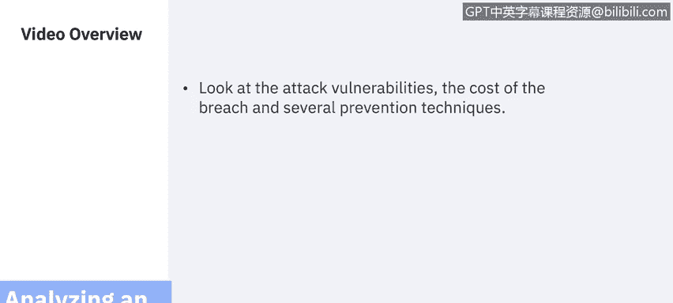
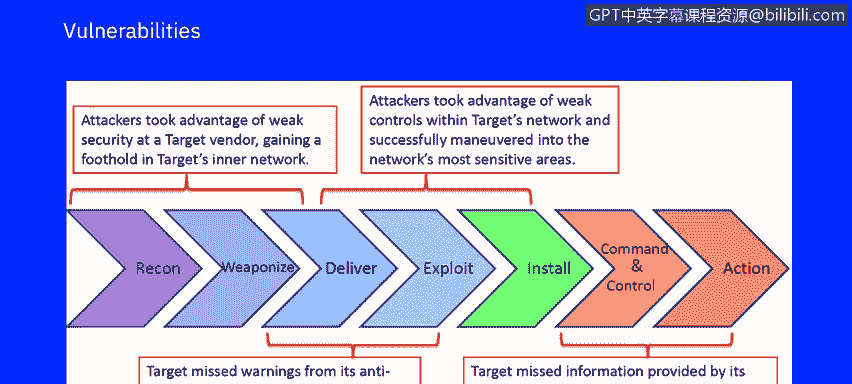
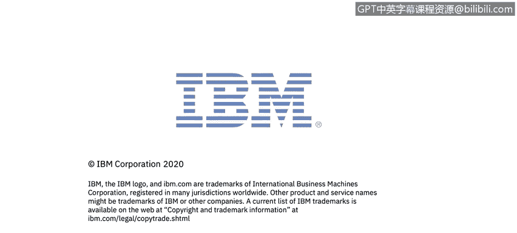

# 课程7：《网络安全顶级项目：入侵响应案例研究》：6：5_目标攻击漏洞.zh

## 🎯 课程概述

在本节课程中，我们将深入分析一个真实世界的大规模目标攻击案例。我们将聚焦于攻击者利用的漏洞、数据泄露造成的成本，以及一系列可以采取的预防技术。通过这个案例，你将理解安全控制失效如何导致严重后果。

## 🔍 攻击漏洞分析

上一节我们介绍了攻击的背景，本节中我们来看看攻击的具体漏洞利用链条。整个攻击过程由一系列情境性的行动和反应导致，最终酿成灾难。

以下是导致此次大规模数据泄露的关键环节：

1.  **利用供应商的薄弱安全**：攻击者首先利用了Target一家供应商的薄弱安全措施，从而获得了进入Target内部IT网络的初始立足点。
2.  **错过初始入侵警报**：在攻击者开始在其部署的资产上安装恶意软件时，Target错过了其防入侵软件发出的初始警告。
3.  **利用内部网络弱控制**：随后，攻击者利用了Target网络内部进一步薄弱的安全控制，成功渗透至网络中最敏感的区域。
4.  **忽视攻击者逃逸计划**：在攻击的最后阶段，Target再次忽视了其防入侵软件提供的关于攻击者逃逸计划的信息，这导致攻击者得以窃取多达1.1亿条客户记录。

## 💰 数据泄露成本分析

了解了攻击如何发生之后，我们来看看这次事件给Target带来的实际损失。即使事件发生在2013年，相关的法律诉讼和财务影响至今仍在持续。

以下是Target因本次数据泄露所承担的部分主要成本：

*   **2017年5月**：Target支付1850万美元，以了结由47个州和哥伦比亚特区提起的索赔，并解决一项多州联合调查。
*   **2016年5月**：Target与银行达成集体诉讼和解，金额约为5800万美元。
*   **与卡组织的和解**：Target与Visa、Mastercard、American Express和Discover等主要信用卡发行机构达成了保密和解，同时也与多家独立银行达成和解。
*   **总成本**：Target报告称，此次泄露事件共产生了约2.92亿美元的相关费用，其中约有9000万美元由保险赔付抵消。
*   **持续诉讼**：直至2019年，Target仍在起诉其长期合作的保险公司，因为后者拒绝赔付Target为更换支付卡而向银行支付的数千万美元和解金。Target已支付总计1.38亿美元（包括律师费）用于了结与数据泄露相关的银行索赔，其中至少有7400万美元的换卡成本未被保险公司承担。

## 🛡️ 预防与改进技术

回顾了整个攻击过程和巨额成本，我们自然会思考：如何才能防止此类大规模泄露，或至少更早地发现它呢？以下是一些关键的安全实践和技术，如果部署得当，本可以显著改善Target的处境。

以下是能够增强威胁检测与响应能力的关键措施：

1.  **安全日志与事件分析**：集中收集并分析安全日志和事件。
2.  **网络流量数据监控**：持续监控网络流量数据（Network Flow Data），以发现异常模式。
3.  **漏洞数据管理**：系统化地管理漏洞数据，并及时修补。
4.  **网络拓扑感知**：清晰掌握网络拓扑结构，理解资产间的连接关系。
5.  **资产画像与业务关联**：建立包含业务联系人、风险责任人的资产档案，特别是对POS设备这类关键资产。
6.  **关联规则应用**：部署关联规则（Correlation Rules），如同在SIEM和其他课程中看到的示例，自动化地关联不同告警。
7.  **用户行为分析**：实施用户行为分析（UBA），这可以减少对人工发现日志告警间关联的依赖，提高事件相关性判断的准确性。
8.  **事件响应流程**：建立并遵循严谨的事件响应处理流程，包括事件案例分析工作流，这在我们关于事件响应处理的视频中已有体现。
9.  **取证与快速确认**：在取证环节，实现攻击的快速确认，从而大幅缩短威胁暴露窗口。

## 📚 课程总结

本节课中，我们一起深入研究了Target公司2013年遭遇的大规模数据泄露案例。我们分析了攻击者如何利用供应链漏洞和内部安全薄弱环节逐步渗透，了解了此次事件带来的长期且高昂的财务与法律成本，并探讨了一系列本可帮助预防或及早发现攻击的安全技术与最佳实践。这个案例清晰地表明，安全是一个环环相扣的链条，任何一环的疏忽都可能导致全线崩溃。

下一节，我们将讨论一种影响金融和科技行业的“水坑攻击”，再次通过历史案例来揭示过去发生过、并且今天仍然可能发生的安全漏洞。