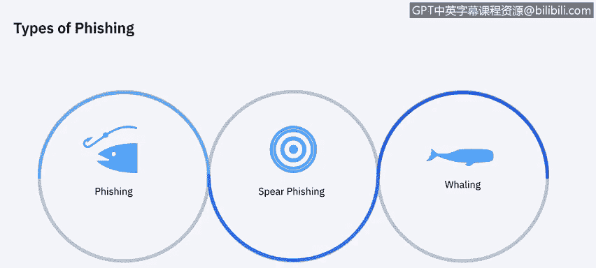
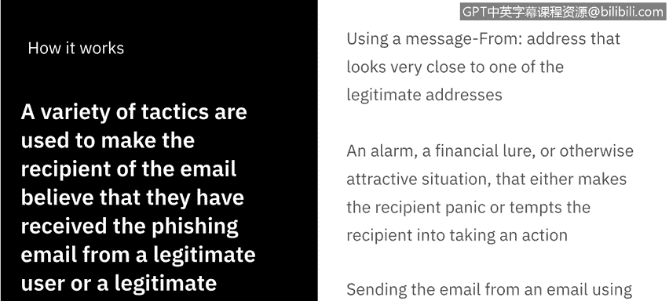
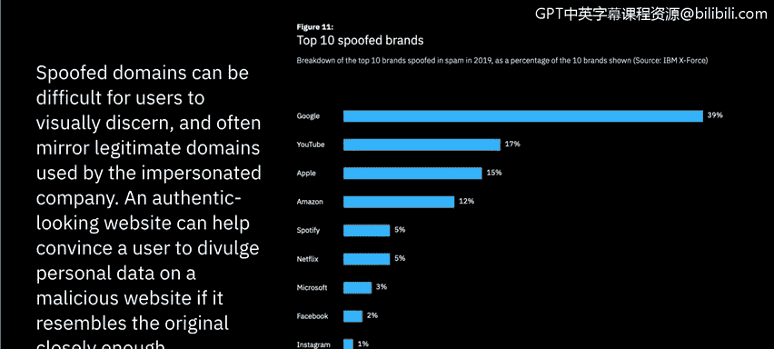
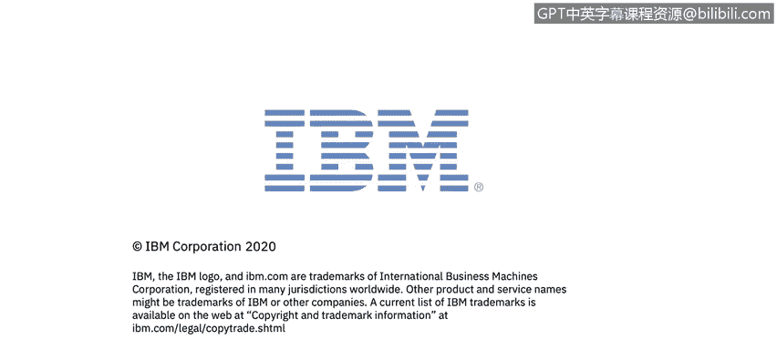

# 课程7：《网络安全顶级项目：入侵响应案例研究》：8：7_网络钓鱼概述.zh

## 🎣 课程名称：第7章：网络钓鱼概述

在本节课中，我们将学习网络钓鱼的历史、运作方式及其为何如此有效。我们将探讨不同类型的网络钓鱼攻击，并了解攻击者常用的诱骗策略。

### 网络钓鱼的定义与起源

网络钓鱼，也被称为“欺骗”或“卡片欺诈”，是一个术语，用于描述犯罪分子主要使用欺诈性电子邮件来诱骗你泄露个人信息的各种骗局。犯罪分子利用这些信息窃取你的身份、盗取银行账户资金或控制你的计算机。

在深入分析网络钓鱼骗局及其影响之前，了解其起源很有帮助。网络钓鱼一词来源于一个类比：互联网诈骗者使用电子邮件作为诱饵，从互联网用户的海洋中“钓取”密码和财务数据。它最初被黑客用来描述通过获取用户名和密码来窃取美国在线账户的行为。

### 网络钓鱼的类型

虽然网络钓鱼一词被广泛使用，但它实际上是一个广义概念。当我们深入探究时，会发现实际上存在多种不同类型的网络钓鱼攻击或骗局。

以下是几种主要的网络钓鱼类型：

*   **网络钓鱼**：这是我们视频开头定义的、也是最广义的概念。指通过某种欺骗手段或行动号召，试图从最终用户那里获取信息的行为。
*   **鱼叉式网络钓鱼**：这不是大规模撒网、希望有所收获的攻击。它是一种针对特定用户或群体的定向攻击。
*   **鲸钓**：特指针对拥有最高信息访问权限的高管级别（如公司最高层管理人员）进行的鱼叉式网络钓鱼。

### 网络钓鱼的运作机制

上一节我们介绍了网络钓鱼的基本类型，本节中我们来看看它为何如此有效，以及其具体的运作方式。

攻击者使用多种策略使电子邮件收件人相信他们收到了来自合法用户或域名的邮件。例如，使用与收件人惯常看到的合法地址非常相似的邮件地址。或者，邮件内容可能包含警报、财务诱惑或其他诱人情境，使收件人恐慌或诱使他们采取行动。此外，攻击者还可能使用合法账户持有者的软件或凭据发送邮件，如果来源或域名被黑客入侵，有人充当中间人，你将无法知道是有人在获取你的信息，因为你认为它是合法的。

### 常见的诱骗策略

了解了基本运作方式后，接下来我们详细看看那些让许多人上当的诱骗策略或警报。

以下是攻击者最常用的一些策略，相信你们许多人都曾在收件箱中多次遇到过：

1.  **声称发现可疑活动或登录尝试**：这通常来自服务提供商，如Netflix、银行或大学。你会收到一封欺诈邮件，说“我们发现了一些可疑活动，请登录验证”，从而骗取你的凭据。
2.  **声称你的账户或支付信息有问题**：这通常来自处理定期付款的公司，或者伪装成你的信用卡发卡行或银行，告知你某笔交易未成功。
3.  **要求你确认某些个人信息**：这种策略非常宽泛，可以在许多不同情境下使用。
4.  **包含虚假发票**：这通常与一些社会工程学手段结合使用。当攻击者发现你定期使用某项服务或参加某个活动时，他们可能会创建虚假发票，诱使你不仅泄露个人身份信息，还泄露财务信息。
5.  **要求你点击链接进行支付**：这纯粹是为了获取你的信用卡数据。例如，早年PayPal就曾遭遇大量此类钓鱼攻击，攻击者冒充PayPal发送链接。
6.  **声称你有资格申请政府退款**：这在特定时期（如COVID-19疫情期间）尤为常见。攻击者利用政府发放刺激支票的机会，发送钓鱼邮件，告诉人们需要在虚假的政府网站上注册才能获得支票，从而骗取信息。
7.  **提供免费物品的优惠券**：因为我们都喜欢免费的东西，所以这类攻击也经常发生。

这些只是最常见的一些方式，实际上有数百种，形式各异。我们能做的最好的事情就是自我教育并保持警惕。

### 网络钓鱼为何有效

网络钓鱼骗局之所以如此有效，有几个关键原因。首先，伪造的域名用户很难用肉眼辨别，而且它们通常模仿被冒充公司使用的合法域名。其次，一个外观逼真的网站，如果与原网站足够相似，可以帮助说服任何用户在恶意网站上泄露个人数据。

根据IBM的一项研究，以下是排名前十的被仿冒品牌：**Google**（遥遥领先，主要是人们使用Gmail邮箱服务）、**YouTube**（也属于Google公司）、**Apple**、**Amazon**、**Spotify**、**Netflix**、**Microsoft**、**Facebook**、**Instagram**和**WhatsApp**。可以看到，这些都是我们日常生活中积极参与的服务或社交媒体，这增加了人们想要尽快处理相关事务的紧迫感，因为它们在我们的生活中占有重要地位。

### 攻击手段的演变：HTTPS的滥用

攻击者不仅在伪造的电子邮件和网站上变得越来越有说服力，现在他们还在欺骗我们一直认为是真理的东西——即**HTTPS**（那个“S”代表安全）。过去，我们用它来识别什么是安全网站，这让我们感到安心。

HTTPS的背景是，它通过加密个人浏览器与其访问网站之间的数据交换来保护通信安全。这对于提供在线销售或受密码保护账户的网站尤其重要。然而，在钓鱼网站上使用HTTPS，揭示了钓鱼者如何通过将互联网安全功能反过来对付用户，从而欺骗互联网用户。

在2019年第四季度，超过**70%** 由钓鱼者托管的网站都在使用HTTPS。他们正在进化以捕获更多受害者。

### 总结与展望

本节课中，我们一起学习了网络钓鱼的定义、起源、不同类型、运作机制以及常见的诱骗策略。我们了解到，网络钓鱼之所以有效，是因为伪造的域名和网站难以辨别，并且攻击者甚至开始滥用HTTPS这样的安全标识来增加可信度。

基于以上知识，我认为接下来我们需要实际查看一封电子邮件，并开始识别我们需要警惕哪些迹象。我们将在下一个视频中进行这项实践。