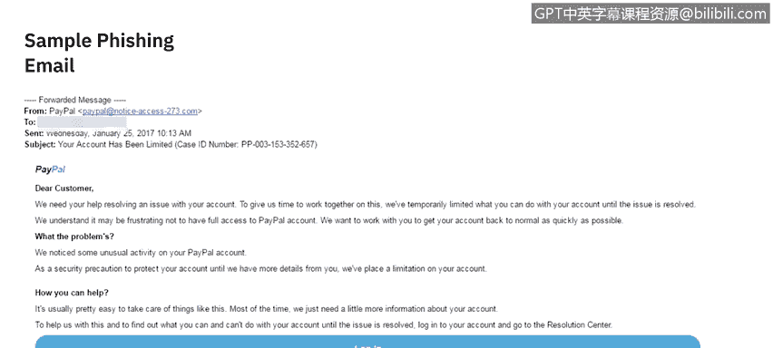
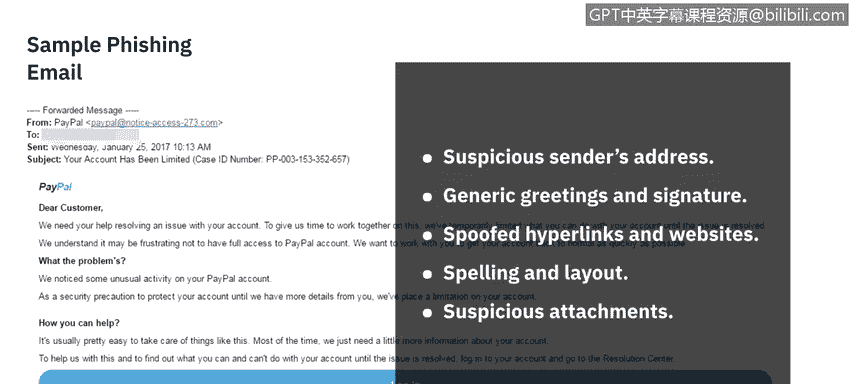

# 课程7：《网络安全顶级项目：入侵响应案例研究》：9：8_网络钓鱼电子邮件研究.zh

## 📧 课程概述：网络钓鱼电子邮件研究

在本节课中，我们将学习如何识别和分析网络钓鱼电子邮件。我们将通过一个具体的案例，剖析攻击者用来欺骗用户的常见技术，并总结出需要警惕的关键迹象。

---

## 🔍 钓鱼邮件案例分析

首先，我们来看一个示例邮件。我曾提到自己曾是PayPal钓鱼诈骗的受害者，因此，通过这个例子进行学习，对大家都有借鉴意义。

以下是邮件内容，我们将从上到下进行分析。

邮件顶部显示发件人为“PayPal”，但这可能只是在收件箱中的预览。当你打开邮件时，会看到实际的发件人地址是 `Paypal@noticeiceaccess.273.com`。

邮件包含日期、主题（“您的账户已被限制”并附有一个案例ID号），然后是正文。

正文部分包含PayPal的官方Logo，并以“尊敬的客户”开头。邮件内容如下：

> 我们需要您的帮助来解决您账户的一个问题。为了给我们时间共同处理此事，我们已暂时限制了您账户的部分功能。
>
> 我们理解无法完全访问PayPal账户可能会令人沮丧。我们希望与您合作，尽快让您的账户恢复正常。
>
> **问题是什么？**
> 我们注意到您的PayPal账户存在一些异常活动。作为安全预防措施，在从您那里获得更多详细信息之前，我们已对您的账户设置了限制。
>
> **您如何提供帮助？**
> 解决此类问题通常非常简单。大多数时候，我们只需要关于您账户的更多信息。要了解在问题解决前您可以和不可以执行哪些操作，请登录您的账户并前往“解决中心”。

正文中有一个横跨邮件宽度的蓝色大登录按钮。页脚部分包含“帮助”、“联系”、“安全”等链接，以及一些法律声明：

> 此邮件已发送给您。请不要回复此邮件。我们无法回复发送到此地址的询问。如需解答问题，只需访问我们的帮助中心，点击任何PayPal页面底部的“帮助”链接。
>
> 版权所有，保留所有权利。

---

## 🚩 识别钓鱼邮件的红色警报

上一节我们查看了示例邮件，本节中我们来看看需要警惕的常见迹象。以下是钓鱼邮件中常见的“红色警报”，我们将逐一检查它们是否出现在我们的示例中。

**1. 可疑的发件人地址**
这是第一个警报。邮件显示来自“PayPal”，但实际发件地址是一个陌生的自定义域名（`noticeiceaccess.273.com`），而非官方的 `@paypal.com` 域名。这非常可疑。

**2. 泛泛的问候语和签名**
邮件中使用的是“尊敬的客户”，而非收件人的具体姓名。这表明这很可能是一封群发邮件。

**3. 伪造的超链接和网站**
虽然这只是一张截图，无法实际点击，但通常当你将鼠标悬停在按钮或链接上时，可以查看其背后的真实URL。在怀疑时，切勿直接点击邮件中的链接。正确的做法是，单独打开浏览器，手动输入官方网站地址登录查看。

**4. 拼写和布局错误**
虽然此邮件的布局模仿得很好，但原文中存在一些语法和表达不自然的地方（例如“We want to work with you to get your account back to normal as quickly as possible. What the problems?”）。对于大公司发出的正式邮件，通常会经过严格的设计和文案校对，不应出现此类错误。

**5. 可疑的附件**
此示例邮件中没有附件，但需注意：收到来自未知发件人的附件通常是高度可疑的，应直接删除整个邮件。

---

## ✅ 课程总结

本节课中，我们一起学习了如何分析网络钓鱼电子邮件。我们通过一个模仿PayPal的钓鱼邮件案例，实践识别了多项关键红色警报，包括**可疑的发件地址**、**泛泛的问候**、**潜在的伪造链接**以及**语法错误**。

了解这些迹象是保护个人和企业免受钓鱼攻击的第一步。在下一节课中，我们将探讨网络钓鱼对企业和个人造成的具体影响。