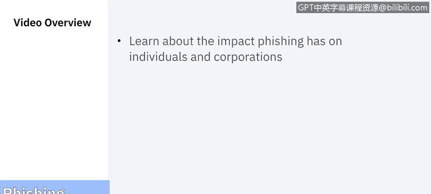
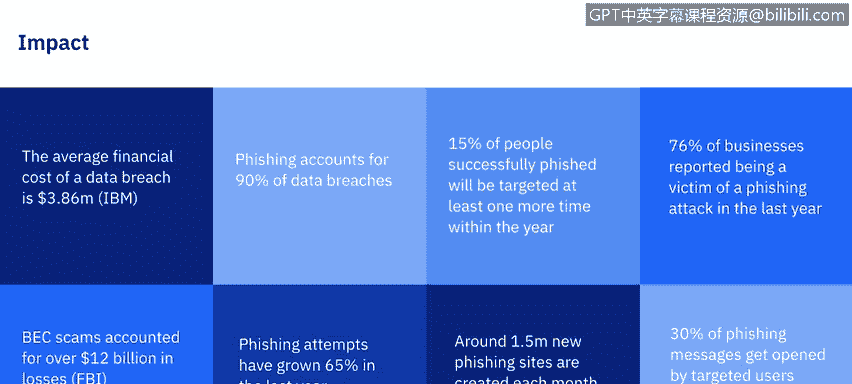
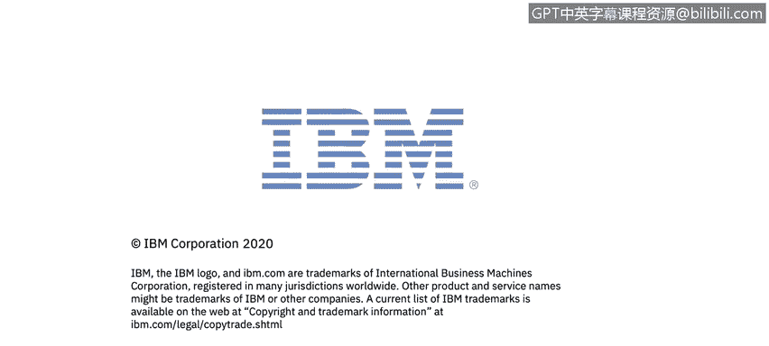

# 课程7：《网络安全顶级项目：入侵响应案例研究》：10：网络钓鱼的影响 🎣

在本节课中，我们将学习网络钓鱼对个人和公司造成的具体影响。我们将通过数据和案例，了解这种攻击方式的严重性及其带来的实际后果。

---

### **网络钓鱼的演变与现状**

上一节我们介绍了网络钓鱼的基本概念。本节中我们来看看网络钓鱼的演变及其当前的规模。网络钓鱼的性质已经发生变化，它远远超越了通过欺诈网站窃取用户名、密码和信用卡号等传统形式，演变为复杂的网络犯罪攻击。这些攻击能对组织发起高级持续性威胁，并窃取个人的财务身份信息，对用户和组织都造成毁灭性后果。

为了让你了解网络钓鱼的影响有多大，请看以下统计数据：

*   根据IBM的一项研究，数据泄露的平均财务成本为386万美元。
*   在所有数据泄露事件中，90%由网络钓鱼导致。
*   15%成功被钓鱼攻击的用户，在同一年内至少会再次成为目标。
*   76%的企业报告称在过去一年内曾是网络钓鱼攻击的受害者。
*   根据FBI的数据，商业电子邮件诈骗（BEC）造成了超过120亿美元的损失。
*   与2018年相比，网络钓鱼尝试增长了65%。
*   每月大约会创建150万个新的钓鱼网站。
*   最后，30%的钓鱼信息会被目标用户打开。

如果这些数据还不够令人震惊，请再看反钓鱼工作组2019年第四季度的报告数据：

*   **检测到的独立钓鱼网站数量**：从10月到12月，范围在39,000到76,000个之间。
*   **消费者向反钓鱼工作组报告的独立钓鱼邮件或活动数量**：基本稳定在45,000左右。
*   **被钓鱼活动针对的品牌数量**：在300多个，具体为333、325和341个。我们在第一个视频中曾概述了被仿冒最多的顶级品牌，而这里反钓鱼工作组报告仅2019年第四季度就有超过300家公司被仿冒，且这还只是被报告的数量，并非全部存在的情况。细想之下，这相当可怕。

---

### **对个人的影响**

你可能会问，这对我意味着什么？让我们分别剖析对个人和公司的影响。对于个人而言，影响最大的是**身份盗窃**。

以下是相关数据：
*   仅2019年，就有650,572起身份盗窃案件。
*   去年，30至39岁的人群报告的身份盗窃案件最多。
*   佐治亚州、内华达州和加利福尼亚州是身份盗窃案件最多的三个州。
*   去年有超过270,000起报告，信用卡欺诈是最常见的身份盗窃类型，并且从2017年到2019年增加了一倍多。
*   2019年，近1.65亿条包含个人数据的记录通过数据泄露被暴露。
*   Capital One网络安全事件是2019年最大的数据泄露事件，暴露了美国约1亿消费者的个人数据。
*   未经授权的访问正在增加，并且是导致包含个人信息的记录暴露和数据泄露的主要原因。

从下图中我们可以看到最常见的身份盗窃类型：

以下是主要类型：
*   **信用卡欺诈**和**其他未分类项目**是前两名。
*   **贷款和租赁欺诈**、**电话和公用事业欺诈**以及**银行欺诈**构成了报告中的较小部分。
*   **就业或税务欺诈**以及**政府文件欺诈**排在最后。

如图所示，信用卡欺诈与其他类型之间的差距相当巨大。

---

### **对企业的影响**

对于企业而言，钓鱼邮件仍然是威胁行为者使用的主要武器。

以下是关键影响：
*   美国联邦调查局估计，网络犯罪分子在五年内利用网络钓鱼攻击和商业电子邮件诈骗从公司窃取了超过**120亿美元**。
*   这些不再是孤立事件。马里兰大学的一项研究得出结论，平均每**39秒**就会发生一次攻击。
*   近一半的小型企业曾遭受攻击，并带来灾难性后果。
*   **60%** 遭受黑客攻击的中小型企业在仅仅**六个月**后就会倒闭。

---

### **总结与预告**

本节课中，我们一起学习了网络钓鱼对个人和企业造成的广泛而严重的影响，包括身份盗窃、巨额财务损失以及对企业生存的威胁。这些数据突显了网络安全意识和防护措施的极端重要性。

谈到对企业的影响，在下一个视频中，我们将深入分析一个具体案例：**Facebook和Google如何成为大规模网络钓鱼诈骗的受害者**。我们下节课见。

