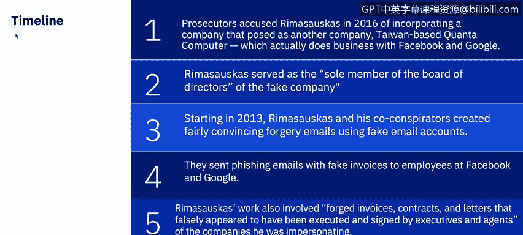
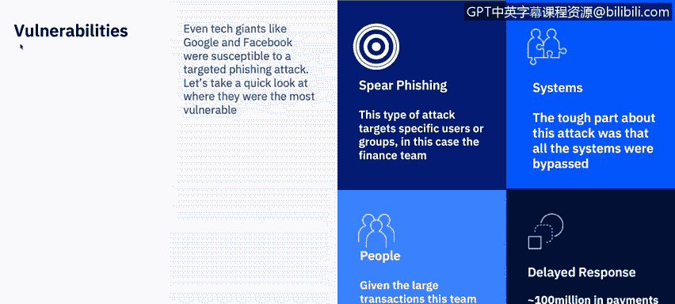
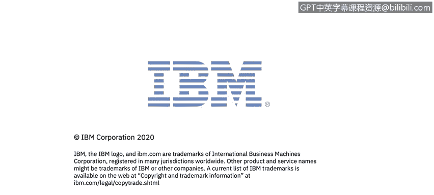

# 课程7：《网络安全顶级项目：入侵响应案例研究》：11：网络钓鱼案例研究：谷歌与Facebook 🎣

在本节课中，我们将通过一个真实的案例，深入剖析针对谷歌和Facebook的复杂网络钓鱼攻击。我们将了解攻击的时间线、攻击者与公司采取的行动，以及攻击造成的最终影响。

正如Adam在上一个视频中提到的，网络钓鱼攻击的后果可能非常严重，不仅对受骗的个人，也对被冒名的组织或公司产生重大影响。我是来自IBM安全学习服务团队的Correne，在本课程中，我将带您分析多个案例研究。请注意我讲解案例的格式，因为在您的同伴项目中，您不仅需要更详细地审视特定类型的攻击，还需要展示一家公司或个人成为该攻击受害者的公开数据。

现在，让我们详细看看这次网络钓鱼攻击中发生了什么。

## 攻击概述

根据美国纽约南区检察官办公室的信息，诈骗者以一种极具创意的方式从Facebook和谷歌窃取了超过1亿美元。简而言之，他们通过向这两家科技巨头发送电子邮件来索要钱财。该骗局包括设立一家虚假公司，并向Facebook和谷歌的员工发送钓鱼邮件，最终在2013年至2015年间，从这两家价值数十亿美元的公司骗取了总计超过1亿美元。

## 攻击时间线

以下是此次攻击的关键时间线：

*   **2013年**：攻击者Rimas Kavaliauskas注册了一家假冒公司，伪装成与Facebook和谷歌有实际业务往来的台湾公司“广达电脑”。
*   **2013-2015年**：Rimas Kavaliauskas及其同谋者创建了极具说服力的伪造电子邮件。他们使用看似由台湾真实广达公司员工发送的虚假邮箱账户。
*   **具体过程**：他们向定期与广达进行数百万美元交易的Facebook和谷歌员工发送带有虚假发票的钓鱼邮件。收到邮件后，这些员工向假冒公司的银行账户支付了超过1亿美元。
*   **伪造手段**：攻击者还伪造了发票、合同和信件，使其看起来像是被冒名公司的执行官和代理人签署并执行的。他们甚至制作了带有这些公司名称的虚假公司印章，为交易创建虚假的支持文件，以规避银行的怀疑。
*   **2015年**：该骗局从Facebook骗取了9800万美元，从谷歌骗取了2300万美元。
*   **后续**：骗局被发现后，两家公司追回了大部分资金，Rimas Kavaliauskas被捕。
*   **2019年7月**：他最终被判处30年监禁。

## 漏洞分析

即使是谷歌和Facebook这样的科技巨头，也容易受到针对性钓鱼攻击的影响。让我们快速分析一下他们最脆弱的环节在哪里。

一些关于Rimas Kavaliauskas案件的夸张标题，声称他只是“开口要钱”，这低估了他实施欺诈的复杂程度。要成功实施此类攻击，需要精心的伪造和对相关公司内部财务运作的深入了解。FBI警告称，攻击者通常会提前使用恶意软件或入侵账户来渗透目标网络，并潜伏数周，观察计费系统和内部通信，然后才采取行动。

对于谷歌和Facebook，主要漏洞在于：

*   **鱼叉式钓鱼**：攻击针对财务团队，因为他们有权支付发票。
*   **系统**：由于这是“常规业务”，任何威胁检测系统都被绕过了。
*   **人员**：处理广达业务是财务团队的正常工作部分，因此没有人怀疑威胁并延迟了响应。

由于缺乏检测，Facebook和谷歌支付了1亿美元。

## 攻击成本

那么，这次入侵的成本是什么？

*   **直接经济损失**：如前所述，2015年Facebook损失9800万美元，谷歌损失超过2300万美元。
*   **资金追回**：骗局被发现后，两家公司追回了大部分资金。
*   **法律后果**：Rimas Kavaliauskas被捕并认罪，因其行为被判处30年监禁。
*   **声誉损失**：我还想补充第四点成本——负面宣传。每当有关于数据泄露的媒体报道时，公司的脆弱性就会被曝光。

## 预防措施

那么，有哪些方法可以防止此类或其他网络钓鱼攻击呢？让我们回顾一下。

**加强公司注册与通信审查**
大多数国家和地区都有防止注册相同或过于相似公司名称的保护措施。Rimas Kavaliauskas利用了立陶宛相对宽松的规则，该国因作为洗钱热门地而持续存在欺诈性公司注册问题。来自已知此类钓鱼骗局国家的通信可以作为一个早期预警信号，特别是如果商业伙伴此前并未在该国设有机构。

**优化内部流程与验证**
如果欺诈者确实策划了此类骗局，早期检测至关重要。这些攻击通常由有组织的团体实施，一旦收到钱，他们会立即利用“钱骡”进行洗钱。定期审查发票和与付款相关的通信的准确性，在这种情况下帮助巨大。检查文件以验证所有联系信息随时间推移保持一致，可以提供至关重要的早期预警。也可以调整付款流程，将针对商务邮件入侵的保护措施融入常规程序。例如，一个想法是在进行付款时实施双因素认证，要求电话验证。

😊

**部署技术防护与员工培训**
让我们也讨论一些其他的网络钓鱼攻击预防技术。

*   **邮件系统配置**：可以调整电子邮件系统，自动标记“发件人”和“回复”地址不完全匹配的任何邮件，或自动将来自内部公司账户的文本显示为特定颜色。这将有助于更快地识别来自钓鱼网站的通信。
*   **员工教育与培训**：应在模拟钓鱼场景中开展培训课程，对员工进行教育。
*   **部署垃圾邮件过滤器**：组织可以部署能够检测病毒、空白发件人或可能不符合标准电子邮件做法的其他信息的垃圾邮件过滤器。
*   **系统与软件更新**：所有系统都应保持最新的安全补丁和更新。应安装防病毒解决方案，并定期安排签名更新，监控所有设备上的防病毒状态。
*   **制定安全策略**：应制定安全策略，包括但不限于密码过期和复杂性要求。
*   **部署网络过滤器**：可以部署网络过滤器来阻止恶意网站。
*   **信息加密**：所有敏感的公司信息都应加密。
*   **邮件格式限制**：最后，将HTML电子邮件转换为纯文本电子邮件，或禁用HTML电子邮件。

请查看附加资源，以阅读两篇详细描述此钓鱼骗局的完整文章，以及一篇关于立陶宛的文章。

😊

Adam接下来将讨论销售点攻击的概述。我将在本课程稍后回来讨论另一个案例研究。谢谢。

## 总结

在本节课中，我们一起学习了针对谷歌和Facebook的复杂网络钓鱼攻击案例。我们回顾了攻击者如何通过精心伪造和利用公司内部流程漏洞，成功骗取了巨额资金。分析揭示了即使在顶级科技公司，人员、流程和系统也可能存在薄弱环节。最后，我们探讨了从加强注册审查、优化内部验证流程，到部署技术防护和加强员工培训等一系列预防措施。这个案例深刻地提醒我们，网络安全需要多层防御和持续警惕。