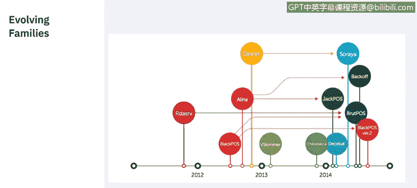
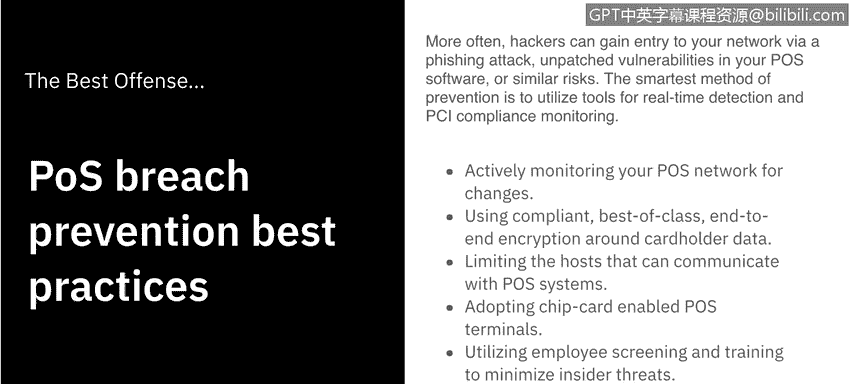
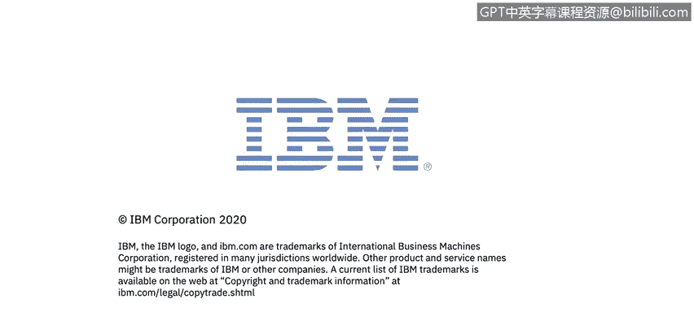

# 课程7：《网络安全顶级项目：入侵响应案例研究》：13：OS恶意软件分析 🧾

## 概述
在本节课程中，我们将学习恶意软件如何入侵销售终端设备。我们将了解不同类型的POS恶意软件家族，并探讨信息被窃取后的流向。

---

## POS系统与网络连接
销售终端系统需要某种网络连接，以便与外部信用卡处理器通信。这是验证信用卡交易所必需的。

然而，具备足够技能的恶意攻击者可以大规模地针对企业的POS终端，一次性危害成千上万用户的信用卡。同样的网络连接也可能被利用来帮助窃取信息。

## POS系统的本质与攻击路径
大多数销售终端系统运行在Windows或Linux上，本质上它们就是小型计算机。网络罪犯通常通过公司的网络入侵。一旦进入内部，POS恶意软件就可以选择要窃取的数据，并上传到远程服务器。

大多数POS恶意软件都配备有后门以及命令与控制功能。

## 数据加密与内存抓取
目前，行业对来自卡片磁条或芯片的敏感支付数据采用端到端加密。这些数据在传输、接收或存储时都是加密的，解密只发生在销售终端设备的随机存取存储器中，并在那里进行处理。

**POS恶意软件专门针对RAM，以窃取未加密的信息，这个过程被称为内存抓取。**

## 常见的POS恶意软件家族
以下是目前最常见且易于获取的几类POS恶意软件家族。

*   **Alena家族**：该恶意软件扫描系统内存，检查内容是否匹配正则表达式，以识别可窃取的卡片信息。
*   **VSkimmer**：如果找不到其服务器，它会检查是否存在带有特定标签的可移动驱动器。如果找到该驱动器，它会将包含任何窃取信息的文件放入其中，从而实现离线数据窃取。
*   **Dexter家族**：其信息窃取活动不仅限于卡片信息，还会窃取各种系统信息，并在受影响的系统上安装键盘记录器。
*   **FYSNA恶意软件**：使用Tor网络与其C&C服务器通信，这使得恶意软件产生的所有网络流量极难分析，从而增加了检测和调查的难度。
*   **Deimbel恶意软件**：在运行前会检查机器上是否存在沙箱或分析工具，这使得检测和分析变得更加困难。
*   **最流行的BlackPOS**：使用文件传输协议将信息上传到攻击者选择的服务器。这允许攻击者将来自多个POS终端的被盗数据整合到单个服务器上。

有两点需要注意：第一，POS恶意软件很少在没有其他恶意软件辅助的情况下单独使用。第二，我们称它们为恶意软件“家族”，是因为它们会随着时间的推移而被改编和更新。

## 恶意软件的演变
接下来，我们看看这些更新。

正如你所见，我们讨论过的大多数恶意软件或其变种，都已经被改编、更新或改变成新的、改进的版本，这些版本要么提供新功能，要么更难以检测。不过，它们都有一个共同点：都是为了窃取金融数据。

现在你可能会问，如果我的数据通过POS漏洞被窃取了会怎样？

## 失窃数据的流向
现在我们来探讨这个问题。一旦你的数据被窃取，犯罪分子会将信息卖给中间商。这些中间商批量购买支付卡信息，然后将其卖给“制卡者”。

制卡者会使用如左图所示的制卡网站来获取支付信息，并用这些信息购买预付信用卡。这些信用卡将被用来购买礼品卡。礼品卡随后被用来购买商品以转售获利。

为了使追踪更加困难，商品不会直接运送给最终用户。它们会先运送给一个转运商，再由转运商运送给最终用户，这使得整个交易从头到尾都很难追踪。

## 如何防范POS漏洞
那么，我们如何防止POS漏洞呢？事实证明，最好的进攻就是良好的防御。

通常，黑客通过钓鱼攻击、POS软件中未修补的漏洞或类似风险进入你的网络。最明智的预防方法是利用工具进行实时检测和PCI合规性监控。

以下是一些最佳实践列表：

*   **主动监控**：主动监控你的POS网络变化。
*   **使用加密**：围绕持卡人数据，使用合规、一流且端到端的加密。
*   **限制通信**：限制可与你的POS系统通信的主机。
*   **采用芯片卡终端**：采用支持芯片卡的POS终端。
*   **员工筛查与培训**：进行员工筛查和培训，以最小化内部威胁。
*   **培训员工识别异常**：培训员工立即检测并报告可能的篡改迹象。

---

## 总结
本节课中，我们一起学习了POS恶意软件的入侵方式、主要家族及其特点、失窃数据的流转链条，以及防范此类攻击的关键最佳实践。理解这些内容对于保护支付系统和持卡人数据至关重要。