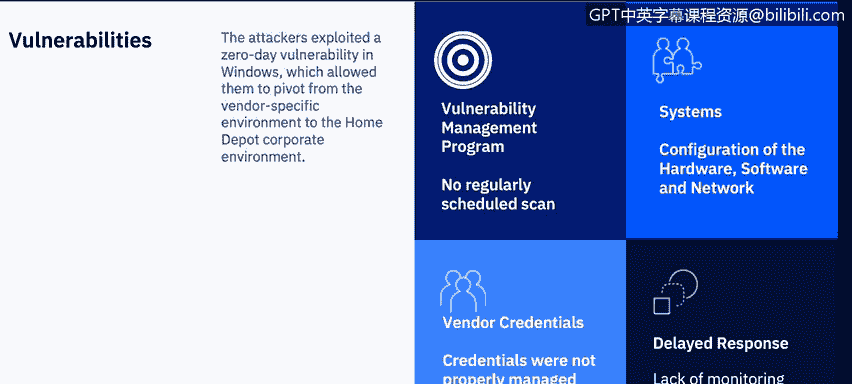
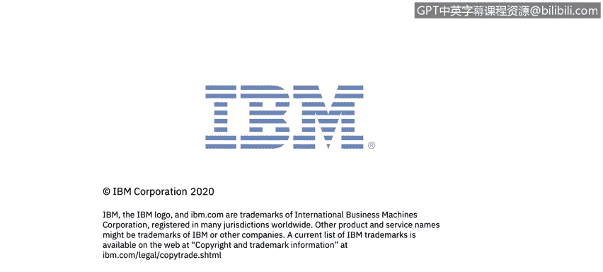

# 课程7：《网络安全顶级项目：入侵响应案例研究》：14：13_POS案例研究：家得宝

## 概述
在本节课程中，我们将深入研究一起针对零售巨头家得宝（Home Depot）的销售终端攻击案例。我们将了解攻击的时间线、攻击者采取的行动，以及此类攻击带来的深远影响。

## 攻击摘要
上一节我们介绍了目标公司的攻击案例，本节中我们来看看家得宝案例。家得宝是2014年众多零售数据泄露事件的受害者之一。不幸的是，攻击者渗透其销售终端网络并窃取支付卡数据的方式，与2013年目标公司数据泄露事件中使用的方法有诸多相似之处。

攻击者利用第三方供应商的登录凭证，成功访问了家得宝的供应商环境之一。进入家得宝网络后，他们在超过7500台自助结账销售终端上安装了内存抓取恶意软件。该恶意软件窃取了5600万张信用卡和借记卡的数据，并捕获了5300万个电子邮件地址。

被盗的支付卡被用于出售，并被“卡贩”购买。卡贩是“卡片论坛”网站的活跃参与者，这些论坛主要促进被盗身份信息、被盗信用卡号和虚假登录凭证的销售。而被盗的电子邮件地址则被用于发起大规模的网络钓鱼活动。

## 攻击时间线
接下来，让我们详细回顾攻击的时间线。

以下是攻击发生的关键步骤：
1.  **初始入侵**：攻击者利用从零售商一家供应商处窃取的凭证获得了网络访问权限。
2.  **权限提升与横向移动**：攻击者提升了权限，并访问了销售终端系统，下载了用于记录信用卡详细信息的恶意软件。
3.  **长期潜伏**：恶意软件感染在2014年4月至9月间持续了五个月未被发现。
4.  **事件发现与披露**：家得宝于9月2日开始调查，并于9月8日发布声明，确认其支付卡系统遭到入侵。
5.  **客户补救措施**：家得宝宣布将为自2014年4月起使用支付卡受影响的客户提供免费的信用监控服务，并就数据泄露事件致歉。

## 攻击技术分析
在了解了时间线后，我们深入分析攻击者使用的具体技术。

攻击者进入家得宝网络后，利用了Windows系统中的一个**零日漏洞**。零日漏洞是指软件供应商尚未知晓或未修复的计算机软件漏洞。在漏洞被修复之前，黑客可以利用它来对计算机程序、数据或其他网络造成不利影响。这个先前未知的Windows弱点使攻击者能够提升权限、在网络中横向移动，并识别出7500个自助结账通道。

## 可采取的防护措施
家得宝本可以采取多项防护措施来预防此次泄露，或更早地检测到入侵，从而最小化影响。

以下是几个关键的安全实践领域：
*   **漏洞管理**：没有证据表明家得宝对销售终端环境进行定期漏洞扫描。他们本应建立漏洞管理程序，每月对销售终端环境进行扫描，并利用扫描结果向管理层展示环境中的安全缺口，从而在泄露发生前开始降低风险。
*   **系统配置**：
    *   **网络隔离不足**：家得宝的企业网络与销售终端网络之间缺乏适当的隔离。销售终端环境本应部署在独立的、限制性的虚拟局域网中。
    *   **安全功能未启用**：虽然安装了安全端点防护产品，但未启用关键的“网络威胁防护”功能。
    *   **加密缺失**：未使用点对点加密技术。
    *   **过时操作系统**：销售终端设备运行的是Windows XP系统，该系统在当时极易受到攻击。
*   **凭证管理**：家得宝未能妥善管理第三方供应商的凭证，应遵循**最小权限原则**，即仅授予用户完成工作所必需的最低权限。
*   **监控与检测**：即使无法阻止攻击，家得宝也应具备监控能力，而不应花费五个月才发现入侵。将销售终端环境的网络或主机活动日志转发到安全信息与事件管理系统中，本有助于更早地检测到泄露。

## 攻击影响与成本
那么，家得宝数据泄露的估计成本是多少呢？此次泄露规模巨大，是当时涉及销售终端系统的最大零售数据泄露事件。

以下是主要的财务影响：
*   **客户赔偿**：家得宝同意向受影响的客户支付1950万美元，包括提供信用监控服务的费用。
*   **银行与信用卡公司赔偿**：向信用卡公司和银行支付至少1.345亿美元。和解方案允许银行和信用卡公司为每张被盗信用卡索赔2美元，而无需证明实际损失。若能证明损失，最高可获得60%的损失补偿。
*   **总成本估算**：此次零售数据泄露的总成本约为1.79亿美元，但这尚未包含所有法律费用和未公开的和解金额。最终成本很可能接近2亿美元。
*   **声誉损害**：更难量化的是声誉损害。研究表明，在敏感数据泄露后，公司可能会失去高达51%的客户。

## 行业改进与后续发展
在分析了家得宝和目标公司的泄露事件后，支付行业也做出了一些改进。

以下是主要的改进措施：
*   **芯片卡推广**：传统的磁条卡开始被芯片密码卡取代。芯片卡内置安全芯片，为每笔交易生成唯一的支付数据，使卡片无法被复制。
*   **移动支付兴起**：供应商开始推广Apple Pay和Google Pay等移动支付方式。这些系统不会将你的信用卡号传递给商户，增加了安全性。
*   **点对点加密应用**：2P加密技术在刷卡瞬间就对卡片数据进行加密，并一直加密传输至银行进行交易授权。在此过程中，支付卡数据从未以明文形式暴露。

> **注意**：2P加密仍存在一个风险，即有人在实际的PIN输入设备上安装信用卡侧录器。这类攻击在2020年仍有发生，主要发生在加油站等无人值守的刷卡设备上。

## 总结
本节课中，我们一起学习了家得宝销售终端攻击案例的完整过程。我们回顾了攻击的时间线，分析了攻击者利用零日漏洞和第三方凭证的技术手段，探讨了家得宝在漏洞管理、系统配置和监控方面存在的不足，并评估了此次事件带来的巨额财务与声誉损失。最后，我们也看到了行业为此推出的芯片卡、移动支付和点对点加密等改进措施。下一节，我们将探讨第三方数据泄露，并分析Equifax数据泄露案例。