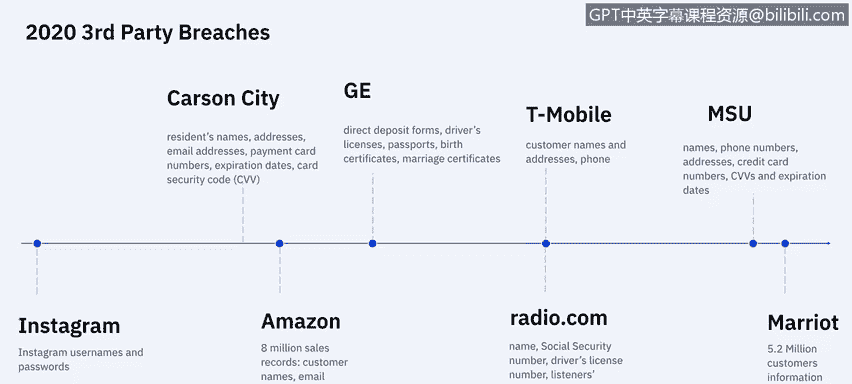
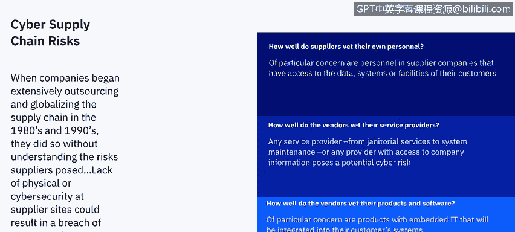
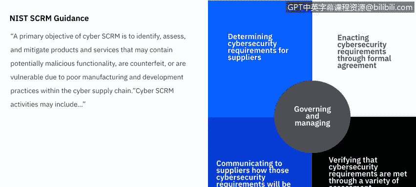
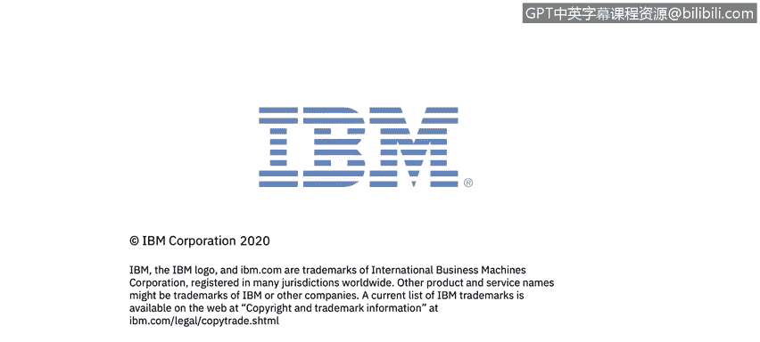

# 课程7：《网络安全顶级项目：入侵响应案例研究》：15：第三方违规概述

## 概述
在本节课中，我们将学习什么是第三方违规，回顾应对方法，并了解第三方供应商最常见的安全漏洞类型。

---

## 什么是第三方违规？🔍
第三方违规，也称为供应链攻击或价值链攻击，是指源自您系统内某个第三方（该方拥有您系统的访问权限）的攻击。这包括数据管理公司、律师事务所、电子邮件提供商、网络托管公司、子公司、供应商、分包商，以及您系统中使用的任何外部软件或硬件，甚至包括为收集分析数据而添加到您网站上的JavaScript脚本等。

## 第三方违规的现状与统计数据
为了解第三方违规的普遍性，请参考以下数据：
*   在2018年的一项研究中，64%的企业表示他们最担心第三方滥用或与其他方共享机密信息。
*   在实际调查中，41%的企业确实遇到了该问题。
*   企业在审查第三方上的年均花费为2100万美元，但64%的企业认为其审查流程效果一般或完全无效。
*   尽管进行了大量评估，但只有8%的评估导致了实际措施（如取消供应商资格或要求修复安全漏洞）。

以下是第三方最常涉及的三种用途：
1.  基于云的存储、服务或托管提供商。
2.  在线支付、信用卡处理或销售点系统。
3.  用于网站分析、访客跟踪等的JavaScript。

## 近年来的重大第三方违规案例
2018年和2019年出现了破纪录的第三方违规事件，而2020年伊始形势已十分严峻。从2020年1月的Instagram事件到4月的万豪国际事件，个人信息和财务信息是这些违规事件中最常泄露的数据类型，有些甚至暴露了社会安全号码和驾照号码，极大增加了身份盗用的风险。

## 第三方违规为何成为严重问题？🤔
上一节我们了解了第三方违规的定义和现状，本节我们来探讨其根源。当企业在80年代和90年代开始广泛外包和全球化供应链时，并未充分理解供应商带来的风险。供应商站点缺乏物理或网络安全防护，可能导致企业数据系统被入侵或产品被破坏。

起初，企业只询问最基本的问题，例如：
*   供应商如何审查其自身人员？
*   供应商如何审查其服务提供商？
*   供应商如何审查其产品与软件？

## 应对策略：从提问到建立框架
随着担忧加剧，行业从提问转向构建框架和最佳实践。美国国家标准与技术研究院制定了供应链风险管理指南，其主要目标是识别、评估和缓解供应链中可能因制造和开发实践不当而包含恶意功能、假冒或存在漏洞的产品和服务。

网络供应链风险管理活动可能包括：
*   确定对供应商的网络安全要求。
*   通过合同等正式协议执行网络安全要求。
*   向供应商传达将如何验证这些网络安全要求（例如审计）。
*   通过各种评估方法验证网络安全要求是否得到满足。
*   治理和管理上述所有活动。

## 如何防范第三方违规？🛡️
上一节我们介绍了管理框架，本节我们来看看具体的最佳实践。在2018年，企业和高管们协作制定了一份最佳实践清单，以全面避免第三方违规：

以下是五项关键最佳实践：
1.  **评估所有第三方的安全和隐私实践**：需要定期进行审计和评估。
2.  **清点所有共享信息的第三方**：需要跟踪所有能访问敏感数据的第三方，以及这些方又将数据共享给了多少其他方。
3.  **频繁审查第三方管理政策和程序**：实施正式流程，定期评估第三方及第N方的安全和隐私实践，特别是针对物联网设备等新技术。
4.  **当数据共享给第N方时，要求第三方通知**：强制要求第三方在共享敏感数据前，提供其第N方关系的透明信息。
5.  **董事会监督**：让高级领导层和董事会参与第三方风险管理计划。高层对第三方风险的关注可能会增加应对这些威胁的预算。

## 总结
本节课中，我们一起学习了第三方违规的定义、其严峻的现状与统计数据、近年来的典型案例、问题产生的根源，以及从建立管理框架到实施具体最佳实践的完整防范策略。理解并管理第三方风险，是现代企业网络安全防护中至关重要的一环。