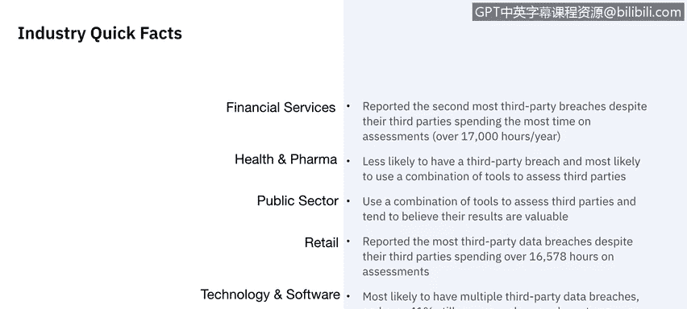
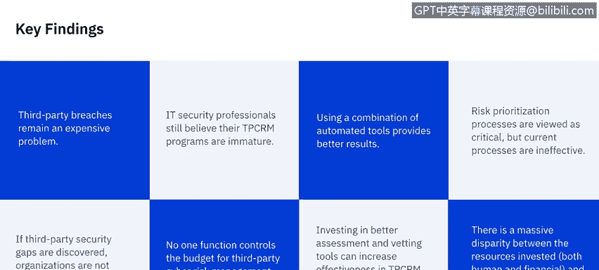
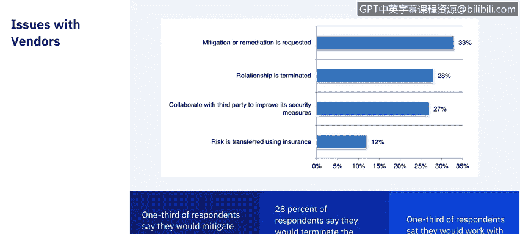
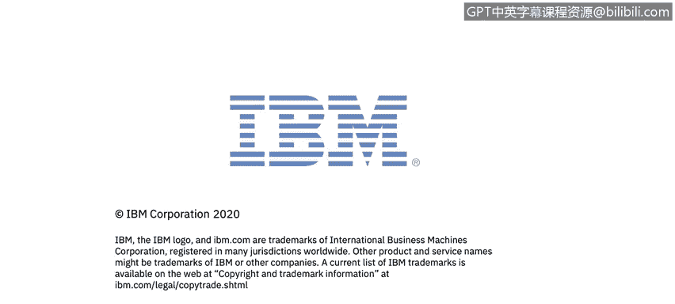

# 课程7：《网络安全顶级项目：入侵响应案例研究》：16：第三方违规影响

## 📊 概述
在本节课中，我们将学习第三方数据泄露对个人和企业可能产生的影响。我们将探讨相关行业现状、消费者信任度的变化，以及组织可以采取的风险管理措施。

## 🏢 行业现状与挑战
上一节我们介绍了第三方违规的基本概念，本节中我们来看看不同行业的具体情况。第三方泄露仍然是组织面临的主要安全挑战，超过63%的数据泄露与第三方有关。

以下是一些行业的快速事实：

*   **金融服务**：尽管其第三方每年花费超过17,000小时进行评估，但报告的第三方泄露数量位居第二。
*   **健康与制药**：发生第三方泄露的可能性较低，并且最有可能使用多种工具组合来评估第三方。
*   **公共部门**：使用多种工具组合评估第三方，并倾向于相信评估结果。
*   **零售业**：报告的第三方数据泄露最多，尽管其第三方在评估上花费了超过16,578小时。
*   **科技与软件**：最有可能发生多次第三方数据泄露，并且超过41%的企业仍使用手动流程评估第三方。

## 💰 第三方泄露的成本与应对
同一项研究还确定了第三方泄露仍然是一个代价高昂的问题。以下是关键发现：

*   IT安全专业人员仍认为其第三方网络风险管理（TPCRM）项目不成熟。
*   使用自动化工具组合能提供更好的结果。
*   风险优先级排序流程被视为关键，但现有流程效果不佳。
*   如果发现第三方安全漏洞，组织不会主动采取措施降低这些风险。
*   没有一个职能部门能完全控制第三方网络风险管理项目的预算。
*   投资于更好的评估和审查工具可以提高第三方网络风险管理的有效性，同时降低维护项目的成本。
*   在投入的资源（包括人力和财力）方面存在巨大差异。

## 🏥 企业对第三方漏洞的响应
在2019年Ponemon研究所关于医疗保健领域第三方泄露的研究中，受访者给出了不同的应对方式：

*   约三分之一表示会主动介入，亲自缓解或调解安全漏洞。
*   约三分之一表示会直接终止与供应商的关系。
*   其余约三分之一表示会与第三方合作解决存在的问题。

你可能会认为直接终止供应商关系的公司比例会更高，但这实际上与消费者对第三方泄露的反应也高度相关。

## 😔 数据泄露对消费者信任的影响
了解了企业的应对方式后，我们来看看消费者的反应。2016年《安全杂志》一项关于网络安全泄露如何影响消费者信任的调查，将结果分为三类：对企业失去信任、负面口碑以及输给竞争对手。

以下是调查结果：

*   **失去信任**：65%的数据泄露受害者对涉事组织失去了信任。
*   **客户流失**：如果信息在泄露中受损，80%的客户会离开该企业。
*   **负面传播**：85%的受害者会向他人讲述自己的经历，其中33.5%的人使用社交媒体投诉，20%的人直接在公司的网站上留言。
*   **安全成为考量**：52%的客户会考虑从安全性更好的提供商那里购买相同的产品或服务。同样有52%的客户表示，安全性是购买产品或服务时的重要或主要考虑因素。
*   **法律行动**：59%的消费者警告说，如果数据泄露导致他们的个人数据被用于犯罪目的，他们将对该公司采取法律行动。
*   **信息共享减少**：72%的消费者表示，他们现在会减少与公司分享个人详细信息，这可能会影响从社交媒体平台到搜索引擎等依赖收集详细消费者数据用于广告的组织的收入。

值得注意的是，在Target泄露事件（我们时代最大、最重大的泄露事件之一）中，尽管有65%的数据泄露受害者表示对组织失去了信任，但仍有40%的Target客户表示这对他们来说无关紧要。

## 🛡️ 风险缓解措施
为了预防或减轻第三方泄露或网络攻击的严重性，组织可以实施各种网络安全风险管理控制措施，例如：

*   **评估法规遵从性**：`assess_compliance(third_party, regulations)`
*   **审查第三方安全实践**：`vet_security_practices(third_party)`
*   **建立事件响应程序**：`establish_incident_response_procedure()`

## 📝 总结
本节课中，我们一起学习了第三方数据泄露的影响。我们了解到，第三方泄露在多个行业普遍存在且代价高昂，会对消费者信任造成严重且长期的损害，导致客户流失、法律风险和收入减少。组织需要投资于成熟的评估工具和流程，并建立有效的事件响应机制来管理此类风险。

现在我们已经了解了第三方泄露及其可能产生的影响，让我们在下一个视频中看一个真实案例。