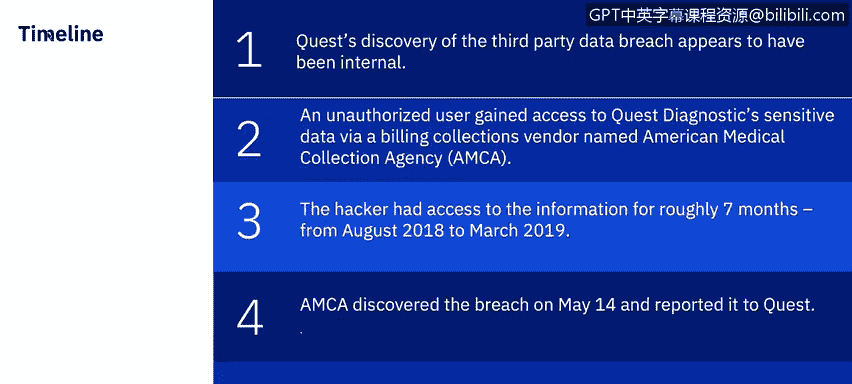
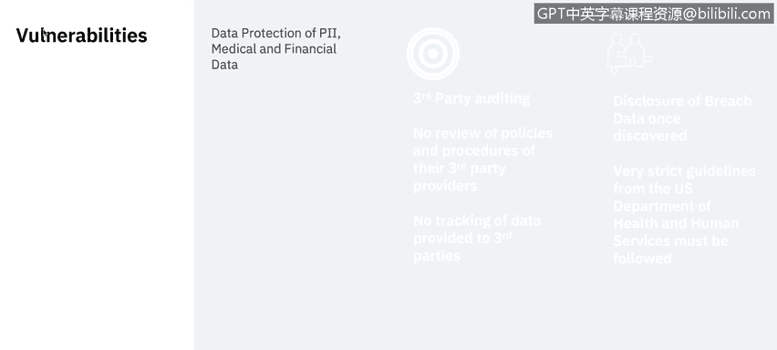
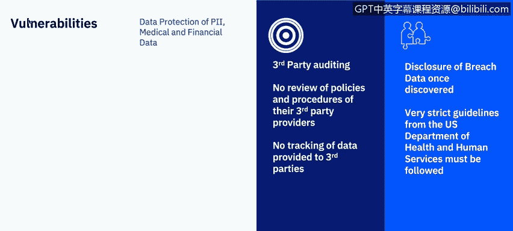
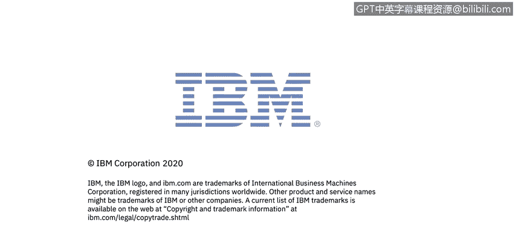

# 课程7：《网络安全顶级项目：入侵响应案例研究》：17：16_第三方违规案例研究：奎斯特诊断

## 概述
在本节课程中，我们将学习一个由IBM提供的第三方违规案例研究，对象是奎斯特诊断公司。我们将了解此次安全事件的时间线、威胁行为者采取的行动，以及第三方攻击所带来的影响。

## 攻击事件摘要
奎斯特诊断是美国最大的临床实验室检测服务提供商之一。此次事件中，约1190万患者的敏感数据被访问，范围涵盖信用卡号、银行账户信息，甚至社会安全号码。

以下是此次违规事件的时间线：

*   **2018年8月至2019年3月**：未经授权的用户通过一家名为美国医疗收款机构的计费收款供应商，访问了奎斯特诊断的敏感数据，持续时间约七个月。
*   **2019年5月14日**：美国医疗收款机构发现了此次违规，并向奎斯特诊断报告。
*   **2019年6月初**：奎斯特诊断在向美国证券交易委员会提交的文件中披露了此次违规，公众首次得知此事。

## 主要漏洞分析
上一节我们了解了事件的时间线，本节中我们来看看导致此次事件的主要漏洞。这些漏洞主要围绕奎斯特诊断及其第三方所能访问的数据。

*   **个人身份信息**：指任何可用于识别特定个人的数据。例如，社会安全号码、邮寄或电子邮件地址以及电话号码。随着技术发展，其范围也在扩大。
*   **医疗数据**：患者的健康相关信息。
*   **财务数据**：包括信用卡数据等。

如果我们具体审视第三方供应商的显性漏洞，以下是关键发现：

*   **缺乏对第三方的审计**：一个未知方非法访问了美国医疗收款机构的网站，并实施了针对支付页面的中间人攻击。攻击者记录了访问者输入的支付和个人信息。
*   **数据访问范围**：奎斯特诊断表示，其内部医疗记录（如实验室检测结果）在此次第三方数据泄露中未被访问。但攻击者能够访问任何可能在美国医疗收款机构网站上输入的医疗信息。
*   **响应措施**：奎斯特诊断已停止向美国医疗收款机构发送收款请求。美国医疗收款机构则移除了其网络支付页面，并聘请外部安全公司进行审计。美国医疗收款机构表示，尚不清楚未经授权的用户是如何获得访问权限的。

## 法规遵从与报告责任
除了技术漏洞，奎斯特诊断还负有报告涉及医疗数据泄露的法规责任。根据美国卫生与公众服务部的规定：

*   涉及未受保护的健康信息泄露时，相关实体必须向受影响个人、部长（在某些情况下还需向媒体）提供违规通知。
*   此外，如果违规发生在业务伙伴处或由其造成，业务伙伴必须通知相关实体。

## 违规成本与影响
了解了漏洞和责任后，我们来看看此次违规造成的成本与影响。这似乎是一批非常庞大的数据，因为它触及了客户数据的三个关键组成部分：**个人身份信息**、**信用卡数据**和**健康信息**。

其影响包括：

*   **身份盗窃和账户接管风险**：存在明显的身份盗窃和账户接管风险。
*   **针对性网络钓鱼攻击**：此次第三方数据泄露暴露的信息组合，可能导致一些特别令人担忧的网络钓鱼攻击。结合可用的财务和个人信息，医疗数据成为诈骗者的有力工具。他们可以轻易冒充目标的医生或保险公司，引用私人医疗细节以获取信任。
*   **勒索可能性**：如果受害者中有公众人物，还可能存在勒索的可能性。
*   **财务成本**：奎斯特诊断的财务成本尚不清楚。2019年6月12日，佛罗里达州律师事务所摩根与摩根在新泽西州对奎斯特诊断提起了集体诉讼。康涅狄格州和伊利诺伊州的司法部长也已对此安全事件展开调查。在长达36页的诉讼中，奎斯特诊断被指控未能妥善通知患者此次违规。
*   **第三方供应商的后果**：对于第三方供应商美国医疗收款机构而言，情况更为严峻。据彭博社报道，在长达八个月的系统黑客攻击泄露了多达2000万奎斯特诊断、LabCorp和BioReference患者的个人财务和健康数据后，美国医疗收款机构申请了第11章破产保护。破产申请显示，LabCorp、奎斯特诊断及其另外两个最大客户因此次违规已停止与美国医疗收款机构的业务往来，这加速了其破产申请。

## 预防建议
基于对那些在过去12个月或历史上成功避免第三方数据泄露的组织的特别分析，我们得出以下预防建议。这些高绩效组织实施了与减少第三方数据泄露事件密切相关的治理和IT安全最佳实践。

以下是其中一些关键建议：

*   **评估所有第三方的安全和隐私实践**：必须对第三方进行定期审计和评估，以审查其安全和隐私实践。
*   **建立共享信息的第三方清单**：必须跟踪所有有权访问敏感数据的第三方，并了解其中有多少方正在将这些数据共享给其他方。
*   **频繁审查第三方管理政策和程序**：必须实施正式流程，定期评估第三方及第N方（即第三方的第三方）的安全和隐私实践，特别是要应对物联网设备等新技术和创新。
*   **要求第三方在数据共享时提供通知**：必须强制要求第三方在共享敏感数据之前，提供其与第N方关系的信息和透明度。
*   **高层领导与董事会监督**：高级领导层和董事会应参与第三方风险管理计划。高层对第三方风险的关注可能会增加应对这些威胁的可用预算。

## 总结
本节课中，我们一起学习了奎斯特诊断第三方数据泄露的案例。我们回顾了事件的时间线，分析了围绕**个人身份信息**、医疗数据和财务数据的主要漏洞，探讨了法规报告责任，并评估了此次违规带来的身份盗窃、网络钓鱼攻击、法律诉讼及供应商破产等多方面影响。最后，我们学习了基于最佳实践的预防建议，包括评估第三方、建立清单、定期审查、要求透明度和高层监督等关键措施。

接下来，我们将提供一个关于勒索软件的概述视频。稍后我将回来，为大家带来一个关于亚特兰大市的勒索软件案例研究。

感谢观看本视频。