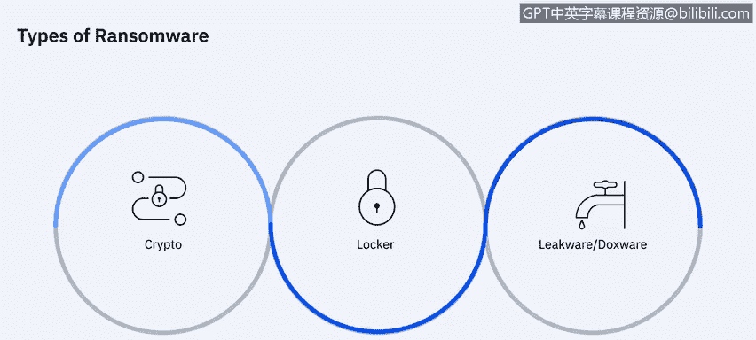
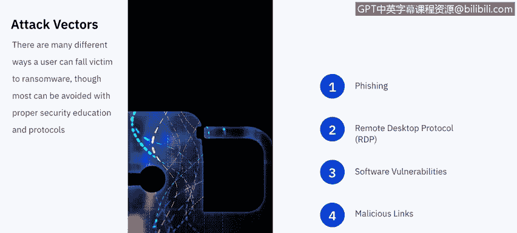
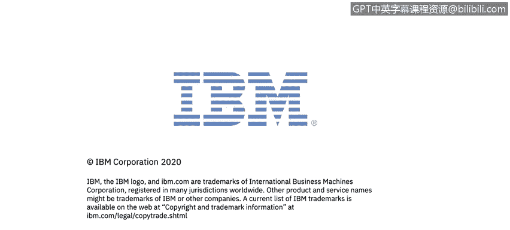

# 课程7：《网络安全顶级项目：入侵响应案例研究》：18：17_勒索软件概述.zh

## 🦠 勒索软件概述

在本节课中，我们将要学习什么是勒索软件，了解它劫持用户数据的各种方法，并探讨用户如何成为勒索软件的攻击目标。

---

### 什么是勒索软件？

美国国土安全部将勒索软件定义为一种感染计算机系统并限制用户访问受感染系统的恶意软件。通常，这些警报会声明用户的系统已被锁定，或者用户的文件已被加密。用户被告知，除非支付赎金，否则访问权限将不会被恢复。

向个人索要的赎金数额差异很大，但通常在200至400美元之间，并且必须使用比特币等虚拟货币支付。

---

### 勒索软件的类型

勒索软件通常分为以下三种主要类型：

*   **加密型勒索软件**：这种勒索软件会加密您计算机上的特定文件或文件组，并在您支付赎金前拒绝您访问这些文件。
*   **锁定型勒索软件**：这种勒索软件会将您完全锁在设备之外。除非支付赎金，否则您将无法进入您的计算机。
*   **泄露型勒索软件**：这种勒索软件会威胁要公开您网络摄像头拍摄的画面，或您计算机上任何可能构成罪证的文件。除非支付赎金，否则攻击者可能会将这些内容公之于众或发送给特定的人。

---

### 勒索软件的感染途径

用户成为勒索软件受害者的方式多种多样，但大多数都可以通过适当的安全教育和协议来避免。以下是几种常见的感染途径：

*   **网络钓鱼攻击**：网络犯罪分子发送电子邮件，试图诱使用户泄露个人信息或采取某种行动。在这种情况下，用户可能会点击附件或链接，从而被引导至一个受感染的网站并安装勒索软件。
*   **远程桌面协议漏洞**：网络犯罪分子能够通过网络访问您的设备，这通常是由于您的设备或网络密码策略薄弱。一旦他们获得访问权限，就可以自行安装勒索软件。
*   **软件漏洞**：这包括未及时更新操作系统以修补已知漏洞，以及未更新第三方软件。例如，针对Adobe Flash Player等软件的广泛欺骗活动，如果开启了自动更新或及时更新，就不容易被欺骗点击链接或下载勒索软件。
*   **恶意链接**：这些超链接几乎无处不在，可能出现在试图窃取您信息的欺诈邮件中，也可能出现在试图诱使您点击以下载勒索软件的欺骗网站上，还可能出现在社交媒体、即时通讯消息或短信中。点击可能下载勒索软件的内容的机会无处不在。

---

### 如何防御勒索软件？

如果不幸遭遇勒索软件，能做的补救措施不多。但正如俗话所说，最好的进攻就是良好的防守。预防成为勒索软件受害者的最佳方法如下：

*   **备份数据**：对抗任何勒索软件的首要防御措施是拥有完整的系统备份。这能让任何试图以数据为要挟进行勒索的攻击者无计可施。在这种情况下，您不会丢失任何数据，只会损失一些时间和精力。
*   **更新软件并使用强密码**：及时更新所有软件，并为您的计算机、应用程序和网络使用强密码，这是网络安全的基础。这能确保您不会成为容易被攻击的目标，攻击者可能需要专门针对您进行鱼叉式网络钓鱼，而不是因为您防护薄弱而轻易得手。
*   **使用防病毒软件**：市场上有许多防病毒软件选项。安装安全软件来扫描恶意附件或计算机的异常更改，能有效对抗网络钓鱼尝试。
*   **警惕超链接**：有时甚至无需下载，仅仅是访问一个欺骗网站就可能开始下载勒索软件。因此，如果您收到来自可疑来源的邮件，或者邮件看起来真实但您不确定为何会收到，请直接打开浏览器访问官方网站，而不是使用邮件中提供的链接。

---

### 总结

本节课中，我们一起学习了勒索软件的基本概念、主要类型、常见的感染途径以及关键的防御策略。下一节，我们将深入分析几种最常见的勒索软件的具体案例。