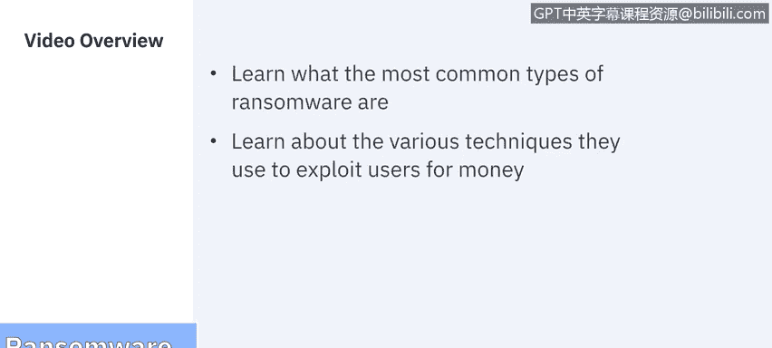
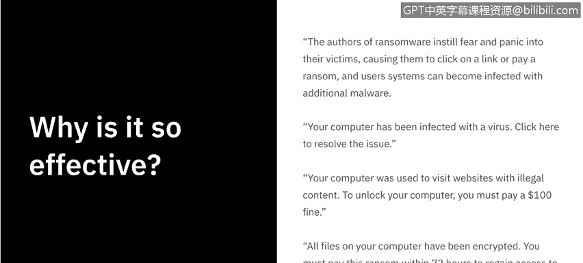
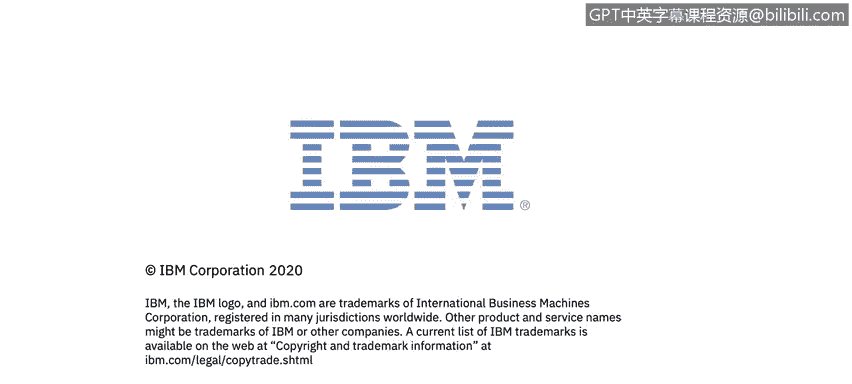

# 课程7：《网络安全顶级项目：入侵响应案例研究》：19：18_勒索软件实例.zh

## 🦠 勒索软件实例

在本节课程中，我们将学习最常见的勒索软件类型，以及它们利用用户牟利的各种技术手段。

---

美国国土安全部的勒索软件主页指出，勒索软件对个人或组织可能造成毁灭性打击。任何在电脑或网络上存储重要数据的人都面临风险，包括政府或执法机构、医疗保健系统或其他关键基础设施实体。恢复过程可能非常困难，可能需要信誉良好的数据恢复专家的服务，并且一些受害者会支付赎金以恢复文件。然而，即使支付了赎金，也无法保证个人一定能恢复其文件。

那么，为什么勒索软件如此有效？勒索软件的制造者向受害者灌输恐惧和恐慌，诱使他们点击链接或支付赎金，这可能导致用户系统感染额外的恶意软件。受害者通常会看到类似这样的信息：“您的计算机已感染病毒，点击此处解决问题。”或者“您的计算机曾用于访问非法内容网站，要解锁计算机，您必须支付100美元罚款。”以及“您计算机上的所有文件已被加密，必须在72小时内支付赎金以重新获取数据访问权限。”勒索软件作者会将受害者逼入绝境，并利用恐惧策略试图勒索赎金。

在上一节视频中，我们讨论了不同类型的勒索软件，例如加密型勒索软件、锁屏型勒索软件和泄露型勒索软件。现在，我们来看看具体的勒索软件实例。

以下是几个历史上著名的勒索软件案例：

*   **Locky**：这种勒索软件能够加密超过160种不同的文件类型。它通过网络钓鱼，针对拥有设计、工程或开发文件类型的用户。
*   **WannaCry**：可以说是最臭名昭著的勒索软件。它在2017年蔓延至150个国家。它利用了医疗保健行业的过时软件，在全球造成了40亿美元的损失。
*   **Bad Rabbit**：这种勒索软件使用伪造的Adobe Flash更新网站来安装勒索软件，诱骗用户以为需要完成更新。当用户点击安装按钮时，实际安装的是勒索软件。
*   **Ryuk**：这种勒索软件在2018年传播，专门针对Windows系统。它的作用是禁用系统还原按钮，这样当用户发现自己成为勒索软件的受害者时，就无法在当前操作系统中完成备份。它特别恶毒的一点是还会加密网络驱动器。
*   **Trolldesh**：这种勒索软件在2015年流行，追求数量而非质量。它通过垃圾邮件、电子邮件链接和附件来捕获受害者。
*   **Jigsaw**：这种勒索软件以《电锯惊魂》恐怖电影命名。它通过每小时逐步删除越来越多的文件来折磨受害者，除非支付赎金。
*   **CryptoLocker**：这种勒索软件通过电子邮件附件传播，影响了超过50万台计算机。但它被执法部门成功反击，执法部门能够看到所有帮助传播该勒索软件的计算机网络，并能够在网络犯罪分子不知情的情况下向受害者分发解密密钥。
*   **Petya**：这是GoldenEye的前身，它会直接加密整个硬盘驱动器。当它以GoldenEye的形式重新出现时，正值WannaCry流行之际。它针对知名度较高的用户，并完全将他们锁定在外。
*   **Gancrab**：这种勒索软件声称使用了用户的网络摄像头记录个人和私人时刻，并威胁要发布这些录像，除非支付赎金。

尽管勒索软件的现状令人担忧，但未来前景也并不乐观。随着组织越来越依赖技术解决方案，勒索软件的潜在攻击范围只会增加。因此，物联网（IoT）演变为“勒索软件之物”（Ransomware of Things）只是时间问题，因为越来越多地使用互联网连接的工业控制系统、智能建筑和车辆（包括自动驾驶汽车）正在创造新的潜在攻击领域。例如，远程锁定车辆、住宅和建筑可能被滥用于敲诈勒索。操纵建筑自动化系统（如控制暖通空调的系统）可能成为新勒索计划的基础。

在2018年题为《企业视角下的勒索软件》的白皮书中，Stephen Cobb讨论了对这种勒索软件演变的一些建议应对措施。首先，开始在您的风险管理、战略和规划中解决潜在威胁。其次，了解您当前易受勒索的资产，包括您的物联网设备、小型或家庭办公室路由器、任何机器人控制系统或自主系统。跟踪与这些设备相关的漏洞报告，并及时进行补丁和固件更新。最后，将物联网设备和其他新技术与您的生产网络进行隔离，这样即使一个系统被攻破，另一个系统仍有保护机会。

现在，我们将通过一个真实世界的例子，来看看针对亚特兰大市的大规模勒索软件攻击。我们将在下一个视频中详细探讨。

---

在本节课中，我们一起学习了勒索软件的危害性、其利用恐惧心理的运作方式，并回顾了多个历史上著名的勒索软件实例及其攻击手法。我们还探讨了勒索软件未来可能的发展趋势，特别是在物联网领域的潜在风险，并了解了应对此类威胁的一些基本策略。