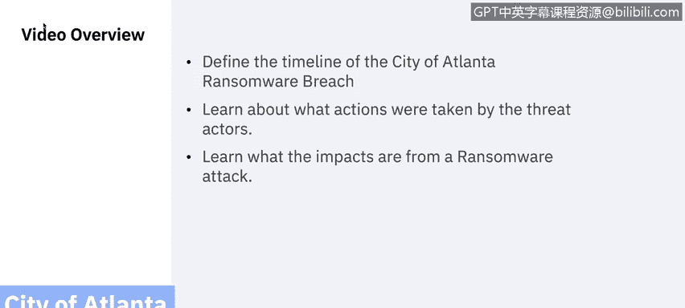
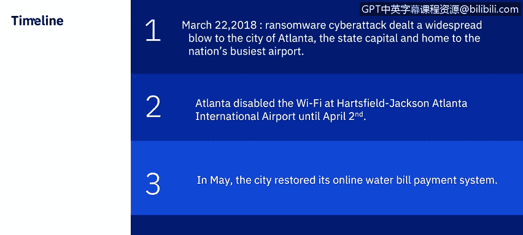
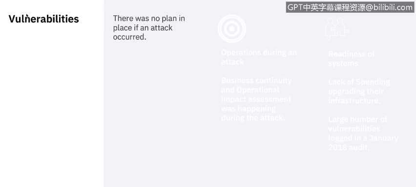
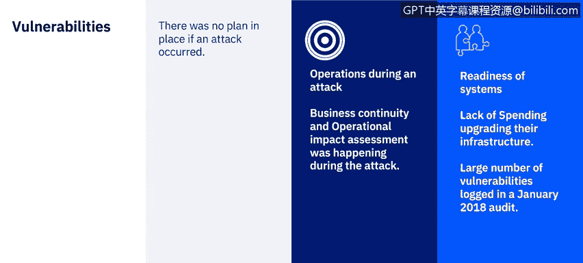
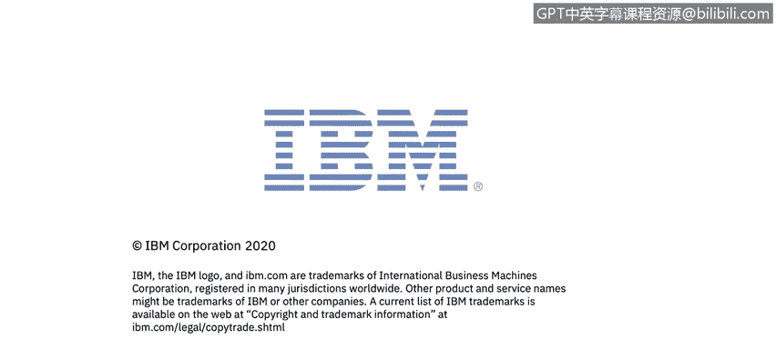

# 课程7：《网络安全顶级项目：入侵响应案例研究》：20：19_勒索软件案例研究：亚特兰大市

在本节课中，我们将学习一起发生在2018年的真实勒索软件攻击案例——美国亚特兰大市网络攻击事件。我们将梳理攻击的时间线，分析威胁行为者的行动，并探讨此类攻击带来的深远影响。

## 攻击事件概述

2018年3月22日凌晨，亚特兰大市遭受了一次大规模的勒索软件攻击。这次事件导致多项市政服务瘫痪，包括逮捕令签发、供水申请、新囚犯处理、法庭费用支付以及多个市政部门的在线账单支付系统。攻击者使用的病毒是 **SamSam** 勒索软件。

这种勒索软件的特殊之处在于，它不依赖于钓鱼攻击，而是利用**暴力破解**来猜测弱密码，直到找到匹配项。它通常以较弱的IT基础设施和服务器为目标。为了解锁城市系统和数据，攻击者索要价值**51，000美元**的比特币，但市政府拒绝支付。

## 攻击时间线回顾

上一节我们了解了攻击的基本情况，本节中我们来详细看看攻击发生和发展的具体时间线。

以下是攻击事件的关键时间节点：

*   **2018年3月22日（凌晨）**：勒索软件网络攻击对亚特兰大市（州首府，拥有美国最繁忙的机场）造成广泛打击。此次入侵导致市政厅的许多设备关闭约五天，并在整个企业网络的其他地方造成广泛感染。
*   **2018年3月22日至4月2日**：出于谨慎考虑，官员们关闭了哈茨菲尔德-杰克逊亚特兰大国际机场的Wi-Fi，直至4月2日。
*   **2018年5月**：市政府恢复了在线水费支付系统。
*   **2018年6月**：法院的在线账单支付选项和案件公告板才恢复服务。

这次攻击对执法部门影响显著，警察一度被迫手写事件报告，并且部门几乎无法访问所有存档的车载视频。它还同时影响了内部和外部应用程序，迫使亚特兰大市法院手动处理案件，并停止了罚单、水费、商业执照及续期的在线或现场支付。

## 暴露的漏洞与应对

了解了攻击的时间线后，我们来看看这次事件暴露了亚特兰大市在网络安全方面存在哪些漏洞，以及他们是如何应对的。

首先，一个关键的漏洞是**缺乏攻击发生时的应急预案**。我们将在后面探讨亚特兰大市从中吸取的许多教训。

尽管发生了入侵，亚特兰大市的911系统和应急响应并未受到影响，主要公用事业（包括供水和污水处理服务）也照常运行。这得益于亚特兰大市保留了手动流程和机构知识，能够回归传统的服务提供方式，并制定了在事件发生时维持业务运营的计划。

根据亚特兰大市应急准备办公室主任Ria Akin的说法，城市的应对措施是业务连续性和运营影响评估同时进行。许多市政机构和私营部门同行过于专注于响应工作，却没有意识到作为响应的一部分，应立即开始思考如何继续运营。

他们还**未能全面理解威胁对所有运营的影响**，系统是在威胁发生时进行评估的。此外，他们在**系统就绪状态**方面也存在漏洞。在攻击发生前，亚特兰大市政府因在升级IT基础设施上投入不足而受到批评，留下了多个可供攻击的漏洞。事实上，2018年1月的一项审计发现该市系统中存在**1500至2000个漏洞**，并指出漏洞数量已多到让工作人员变得自满。

## 攻击的成本与影响

上一节我们分析了漏洞，本节我们来看看这次攻击造成的实际损失和更广泛的影响。

这次于3月发生的、导致亚特兰大市计算机网络瘫痪的SamSam勒索软件攻击，可能使纳税人损失高达**1700万美元**，高于早先估计的270万美元。最新的成本估算包括约600万美元的现有安全服务和软件升级合同，以及1100万美元与攻击相关的潜在成本（包括新的台式机、笔记本电脑、智能手机和平板电脑）。这标志着其成为2018年美国影响地方政府成本最高的网络攻击之一。

尽管市政府官员拒绝支付攻击者要求的赎金，但在勒索软件攻击后恢复服务总是在财务和声誉上代价高昂，因为恢复期间的停机成本（据计算约为每天1万美元）。例如，佛罗里达州彭萨科拉市在2019年12月遭到Maze勒索软件攻击，并被要求支付100万美元赎金。截至2019年，此类攻击激增，有超过70个州和地方政府遭到勒索软件攻击。

## 最佳实践与经验教训

分析了高昂的代价后，我们自然会问：如何避免此类灾难性的网络攻击？让我们看看一些可以预防此类事件的最佳实践。

Verizon的Spitzler指出，彻底预防应成为一个目标。IT官员必须了解其网络架构，投资于电子邮件基础设施，并在各个层面保持警惕，仔细检查电子邮件及其附件，并查找浏览器漏洞。他补充说，**多因素认证**非常有价值，而**网络分段**至关重要。最后，州和地方政府应在自己的网络内建立良好的安全区域分段，以阻止攻击者在通过暴力破解打开一台设备后横向移动。`如果你无法进入一个系统，就无法利用该系统进入另一个系统。`

此外，敦促各机构制定备份计划，定期备份数据并确保其安全，并准备好一旦发生事件或入侵，迅速将受感染的机器从网络中移除。

在看到亚特兰大市花费数百万美元恢复系统（而非支付5.2万美元赎金）之后，地方政府也更频繁地选择支付赎金，而不是重建系统。

## 亚特兰大市的后续改进

最后，我们来看看亚特兰大市如何从这次事件中吸取教训并向前迈进。

亚特兰大市官员强调了保护政府数据和信息的重要性，以及在机构网络安全方法中引入纪律性。根据Raley的说法，该市的网络安全方法基于三大支柱：**合规治理、漏洞管理和整体威胁管理**。

除了限制事件或入侵的财务影响外，网络安全保险政策可以作为路线图，并帮助机构培养推进其网络安全目标所需的持续动力。部分启示是，是的，要购买保险，但要在购买保险的过程中，借此机会更批判性地审视你作为一个市政机构正在做的事情。

Hadley还强调了在事件或入侵发生前与公共和私营部门的潜在合作伙伴建立联系的价值，以及在可能急需之前确定可用资源的价值。但同样有价值的是，从企业级IT管理和网络安全的日常琐碎任务中退一步，看到更大的图景。把握大局可以更好地告知高管们其企业中的各个层面，也有助于识别现有的IT投资和任何障碍（如信息孤岛），并帮助减少不必要的应用程序。

自2018年10月成为亚特兰大市首席信息官以来，Gary Brantley一直专注于制定连续性计划，以便市政官员知道即使网络攻击导致网络瘫痪，如何继续运营城市服务。他将准备工作比作学校的安全演习：当发生灾难性情况时，那些孩子们确切知道该做什么，因为他们之前练习过。IBM的X-Force威胁情报副总裁Wendy Whitmore也指出，进行演习可以揭示导致网络攻击发生的关键弱点，以及可以防止广泛损害的简单预防措施。例如，当攻击发生时，城市员工可能会发现，在没有市政设备和个人电子邮件账户的情况下，他们不知道如何联系同事；或者一个机构可能知道要备份数据，但如果备份连接到一个已被入侵的网络，它可能会与其他一切一起被破坏。

## 总结

本节课中，我们一起学习了亚特兰大市勒索软件攻击案例。我们回顾了攻击的时间线，分析了城市在应急预案、系统漏洞管理和威胁影响评估方面暴露出的问题。我们看到了这次攻击造成的巨大财务和运营成本，并探讨了通过多因素认证、网络分段、定期安全备份和制定业务连续性计划等最佳实践来预防和缓解此类威胁的重要性。最后，我们了解了亚特兰大市如何通过建立治理框架、购买网络安全保险和进行应急演练来改进其网络安全态势。这个案例深刻地提醒我们，健全的网络安全策略和充分的准备对于任何组织都至关重要。