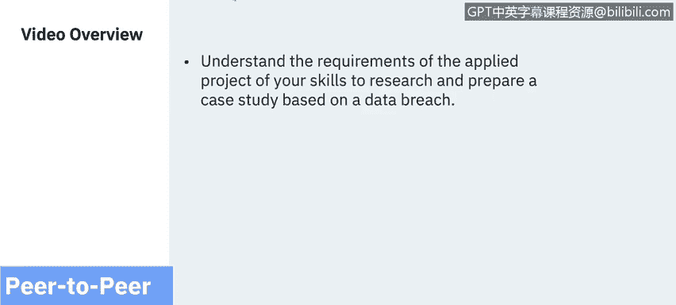
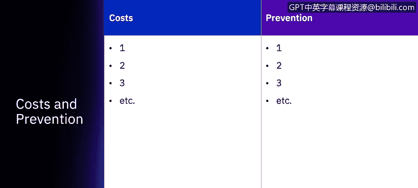
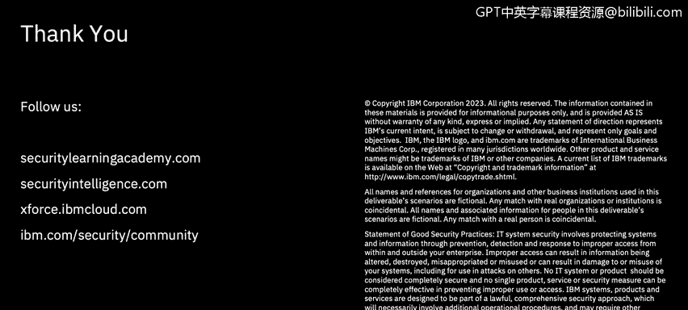

# 课程7：《网络安全顶级项目：入侵响应案例研究》：21：对等数据泄露应用项目简介

在本节课中，我们将学习如何完成本课程的“对等数据泄露应用项目”。你将了解项目要求，并学习如何基于一个真实的数据泄露事件，运用所学技能进行研究并准备一份案例分析报告。

## 项目概述与模板介绍

上一节我们介绍了案例研究的重要性，本节中我们来看看如何具体构建你自己的案例分析。你将使用一个特定的模板来完成这个应用项目。

这个模板旨在帮助你整合在本课程以及之前其他网络安全课程中学到的所有材料，通过研究构建一份完整的案例分析报告。

该演示文稿模板提供多种格式：
*   **PowerPoint** 格式
*   **Keynote** 格式
*   **Google Slides**（开源演示软件）

## 项目核心步骤详解

以下是完成此应用项目需要遵循的核心步骤，我们将逐一进行说明。

### 1. 选择案例与攻击分类

首先，你需要选择一个在过去七年内发生过数据泄露的公司或受影响方。

接着，描述导致该数据泄露的攻击类别，并提供该攻击类别的具体信息。这包括：
*   该攻击类别利用了哪些**漏洞**。
*   该攻击类别的**其他示例**。
*   相关的**行业统计数据**（大部分可在本课程指定的 **X-Force威胁情报报告** 中找到）。

### 2. 描述公司与事件

你需要添加公司描述、事件和数据泄露的摘要。请确保参考本课程中提供的案例研究作为填写此部分信息的范例，因为你的报告将由同伴进行评审。

### 3. 梳理事件时间线

接下来，描述事件的时间线。这包括导致数据泄露的一系列事件，以及在发现泄露日期之后发生的事件。具体信息应涵盖：
*   数据泄露是由公司内部还是外部发现的。
*   数据泄露和攻击发生的具体时间。
*   围绕数据泄露的相关信息摘要。

### 4. 分析安全漏洞

然后，讨论安全漏洞。分析公司整体的脆弱性是什么。例如：
*   系统是否未进行安全加固。
*   是否缺乏安全软件。
*   是否花费了数月才识别出泄露。

你需要从中挑选出**四个具体的漏洞**进行详细说明。这些漏洞可能各不相同，例如员工缺乏安全教育，或是被攻击的服务器未安装防病毒补丁。每个数据泄露事件都是独特的，因此你需要明确指出其特定的漏洞。

### 5. 评估泄露成本

接下来，讨论数据泄露造成的成本。根据泄露发生的时间，成本信息可能有所不同。如果是近期事件，关于公司或组织成本的信息可能有限。然而，如果是过去的事件，你应该能够看到多年来产生的一系列不同成本，包括：
*   **诉讼成本**。
*   为攻击者获取的信用卡信息支付的**潜在赔偿成本**。
*   公司因业务损失而产生的**其他成本**。

### 6. 提出预防策略

最后，你需要讨论预防策略。在这一部分，策略可能多种多样，例如：
*   公司需要制定**事件响应计划**。
*   分析师可能错过了来自同一IP地址的多个事件。

根据你选择的攻击类型和新闻中找到的公司数据泄露事件，可能会有数百种不同的预防技术。

## 项目提交与评估

完成模板填写后，请将演示文稿保存或导出为 **PDF文件**，并提交回课程平台。

随后，将有两名同伴评审员审阅你的报告，并根据你提供的信息量以及基于他们知识判断的信息准确性进行评分。

**评分规则**：每张幻灯片都有部分分数，你需要获得平均 **80%** 的分数才能通过本课程。

## 总结

本节课中，我们一起学习了“对等数据泄露应用项目”的完整流程。从选择案例、分析攻击与漏洞，到评估成本并提出预防策略，你掌握了基于模板构建一份专业数据泄露案例分析报告的方法。现在，你可以开始进行研究并填写你的应用项目了。