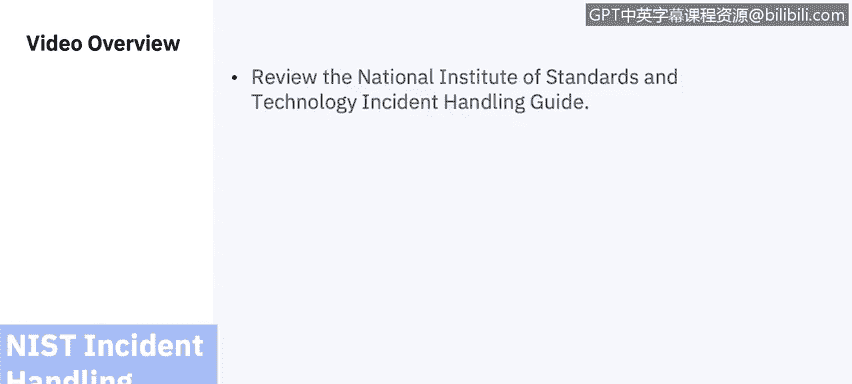
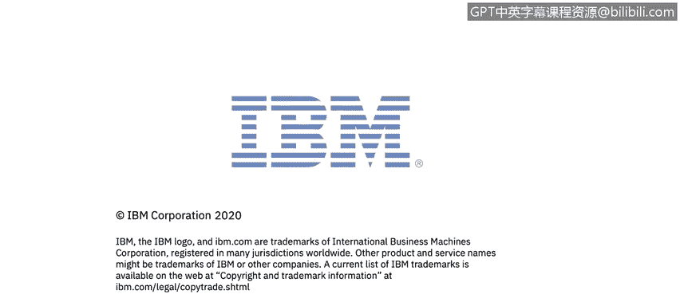

# 课程7：《网络安全顶级项目：入侵响应案例研究》：22：0_03_nist-incident-response-lifecycle-teams.en_subtitled

## 📋 课程概述

在本节课中，我们将要学习美国国家标准与技术研究院（NIST）事件处理指南的概述。我们将重点探讨建立有效的事件响应能力所面临的挑战、团队结构模型、人员配置要求以及团队成员所需的技能。

## 🏗️ 建立事件响应能力

建立事件响应能力应包括以下行动。以下是具体步骤：

*   **制定事件响应策略和计划**：事件响应策略是整个事件响应计划的基础。它定义了哪些事件被视为安全事件，建立了事件响应的组织结构，明确了角色与职责，并列出了事件报告的要求。
*   **制定事件响应计划**：事件响应计划基于策略，为实施事件响应计划提供了路线图。该计划指明了计划的短期和长期目标，包括衡量计划的指标。
*   **制定事件处理和报告程序**：事件响应程序为响应事件提供了详细的步骤。组织应事先在这些政策和程序中确定与外部各方（如媒体、执法机构和事件报告组织）沟通适当事件细节的流程。团队应遵守组织与媒体等外部各方互动的现有政策，例如只有授权人员才能与媒体对话。

## 🤝 与外部各方沟通

作为流程的一部分，你需要为与外部各方就事件进行沟通设定指导方针。你需要向适当的组织提供有关事件的重要信息，包括美国网络安全和基础设施安全局等机构。作为政策的一部分，你应该决定是否使用信息共享与分析中心。信息共享与分析中心是一个非营利组织，为收集关键基础设施面临的网络威胁信息提供中心资源，并在私营和公共部门之间提供双向信息共享。

## 👥 选择团队结构与人员配置模型

在选择团队结构和人员配置模型时，有几个方面需要考虑，我们将在本视频后面深入探讨。

*   **考虑相关因素**：在选择事件响应团队模型时，应仔细权衡每种可能的团队结构模型和人员配置模型在组织需求和可用资源背景下的优缺点。
*   **选择具备适当技能的人员**：团队的可信度和熟练程度在很大程度上取决于其成员的技术技能和批判性思维能力。关键技术技能包括系统管理、网络管理、编程、技术支持和入侵检测。有效的事件处理也需要团队合作和沟通技巧。应为所有团队成员提供必要的培训。
*   **建立关系与沟通渠道**：在安全事件发生之前，应在事件响应团队与内部外部其他团队之间建立关系和沟通渠道。每个事件响应团队都依赖于其他团队的专业知识、判断和能力，包括管理层、信息安全、IT支持、法律、公共事务和设施管理。
*   **确定团队应提供的服务**：虽然团队的主要重点是事件响应，但大多数团队还执行其他功能。例如包括监控、入侵检测、发布安全公告以及对用户进行安全教育。

## 🏢 深入探讨事件响应团队结构

上一节我们介绍了建立事件响应能力的基础步骤，本节中我们来看看具体的团队结构模型。事件响应团队应可供任何发现或怀疑发生涉及组织事件的人员使用。事件处理人员分析事件数据，确定事件的影响，并采取适当行动以限制损害并恢复正常服务。

对于团队模型，大多数组织会使用几种不同的模型。以下是常见的模型：

*   **集中式事件响应团队**：处理整个组织的事件。此模型通常用于通常位于单一地理位置的小型组织。
*   **分布式事件响应团队**：组织拥有多个事件响应团队，分别负责某个业务单元、大型组织或地理上分散的区域。应指定一个协调团队。

计算机安全事件响应团队是一组IT专业人员，为组织提供围绕预防、管理和协调这些潜在网络安全相关紧急情况的服务和支持。

## 💼 人员配置模型

在选择事件响应团队的适当结构和人员配置模型时，组织可以考虑三种人员配置模型。以下是具体选项：

*   **内部员工**：使用内部员工。
*   **部分外包**：将事件响应工作部分外包给另一个组织。如果组织将部分事件响应工作外包，最常见的安排是将入侵检测传感器、防火墙和其他安全设备的7x24小时监控外包给场外的托管安全服务提供商，有时称为MSSP。
*   **完全外包**：一些组织选择第三种选项，即完全外包其事件响应工作，通常外包给现场承包商。当组织需要全职的现场事件响应团队，但没有足够可用的合格员工时，最有可能使用此模型。

## ⚖️ 选择模型时的考虑因素

在选择事件响应团队的适当结构和人员配置模型时，组织应考虑以下因素：

*   **7x24小时可用性的需求**。
*   **团队成员是全职还是兼职**，例如将IT帮助台等现有团队作为事件报告的第一联系点。
*   **员工士气**。事件响应工作压力很大，通常需要团队成员承担待命职责。许多组织也难以找到愿意参与、有经验且具备适当技能的人员，尤其是在需要24小时支持的情况下。分离职责，特别是减少团队成员负责执行的管理工作量，可以显著提升士气。
*   **成本**也可能是一个主要因素，取决于是否需要员工7x24小时在现场，还是使用可能支持多个客户的外包组织。

## 🔧 团队成员所需技能

事件处理需要在多个技术领域具备专业知识和经验。所需知识的广度和深度根据组织风险的严重程度而有所不同。以下是核心技能要求：

*   **技术技能**：事件响应团队成员应具备出色的技术技能，例如系统管理、网络管理、编程、技术支持或入侵检测。每位团队成员都应具备良好的解决问题能力和批判性思维能力。并非每位成员都需要是技术专家。
*   **团队合作技能**：事件响应团队成员除了技术专长外，还应具备其他技能。团队合作技能至关重要，因为成功的事件响应需要合作与协调。
*   **沟通技能**：每位团队成员还应具备良好的沟通技巧。这些沟通技巧很重要，因为团队必须与各种各样的人互动。当团队成员准备公告和程序时，写作技巧也很重要。

## 📈 团队的附加职能

事件响应团队的主要重点是执行事件响应，但团队仅执行事件响应的情况相当罕见。一些事件响应团队还执行以下职能：

*   **入侵检测**。
*   **公告分发**：团队可能会在组织内发布关于新漏洞和威胁的公告。

## 🎯 课程总结

本节课中我们一起学习了NIST事件处理指南中关于建立事件响应能力的关键方面。我们探讨了制定策略与计划的重要性，分析了集中式与分布式团队结构模型，比较了内部、部分外包和完全外包等人员配置选项，并明确了团队成员所需的技术、团队合作与沟通技能。理解这些基础要素是构建一个高效、可靠的事件响应团队的第一步。