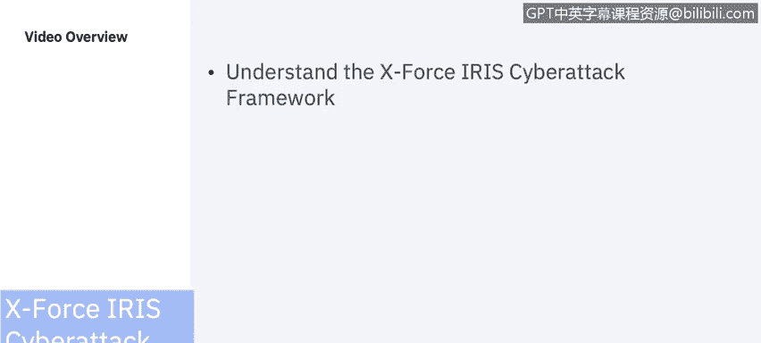
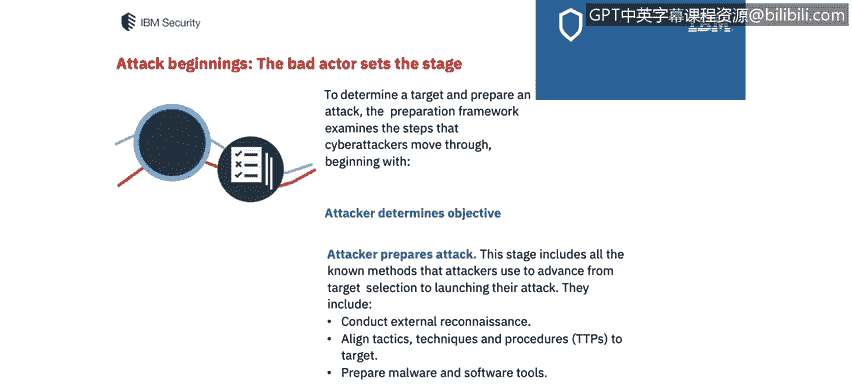
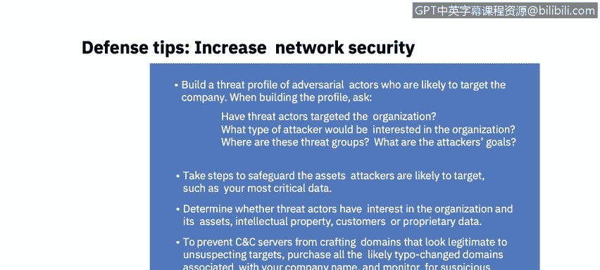
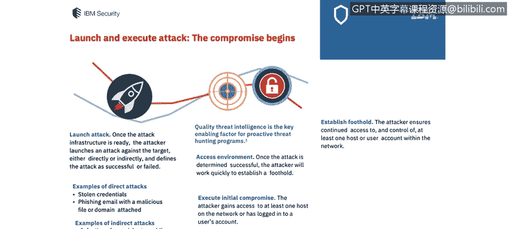
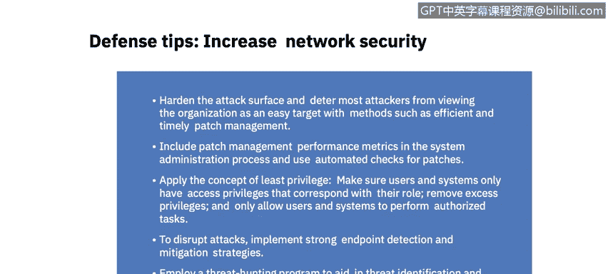
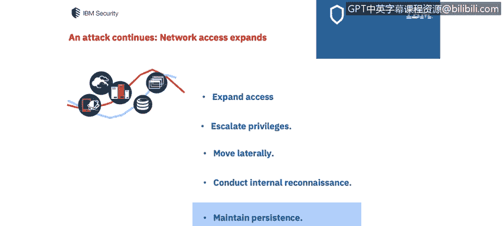
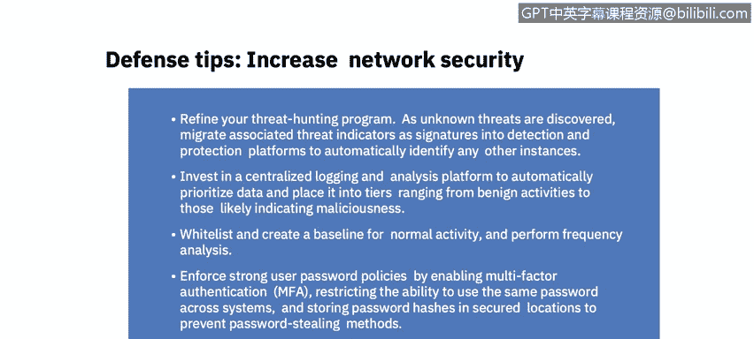
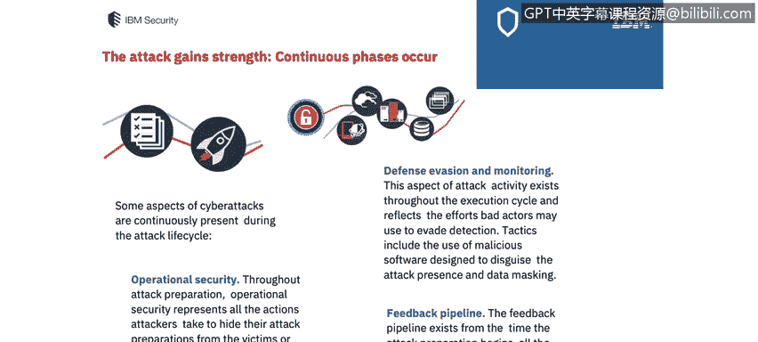
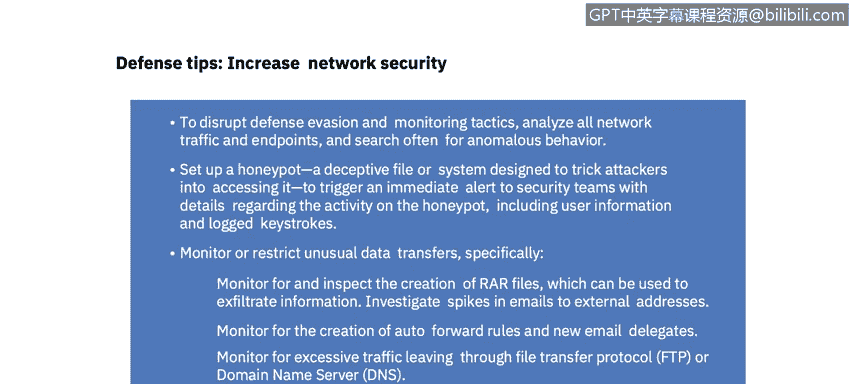
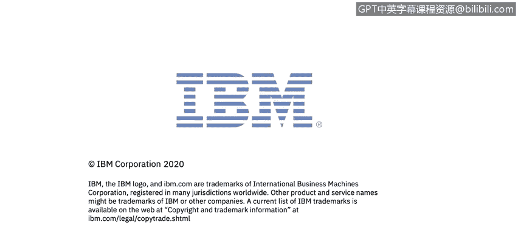

# 课程7：《网络安全顶级项目：入侵响应案例研究》：24：2_01 IBM X-Force IRIS 网络攻击框架 🛡️

## 概述
在本节课中，我们将学习IBM X-Force IRIS团队开发的网络攻击框架。该框架从攻击者的视角，系统地分解了网络攻击的各个阶段，旨在帮助安全分析师和威胁猎手理解攻击过程，从而更有效地制定防御策略、缩小风险敞口并挫败日益增多的网络攻击。

## 网络攻击框架简介
作为安全分析师，理解网络攻击框架至关重要。IBM X-Force IRIS团队开发了一个全面的框架，涵盖了攻击者采取的所有行动。该框架以可重复且全面的方式勾勒出网络攻击的每个阶段，使安全分析师能够系统地审视它们。

需要注意的是，网络攻击的各个阶段**不一定**按严格的线性顺序发生。根据攻击的进展，阶段可能同时发生、多次迭代，甚至被完全跳过。

## 攻击准备框架
在攻击开始之前，恶意攻击者会进行周密的准备。攻击的第一部分是准备框架，它审视了网络攻击者从确定目标到发起攻击所经历的步骤。

以下是攻击准备阶段的关键步骤：

1.  **确定目标**：攻击者明确其攻击目的，例如窃取知识产权。
2.  **识别目标**：攻击者选定具体的攻击目标。
3.  **确定攻击需求与制定初步计划**：攻击者评估所需资源并制定初步的攻击方案。
4.  **准备攻击**：此阶段包括攻击者从选定目标到发起攻击所使用的所有已知方法。具体可能涉及：
    *   进行外部侦察。
    *   调整战术、技术和程序。
    *   准备恶意软件和软件工具。攻击者会定义计划用于入侵并在网络中横向移动的工具集，可能使用恶意软件、重新利用具有合法用途的软件工具，或两者结合。
5.  **准备攻击基础设施**：攻击者可能搭建命令与控制网络。我们将在后续的“水坑攻击”案例研究中看到一个具体例子。

### 防御建议：准备阶段
基于此阶段的框架内容，以下是一些增强网络安全的防御建议：

*   **构建威胁画像**：分析哪些攻击者可能以公司为目标。构建画像时，可以问自己以下问题：
    *   过去是否有威胁行为者针对过本组织？
    *   哪些类型的攻击者会对本组织感兴趣？
    *   这些威胁组织位于何处？
    *   攻击者的目标是什么？
*   **保护关键资产**：采取步骤保护资产。攻击者很可能瞄准最关键的数据，因此需要明确这些数据存储在哪里。确定威胁行为者是否对本组织感兴趣，是否存在攻击者希望获取的资产、知识产权、客户数据或专有数据。
*   **防范C2服务器**：为防止C2服务器注册看似合法的域名来欺骗目标，应购买所有可能与公司名称相关的、易被篡改的域名类型，并监控可疑的域名注册行为。

## 攻击发起与执行框架
上一节我们介绍了攻击的准备阶段，本节中我们来看看攻击的发起与执行。一旦攻击基础设施准备就绪，攻击者就会发起攻击，入侵就此开始。

攻击者直接或间接地对目标发起攻击，并定义攻击成功或失败。在本课程的后续部分，我们将更详细地探讨其中一些攻击类型。

高质量威胁情报是主动威胁狩猎计划的关键推动因素。成功入侵后，网络攻击执行框架随即启动。如果尝试失败，攻击者可能会回溯之前的步骤，以完善攻击策略、确定失败点，从而重新发起攻击。他们可能会审视访问环境、再次执行初始入侵，并尝试建立实际的立足点。

### 防御建议：发起与执行阶段
在此阶段，可以采取以下措施增强网络安全：

1.  **强化攻击面**：通过补丁管理使组织不被视为容易攻击的目标。可以将补丁管理绩效指标纳入系统管理流程，并使用自动检查来应用补丁。
2.  **应用最小权限原则**：这是我们之前课程中探讨过的概念。
3.  **中断攻击**：实施强大的端点检测和缓解策略，正如我们在关于端点安全的课程中所探讨的。
4.  **采用威胁狩猎计划**：以辅助威胁识别和缓解计划。

## 网络访问扩展阶段
随着攻击的继续，攻击者的网络访问权限会扩大。一旦攻击者在网络中获得了立足点，下一步就是扩大网络访问权限。此阶段包括攻击者从初始入侵到执行其目标所使用的方法。

以下是攻击者可能采取的行动：

*   **提升权限**：攻击者在受感染网络中获得更高级别的访问权限。凭证转储、使用先前窃取的哈希绕过密码、破坏内部应用程序或系统都是可用于提升网络访问权限的战术。
*   **横向移动**：攻击者在网络内部横向移动。我们将在本课程后面回顾的第三方案例研究中看到这种情况。
*   **进行内部侦察**：攻击者可能使用查询网络操作系统和端口、浏览文件以寻找数据或追踪特定资源的服务工单等战术，收集有关网络的更多信息。
*   **维持持久性**：攻击者采取行动以加强和维持其立足点，确保持续访问环境。

### 防御建议：访问扩展阶段
在此阶段，可以采取以下防御措施：

*   **完善威胁狩猎计划**：随着未知威胁的发现，不断改进计划。
*   **集成威胁指标**：将相关的威胁指标作为特征集成到检测和保护平台中，以自动识别其他实例。
*   **投资集中式日志分析平台**：自动对数据进行优先级排序和分层。
*   **建立白名单和基线**：为正常活动创建白名单和基线，并进行频率分析。
*   **强制执行强密码策略**：启用多因素认证，并对员工进行密码规则的教育和限制。

## 持续存在的攻击阶段
网络攻击的某些方面在整个攻击生命周期中持续存在。接下来，我们看看这些持续发生的阶段。

*   **行动安全**：从攻击准备开始，行动安全代表了攻击者为向受害者或网络安全防御者隐藏其攻击准备而采取的所有行动。
*   **防御规避与监控**：战术包括使用旨在伪装攻击存在的恶意软件、数据掩码等。典型行动包括删除日志、隐藏或伪装恶意代码。
*   **反馈管道**：反馈管道从攻击准备开始一直贯穿到执行阶段。一旦进入网络，攻击者会重新评估其目标和战术，将结果与任务目标进行比较，并可能返回以改进任何攻击阶段。

### 防御建议：应对持续阶段
为破坏防御规避和监控战术，增强网络安全，请确保：

*   **分析所有网络流量和端点**：并经常搜索异常行为。
*   **设置蜜罐**：部署旨在诱骗攻击者访问的欺骗性文件或系统，这可以立即向安全人员触发警报。
*   **监控并限制异常数据传输**。
*   **查找特定文件的创建**。
*   **调查发送到外部地址的邮件激增情况**。
*   **监控自动转发规则的创建**。
*   **监控来自单个FTP或DNS服务器的过量流量**。

## 攻击目标执行阶段
在此阶段，攻击者完成其最终目标。一旦执行阶段成功完成，攻击者便朝着最终目标迈进，这可能是窃取、间谍活动、发送信息、破坏公司声誉等。威胁行为者可能对组织怀有多种不同的目标。

你必须建立自己的网络攻击应对策略，以有效防止恶意行为者进入你的网络。要从攻击者的角度全面审视网络攻击技术。本课程中将展示的一些案例研究和详细探讨的攻击，将帮助你制定这一策略，并在组织向你介绍其策略时，使你具备相关知识，熟悉一些最常见的攻击策略。

### 防御建议：目标执行阶段
最后，我们来看看此阶段的防御建议：

*   **建立并培训专门团队**：组建并培训专门团队来响应安全事件。我们已经了解过NIST组织建议设立的事件响应团队。
*   **进行攻防演练**：通过桌面推演或模拟网络攻击的仿真练习来实践相关的攻击场景。另一种方法是回顾案例研究，并整理过去公司发生的攻击案例。
*   **彻底检查可用取证数据**：以理解攻击细节、确定缓解优先级、向执法机构提供数据并规划风险降低策略。你将在案例研究中查看特定已发生漏洞的取证细节。
*   **考虑与可信安全合作伙伴签订事件响应保留协议**：这将使你能够利用可信合作伙伴的知识，并在公司间共享数据，从而可能预防未来的攻击。

## 总结
本节课中，我们一起学习了IBM X-Force IRIS网络攻击框架。该框架将攻击分解为准备、发起与执行、访问扩展、持续阶段以及目标执行等多个阶段，并针对每个阶段提供了实用的防御建议。理解此框架有助于安全分析师从攻击者视角思考，从而更主动、更有效地构建网络安全防御体系。在下一个视频中，我们将通过2013年发生的Target数据泄露案例研究，来查看攻击者在现实中的具体操作以及该攻击给企业带来的代价。