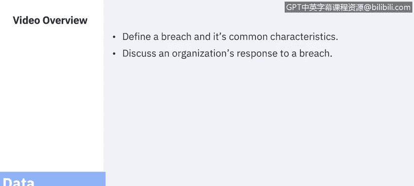
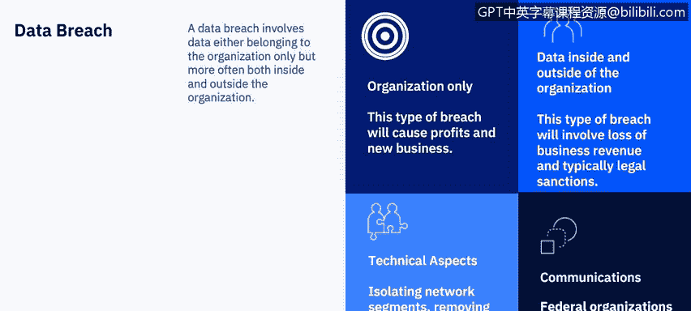

# 课程7：《网络安全顶级项目：入侵响应案例研究》：25：3_02_什么是数据泄露

## 📖 概述

在本节课程中，我们将学习数据泄露的定义及其常见特征，并探讨组织应如何响应数据泄露事件。

---

## 🔍 什么是数据泄露？

数据泄露是最常见的安全事件之一。你几乎每天都能在新闻中听到数据泄露事件，尤其是在恶意行为者利用全球性事件（例如新冠疫情）进行攻击时。然而，数据泄露对新闻媒体而言并非新鲜事，它已对公众产生影响有一段时间了。

作为网络安全专业人员，尤其是分析师，回顾过往的数据泄露案例研究，并实时关注新闻和威胁情报网站关于新泄露事件的报告，是非常重要的。

Mike Myers在其《Security+认证复习指南》一书中将数据泄露定义为：**数据泄露是另一起安全事件的结果，无论是黑客攻击、内部人员的疏忽或恶意行为，还是涉及错误流程或程序的事故。**

---

## ⚖️ 组织对数据泄露的响应

组织会对外部或内部攻击做出响应，例如实施系统加固程序或对员工进行教育。然而，数据泄露需要采取的行动，远超出典型安全事件所需的范围。

组织对数据泄露的响应方式，将受到泄露数据是否仅属于该组织，还是同时涉及组织内外的影响。

以下是两种情况的区别：

*   **仅涉及组织内部的数据泄露**：可能仅导致公司收入或知识产权的损失。尽管这是一个严重问题，但它可能不涉及刑事和法律问题，而如果泄露涉及组织内外，则会产生这些问题。
*   **涉及组织内外的数据泄露**：影响公司内部和外部的数据，例如涉及个人可识别信息（如医疗记录、信用卡数据）或个人数据（如社会安全号码、驾照号码）的泄露。对于此类数据泄露，组织将面临潜在的罚款、法律制裁和刑事处罚，同时也会失去利益相关者和客户的信任。每种情况都是独特的，可能需要数年时间才能完全了解对公司造成的损害程度。

响应团队必须遵循已为安全事件建立的流程和程序，例如从系统收集数据、关闭IP端口、建立防火墙规则以阻止数据或采取一系列其他系统加固措施。

然而，他们可能还需要进行额外的取证工作，包括确定攻击者可能接触到了何种类型的数据，以及攻击者是否能够将数据下载到其系统或暗网。

团队可能还需要与高管层沟通，以决定下一步行动方针，尤其是在遭遇勒索软件等攻击时（Adam将在本课程后续模块中详细探讨）。在这种情况下，必须决定如何推进，因为结果和后续步骤可能因组织的决策或攻击者对该决策的反应而有很大不同。

最后，通常安全事件不需要与组织外部进行沟通，但对于数据泄露，组织在法律上有义务与多个外部方沟通，具体取决于数据类型，包括：
*   执法机构，如美国联邦调查局（FBI）。
*   围绕医疗数据的美国政府机构。
*   处理信用卡数据的金融机构。

由于每个国家的法律可能差异很大，团队应在发生泄露事件需要信息之前，审查所有可能的组合情况。

---

## 👥 谁应参与响应？

我们之前讨论过谁应参与安全事件响应，但数据泄露将涉及不同的沟通方式和沟通协议。

作为安全分析师，一旦意识到发生数据泄露，你应立即与管理团队沟通。法律和公共关系团队希望在安全事件响应团队之外的任何人进行沟通之前，审查所有沟通内容。

随着课程的深入，你会发现沟通将远远超出发现泄露的当天，无论是由你的团队发现还是由攻击者向媒体报告。沟通方式可能因这些具体情况和/或攻击者窃取的数据性质而变得独特。

最重要的是，需要在数据泄露发生之前，就确定哪些团队需要知情，以及哪些团队需要与公司外部进行沟通。

---

## 🚀 后续学习路径

接下来的两个视频将是你案例研究回顾的开始。然后，我们将开始深入回顾攻击类型、攻击者案例研究，所有这些都将为你完成自己的应用项目——即你需要自行研究和记录的案例研究——做好准备。

---

## 📝 总结

在本节课程中，我们一起学习了数据泄露的定义、其特征，以及组织在面临仅涉及内部和涉及内外部数据泄露时的不同响应策略与法律义务。我们还明确了响应团队的角色与沟通协议的重要性，为后续的案例研究学习奠定了基础。