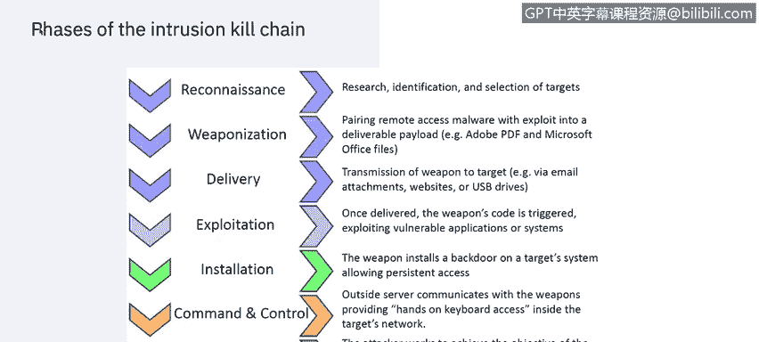
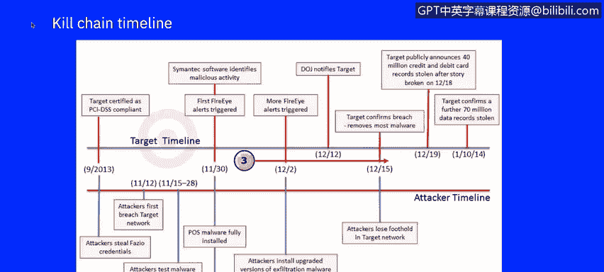
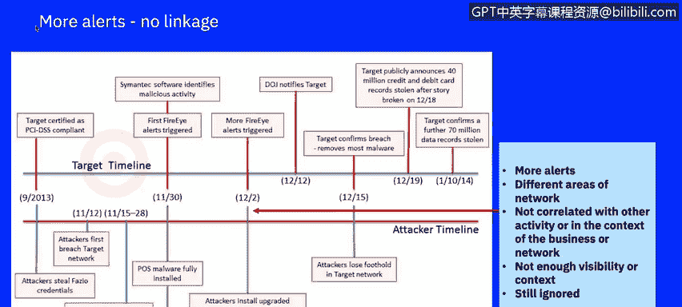

# 课程7：《网络安全顶级项目：入侵响应案例研究》：26：4_01_target-attack-timeline｜ 🎯

## 概述

在本节课中，我们将深入分析一个真实世界的大规模网络攻击案例——2013年发生的Target数据泄露事件。通过学习这个案例，你将了解攻击者如何策划并执行一次复杂的入侵，以及企业安全防御中可能存在的薄弱环节。这个案例虽然发生在近十年前，但其揭示的攻击模式和防御教训在今天依然具有极高的教育价值。

---

## 案例背景介绍

Target公司是一家美国零售企业，成立于1902年，总部位于明尼苏达州明尼阿波利斯市，是美国第二大折扣零售商。截至2013年，Target在美国运营着1916家门店，并于当年3月进军加拿大市场。

然而，在2013年12月，Target系统遭遇了一次大规模数据泄露，影响了多达1.1亿客户。根据IBM X-Force威胁情报报告，零售业在2020年是受攻击第二严重的行业。2019年的数据显示，该行业承受了针对前十大行业全部攻击中的16%，相比2018年11%的占比和第四的排名有显著上升。

攻击零售业最常见的威胁行为者是出于经济动机的网络犯罪分子。他们的目标通常是获取消费者的**个人身份信息**、**支付卡数据**、财务数据、购物历史和会员计划信息。犯罪分子利用这些数据进行账户接管、欺诈客户，并在各种身份盗窃场景中重复使用。

2019年，犯罪分子针对零售商的一种流行攻击技术是**销售点恶意软件**和**电子商务支付卡侧录**，前者通过物理支付终端，后者通过网络，目的都是在交易过程中窃取支付卡信息。

---

## 攻击时间线分析

上一节我们了解了Target公司的背景和零售业面临的威胁概况。本节中，我们将使用洛克希德·马丁公司提出的**入侵杀伤链模型**作为框架，来详细拆解Target攻击事件的时间线。

### 侦察阶段

大约在Target获得PCI DSS（支付卡行业数据安全标准）认证的同时，攻击者开始了第一阶段的侦察活动。在此阶段，攻击者尽可能多地收集关于受害者的信息。

攻击者通过简单的互联网搜索，找到了Target一家第三方供应商的信息。Target甚至公开了一个供应商门户网站，这泄露了他们用于在线供应商账单处理的软件类型。

### 武器化与投递阶段

获得这些知识后，攻击者开始对一家名为Fazio的特定供应商进行侦察。

在武器化阶段，攻击者创建了带有恶意软件的电子邮件，很可能附带了PDF或Microsoft Office文档。

在投递阶段的第一部分，攻击者向该供应商发送了受感染的电子邮件，这是一次所谓的**网络钓鱼攻击**。一旦部署，恶意软件便开始记录密码，为攻击者提供了进入Target外部账单系统的钥匙。

在投递阶段的第二部分，攻击者利用其对供应商系统的访问权限，进入了Target的网络。

### 利用与安装阶段

Target网络周边的安全措施可能不足，这帮助攻击者成功侵入了包含持卡人数据的最敏感网络区域。攻击者使用供应商的凭证访问了Target的内部网络。随后，攻击者似乎直接将他们的**内存抓取恶意软件**上传到了POS终端。

在利用阶段，内存抓取恶意软件和外泄恶意软件开始记录数百万次刷卡数据，并存储被盗数据以备后续外泄。

报告表明，攻击者在试图进一步破坏Target网络期间，曾在一段时间内维持着对供应商系统的访问。

在安装阶段，目前尚不清楚攻击者是如何从外部账单系统将访问权限提升到Target内部网络的更深层次的。但考虑到BlackPOS恶意软件在Target POS终端上的安装、7000万条非财务数据记录的泄露，以及用于收集被盗数据的内部Target服务器的沦陷，攻击者似乎通过利用默认账户名和Target的身份管理系统，成功渗透了多个关键的Target系统。

根据已报告的时间线，攻击者在超过一个月的时间里都能访问Target的内部网络，并在11月30日之前用外泄恶意软件攻陷了内部服务器。

### 命令与控制及数据外泄

虽然攻击者维持命令与控制的确切方法未知，但很明显，他们能够在外部互联网与Target的持卡人网络之间维持通信线路。

攻击者将被盗数据以**明文形式通过FTP**传输到外部服务器，其中至少有一台位于俄罗斯。这个过程持续了大约两周。

### 攻击被发现与响应

12月12日，美国司法部通知Target，他们的被盗信用卡凭证在一个俄罗斯暗网网站上被识别出来并正在出售。此时，Target内部尚无人意识到已遭受攻击。

Target立即展开了密集调查，并成功阻止了进一步的数据外泄活动。三天后，大部分恶意软件被清除。也正是在这个时候，Target才发现不仅丢失了4000万条信用卡记录，还有额外的7000万条不含财务信息的客户数据记录。

回顾调查时间线，来自防火墙和赛门铁克端点的第一个安全相关事件记录于11月30日。

---

## 安全防御失效分析

上一节我们梳理了攻击的完整过程，本节中我们来看看Target的安全防御为何未能及时阻止这次攻击。

以下是安全团队在事件响应中遇到的主要挑战：

*   **警报被忽略**：防火墙和端点分析人员可能将这些早期事件视为误报，因此没有采取行动。原因在于安全环境的复杂性，各个单点解决方案之间缺乏通信。
*   **缺乏关联分析**：很难检索到关于前后流量的额外活动信息，仅查看孤立的事件而没有任何关联分析，无法意识到业务和网络的上下文背景。
*   **上下文缺失**：结合业务上下文和风险管理的能力，可以显示特定攻击模式是否暴露了高价值资产。网络上下文则能显示恶意软件是否能实际接触到这些资产。由于缺乏关联单个事件的手段，这次攻击被忽视了。

一旦数据外泄开始，Target的安全工具记录了更多警报。但同样，由于缺乏与早期事件和网络流量日志的适当关联，对于正在进行的恶意软件部署和数据外泄活动缺乏足够的可见性。这导致正在进行的攻击仍然被忽略。

当美国司法部致电Target高管管理层时，反应为时已晚。

---

## 事件响应与后果

启动的取证调查使安全团队在POS终端和后端数据服务器上发现了恶意软件，并发现了正在向外部FTP服务器进行的外泄传输。随后，通信线路被切断，恶意软件从系统中清除。

只有在取证活动中，安全人员才发现另外7000万条非财务数据记录也已被泄露。这对任何组织来说，都是可能面临的最糟糕的商业情景的警醒。

---

## 总结

在本节课中，我们一起学习了2013年Target数据泄露这一经典案例。我们使用**入侵杀伤链模型**逐步分析了攻击从侦察、武器化、投递、利用、安装、命令控制到最终数据外泄的全过程。同时，我们也剖析了Target安全防御失效的原因，主要在于**安全警报缺乏关联分析**和**业务与网络上下文的缺失**，导致早期攻击迹象被忽视。这个案例深刻说明，即使企业拥有防火墙、恶意软件检测、入侵防御等多种安全层并符合PCI DSS等标准，复杂的定向攻击仍然可能成功。在下一个视频中，我们将回顾此次攻击暴露的漏洞、造成的成本，以及一些本可以帮助Target更早发现或最好能预防此次攻击的技术。