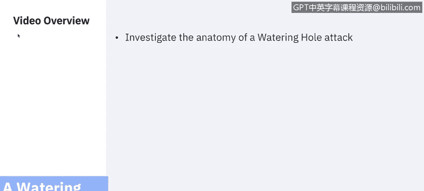
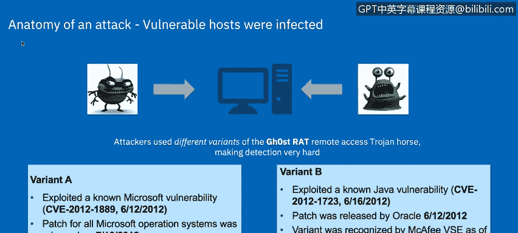
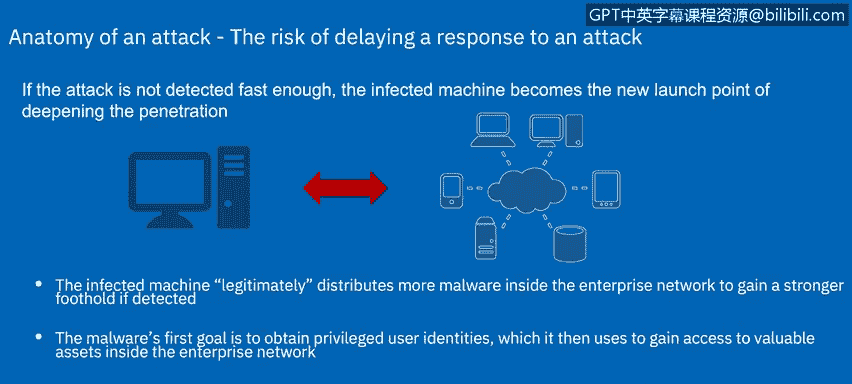
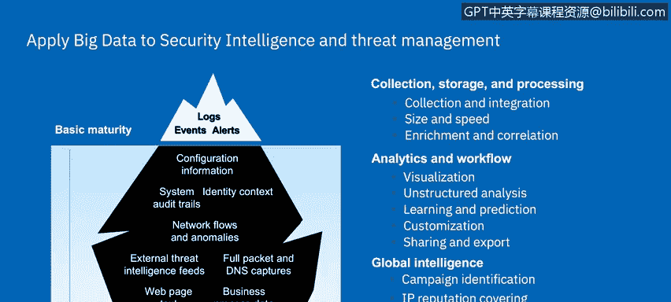
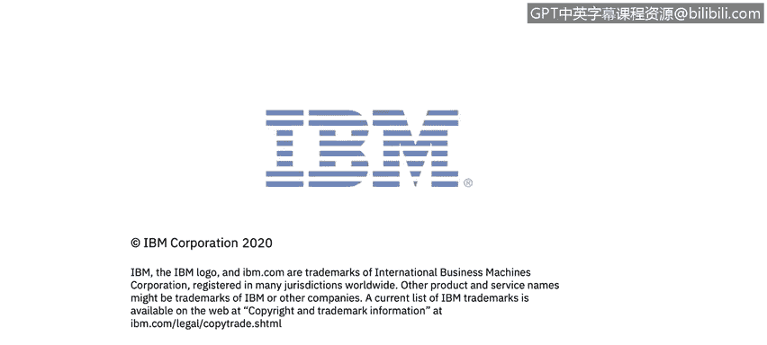

# 课程7：《网络安全顶级项目：入侵响应案例研究》：7：28：6_03 水坑攻击案例研究

## 概述
在本节课程中，我们将学习一种名为“水坑攻击”的高级网络攻击技术。我们将通过分析一个2012年的真实案例，了解攻击者如何利用这种技术渗透组织网络，并探讨相应的防御措施。

## 水坑攻击简介
上一节我们介绍了不同类型的网络威胁，本节中我们来看看一种针对特定群体的攻击——水坑攻击。

水坑攻击是指攻击者通过入侵目标群体经常访问的网站，在其中植入恶意代码，从而感染访问该网站的受害者计算机。

## 攻击案例时间线分析
以下是2012年发生的真实水坑攻击案例的时间线细节。

*   **7月13日至15日**：攻击者入侵了多家区域性消费者金融服务网站。
*   **攻击手法**：黑客在网站的消费者门户页面上植入了隐藏的iframe框架。
*   **用户感染**：在此期间访问网站进行在线银行业务的银行客户，被重定向到一个恶意软件下载站点。
*   **最终结果**：多家公司内部检测到了感染。

与某些长期潜伏的入侵相比，从这个时间线可以看出，攻击者利用零日漏洞进行渗透的速度非常快、效率极高。

## 使用的恶意软件：幽灵鼠
让我们看看在此次攻击中被感染的脆弱主机使用了何种恶意软件。

攻击者使用了不同变种的“幽灵鼠”远程访问木马，这使得检测变得非常困难。

**幽灵鼠** 是一种在Windows平台上使用的远程访问木马工具，曾被用于入侵全球一些最敏感的计算机网络。

以下是幽灵鼠木马的主要能力：
*   完全控制受感染主机的远程屏幕。
*   提供实时及离线的键盘击键记录。
*   提供受感染主机摄像头和麦克风的实时画面与音频。
*   在受感染的远程主机上下载二进制文件。
*   远程控制主机的关机与重启。
*   禁用受感染计算机的远程指针和键盘输入。
*   进入受感染主机的shell并获得完全控制权。
*   列出所有活动进程并清除所有现有的SSDT钩子。

## 恶意软件变种与漏洞
接下来，我们谈谈在此次水坑攻击中观察到的恶意软件变种。

*   **变种A**：利用了一个已知的微软漏洞，且未被任何防病毒厂商识别。
*   **变种B**：利用了一个已知的Java漏洞，虽然已有部分补丁可用，但并非所有防病毒软件都能防护。

## 攻击流程与命令控制
了解恶意软件后，我们来看看感染后的完整攻击流程。

在此案例中，主机被感染后，会尝试与中国境内的远程命令与控制服务器通信。受感染的机器会尝试与两个C&C服务器之一建立连接。

**通信建立后的后果**：
一旦通信成功建立，C&C服务器将获得对受保护网络内系统的完全实时控制。该远程访问木马允许攻击者：
1.  访问数据。
2.  记录系统活动。
3.  捕获键盘记录。
4.  截取屏幕截图。
5.  激活系统摄像头并进行录制。
6.  从系统麦克风进行录音。
7.  在受控机器上投放额外的下载和程序，为后续攻击做准备。

如果未能及时检测到攻击，受感染的机器将成为攻击者深化渗透的新起点。

## 防御与控制措施
面对上述攻击向量，我们可以通过以下适当的措施进行应对。

以下是针对各个攻击环节的防御控制措施：

*   **端点管理**：如果恶意软件试图在企业网络内部署更多恶意软件以巩固据点，端点管理软件应立即检测到任何新的软件安装，报告并阻止其网络访问或将其移除。
*   **特权用户访问控制**：恶意软件的首要目标是获取特权用户身份。实施特权用户访问控制系统（如使用多因素认证的特定签出流程）可以降低攻击者获得特权访问的机会。此外，数据访问监控解决方案可以检测异常的大量特权数据访问行为并报告。
*   **网络异常检测**：大多数攻击会使用非常规端口和扫描。网络异常检测系统可以监控那些通常不执行此类活动的IT系统，一旦发现异常端口或扫描活动立即告警。流量控制系统可以记录涉及内外部IT系统的流量并立即报告。
*   **公共威胁情报**：此类攻击很少是孤立事件。将安全研究社区识别的恶意IP地址和端口纳入黑名单，并整合到组织的安全情报解决方案中，是有效的控制措施。

只有近乎实时地关联所有这些事件，组织才能及时发现并有望在威胁被利用并造成损害之前将其阻止。

## 安全情报的新挑战
接下来，我们将从更宏观的层面总结当前安全情报面临的挑战。

传统上，安全情报侧重于实时或近实时的安全分析，但现在出现了扩展安全情报角色的新需求。

面临的挑战主要包括：
1.  **数据持久化**：需要将安全数据保存更长时间，以检测运行时间更长的攻击模式。
2.  **新数据源关联**：DNS、业务应用数据等新的网络数据源具有更高的安全相关性，需要与安全数据及非结构化内容进行关联分析。
3.  **高级分析需求**：需要应用更高级的分析方法（如回归分析、预测算法），这些分析虽然耗时更长，但能提供更深入的安全洞察。
4.  **支持分析师新行为**：需要支持安全分析师采用更新的分析行为模式。

## 总结
本节课中，我们一起学习了水坑攻击的完整过程。我们通过一个真实案例，分析了攻击的时间线、使用的幽灵鼠木马及其变种、攻击的指挥控制流程，并探讨了从端点管理、访问控制、网络监控到威胁情报整合等多层次的防御措施。最后，我们了解了安全情报在应对此类高级威胁时面临的新挑战。在下一个视频中，Adam将概述网络钓鱼诈骗，我稍后会回来描述下一个案例研究。