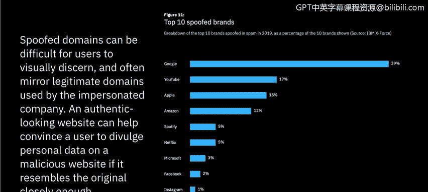
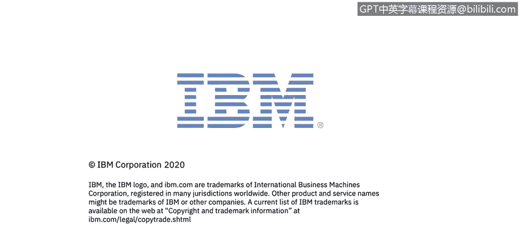

# 课程7：《网络安全顶级项目：入侵响应案例研究》：29：7_01_phishing-scams-overview.en_subtitled - GPT中英字幕课程资源 - BV1MN41167mY

## 钓鱼攻击概述 🎣

在本节课中，我们将学习钓鱼攻击的历史、运作方式及其为何如此有效。我们将从钓鱼攻击的定义和历史起源开始，逐步深入到其具体策略和演变趋势。

钓鱼攻击，也称为欺骗或卡片欺诈，是一个用于描述各类诈骗的术语。这些诈骗主要通过犯罪分子发送的欺诈性电子邮件，诱骗你泄露个人信息。犯罪分子利用这些信息窃取你的身份、盗取银行账户资金或控制你的计算机。

在深入分析钓鱼攻击的具体手段和影响之前，了解其起源很有帮助。钓鱼一词源于一个类比：网络诈骗者使用电子邮件作为诱饵，在互联网用户的海洋中“钓取”密码和财务数据。它最初被黑客用来描述通过获取用户名和密码来窃取美国在线账户的行为。

虽然大多数攻击通过电子邮件进行，但一些诈骗也使用即时消息、虚假新闻公告和社交媒体等社交社区来欺骗用户泄露个人信息。

“钓鱼”一词被广泛使用，但其含义较为笼统。实际上，存在多种不同类型的钓鱼攻击或诈骗。首先，是我们在视频开头定义的、通常意义上使用的“钓鱼”，即通过某种欺骗手段或行动号召从最终用户那里获取信息。此外，还有“鱼叉式钓鱼”，这种攻击并非大规模撒网，而是针对特定用户或群体的定向攻击。进一步延伸，“鲸钓”特指针对拥有最高信息访问权限的高管级别人员的鱼叉式钓鱼，例如公司的高层管理人员。

了解了这些基本概念后，接下来我们探讨钓鱼攻击为何如此具有影响力。

## 钓鱼攻击的运作机制 ⚙️

钓鱼攻击之所以成功，是因为攻击者使用了多种策略让邮件接收者相信他们收到了来自合法用户或域名的邮件。

以下是攻击者常用的策略：
*   使用与合法地址非常相似的邮件地址。
*   制造财务诱惑或其他诱人情境，使收件人恐慌或诱使其采取行动。
*   利用被入侵的合法账户或软件发送邮件，使收件人无法察觉信息来源的异常。

上一节我们介绍了钓鱼攻击的基本运作逻辑，本节中我们来看看攻击者具体使用哪些“诱饵”来让人们上钩。

## 常见的钓鱼诱饵策略 🪤

威胁行为者会使用大量策略诱使你采取行动。以下是一些最常见的策略，你可能在收件箱中多次遇到过它们。

以下是常见的钓鱼诱饵列表：
1.  **声称发现可疑活动或登录尝试**：这通常伪装成来自Netflix、银行或大学等服务提供商，要求你登录验证，从而窃取你的凭证。
2.  **声称你的账户或支付信息存在问题**：这通常针对处理定期支付的公司或你的信用卡/银行，告知你交易未成功等。
3.  **要求你确认某些个人信息**：这种说辞非常宽泛，可用于多种场景。
4.  **包含虚假发票**：这通常结合了社会工程学，攻击者发现你定期使用某项服务后，会发送虚假发票，诱使你泄露个人身份信息和财务信息。
5.  **要求你点击链接进行支付**：这直接旨在捕获你的信用卡数据。例如，早年PayPal就常被仿冒。
6.  **声称你有资格申请政府退款**：这在特定时期（如COVID-19疫情期间发放刺激支票时）尤为常见，攻击者会引导人们到虚假政府网站注册，从而窃取信息。
7.  **提供免费赠品或优惠券**：利用人们喜欢免费物品的心理进行诱骗。

这些只是数百种策略中的一部分，它们形式多样。我们能做的最好的事情就是自我教育并保持警惕。

钓鱼攻击之所以有效，是因为伪造的域名用户难以用肉眼辨别，而且它们经常使用被仿冒公司实际使用的合法域名。一个外观逼真的网站，如果与原网站足够相似，就能说服用户在恶意网站上泄露个人数据。

在一项IBM研究中，他们列出了被仿冒最多的十大品牌：**Google**（遥遥领先，主要是Gmail）、**YouTube**（也属于Google）、**Apple**、**Amazon**、**Spotify**、**Netflix**、**Microsoft**、**Facebook**、**Instagram**和**WhatsApp**。可以看到，这些都是我们日常生活中频繁使用的服务或社交媒体，这增加了人们处理相关“紧急”事务的迫切感。

## 钓鱼攻击的演变：滥用HTTPS 🔒

攻击者不仅在仿冒的电子邮件和网站上越来越逼真，现在他们还在欺骗我们一直认为是安全标志的东西——**HTTPS**（其中的S代表安全）。过去，我们用它来识别安全网站并因此感到安心。

HTTPS的背景是，它通过加密个人浏览器与其访问网站之间的数据交换来保护通信安全。这对于提供在线销售或受密码保护账户的网站尤为重要。然而，在钓鱼网站上使用HTTPS，揭示了攻击者如何将互联网安全功能反过来用于欺骗用户。

虽然我们一直认为HTTPS意味着“安全”，但在2019年第四季度，超过70%由钓鱼者托管的网站都在使用HTTPS。攻击者正在不断进化以捕获更多受害者。

了解了攻击者如何滥用安全标识后，我认为接下来我们需要实际查看一封邮件，学习如何识别需要警惕的迹象。我们将在下一个视频中进行这项实践。

## 总结 📝

本节课中，我们一起学习了钓鱼攻击的概述。我们了解了钓鱼攻击的定义和历史起源，探讨了其通用的运作机制和常见的诱饵策略，例如制造紧急情况或提供诱惑。我们还认识到，钓鱼攻击之所以有效，是因为它利用了人们对常用服务的信任，并且攻击手段在不断演变，甚至开始滥用HTTPS这样的安全协议来增强欺骗性。在下一课中，我们将通过实例分析，学习如何具体识别钓鱼邮件的特征。