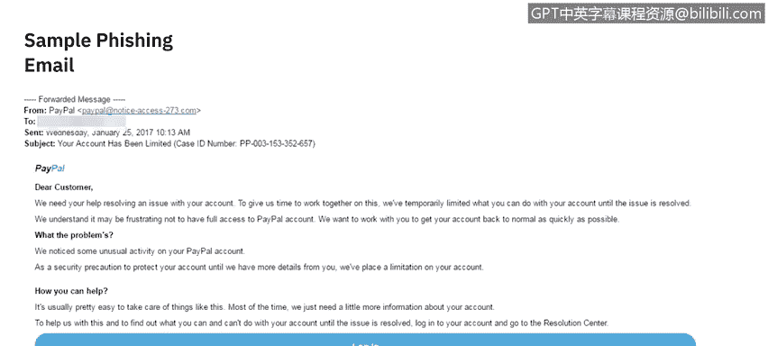
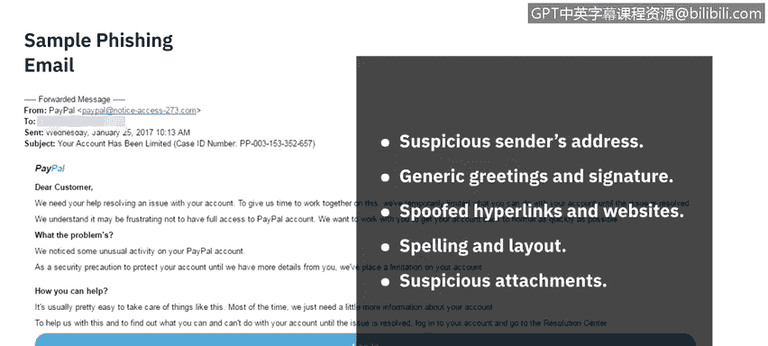
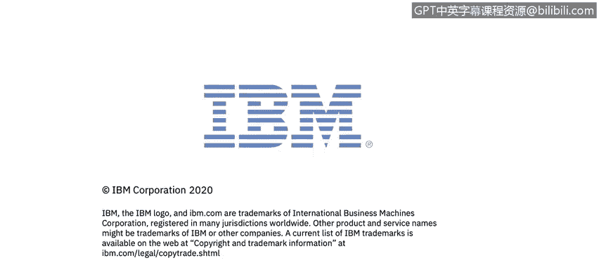

# 课程7：《网络安全顶级项目：入侵响应案例研究》：30：8_03_钓鱼邮件研究

## 🎣 钓鱼邮件研究

在本节课程中，我们将学习如何识别和分析钓鱼邮件。我们将通过一个具体的案例，剖析攻击者用来欺骗最终用户的常见技术，并总结在邮件中需要警惕的关键迹象。

### 案例邮件概览

首先，我们来看一封示例钓鱼邮件。这封邮件伪装成来自PayPal，主题是“您的账户已被限制”，并附带了一个案例ID号。

邮件的发件人地址显示为 `Paypal@noticeiceaccess.273.com`，这并非PayPal的官方域名。

邮件正文包含了PayPal的官方Logo，并以“尊敬的客户”开头。内容声称账户存在异常活动，作为安全预防措施，账户已被临时限制。邮件提供了一个大型的蓝色“登录”按钮，引导用户点击，并附带了帮助、联系和安全链接等页脚信息。

### 🔍 钓鱼邮件的常见特征分析

上一节我们查看了邮件的整体内容，本节中我们来看看攻击者常用的欺骗手法，并逐一对照我们的案例进行识别。

以下是钓鱼邮件中常见的五个危险信号，我们可以用它们来评估这封示例邮件。

**1. 可疑的发件人地址**
这是最直接的警示。在我们的案例中，虽然发件人名称显示为“PayPal”，但实际的发件人邮箱地址 `Paypal@noticeiceaccess.273.com` 是一个随机的、非官方的域名，这明显是一个危险信号。

**2. 泛泛的问候语和签名**
合法的公司邮件通常会使用你的姓名进行问候。这封邮件中使用的是“尊敬的客户”，这表明它很可能是一封群发的垃圾邮件。

**3. 伪造的超链接和网站**
虽然在这张截图里我们无法直接点击，但通常将鼠标悬停在按钮或链接上时，可以查看其背后的真实URL。对于任何可疑邮件，最安全的做法是不要直接点击邮件中的链接，而是手动在浏览器中输入官方网站地址进行登录和查看。

**4. 拼写和布局错误**
大公司的对外邮件通常会经过严格的设计和文案校对，基本不会出现拼写或语法错误。这封邮件的英文表述存在一些不自然和错误之处，这是一个重要的警示。

**5. 可疑的附件**
如果收到来自未知发件人的附件，通常应保持高度警惕。最好的做法是直接删除整封邮件，不要打开附件。

### 📝 总结与过渡

本节课中，我们一起学习了如何通过分析发件人地址、问候语、链接、文字质量和附件来识别钓鱼邮件。我们利用一个伪装成PayPal的钓鱼邮件案例，实践了这些识别技巧。

现在我们已经了解了钓鱼邮件的原理并分析了具体案例，接下来我们将探讨钓鱼攻击对企业和个人造成的实际影响，我们将在下一个视频中看到。